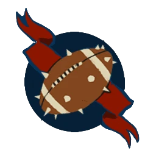

# Alianza del Viejo Mundo — EuroBowl 2026 (Tier 1, Team Budget 1060k)

> **#euro26** — [EuroBowl 2026](../../../source/tiers/eurobowl-2026.md). **BB 3ª temporada / BB2025.** Lista alineada con captura del builder (vídeo [EuroBowl / listas — YouTube](https://www.youtube.com/watch?v=wrmKRBFNqcM)). Posiciones: [`source/teams/alianza-viejo-mundo.md`](../../../source/teams/alianza-viejo-mundo.md).

> **Estado:** plantilla **desde captura**. **12 jugadores**. No regenerar con `_build_rosters.py` (ver `SKIP_EMIT`). Tag: `eurobowl-2026-wip-competitive`.

## Presupuesto EuroBowl (tier 1)

| Concepto | Valor |
|----------|--------|
| **Tier** | 1 |
| **Team Budget (base)** | 1.060.000 M.O. |
| **Skill Gold (pool)** | 120.000 M.O. |
| **Flowing Funds (máx.)** | 10.000 M.O. |

*En la captura: **Team budget** 1055k / 1060k (**1055k** gastados; **5k** del presupuesto base sin usar); **Skill Gold** 130k / 120k (**120k** pool + **10k** Flowing íntegros a Skill Gold = **130k** gastados en avances); **Flowing Funds** 10k / 10k.*

## Alineación

*En **negrita**, avances de Skill Gold. «**Dwarf Lineman**» en inglés GW = **Enano Blocker** (70k) en `alianza-viejo-mundo.md`.*

| Nº | Nombre | Posición | Coste | MV | FU | AG | PS | AR | Habilidades |
|----|--------|----------|-------|----|----|----|----|----|-------------|
| 1 | ____ | Hombre-Árbol | 120k | 2 | 6 | 5+ | 5+ | 11+ | Golpe mortífero(+1), Mantenerse firme, Brazo fuerte, Echar raíces, Cabeza dura, Lanzar compañero, ¡Tronco va! |
| 2 | ____ | Enano Blitzer | 100k | 5 | 3 | 4+ | 4+ | 10+ | Placar, Placaje heroico, Placaje defensivo, Cabeza dura, **Vigilar** |
| 3 | ____ | Humano Blitzer | 85k | 7 | 3 | 3+ | 4+ | 9+ | Placar, Placaje defensivo, **Golpe mortífero** |
| 4 | ____ | Enano Blocker | 70k | 4 | 3 | 4+ | 5+ | 10+ | Placar, Romper defensas, Cabeza dura |
| 5 | ____ | Enano Blocker | 70k | 4 | 3 | 4+ | 5+ | 10+ | Placar, Romper defensas, Cabeza dura |
| 6 | ____ | Enano Blocker | 70k | 4 | 3 | 4+ | 5+ | 10+ | Placar, Romper defensas, Cabeza dura |
| 7 | ____ | Humano Catcher | 75k | 8 | 3 | 3+ | 4+ | 8+ | Atrapar, Esquivar, **Placar** |
| 8 | ____ | Humano Thrower | 75k | 6 | 3 | 3+ | 3+ | 9+ | Pasar, Manos seguras, **Líder** |
| 9 | ____ | Humano Línea | 50k | 6 | 3 | 3+ | 4+ | 9+ | **Forcejeo** |
| 10 | ____ | Humano Línea | 50k | 6 | 3 | 3+ | 4+ | 9+ | — |
| 11 | ____ | Humano Línea | 50k | 6 | 3 | 3+ | 4+ | 9+ | — |
| 12 | ____ | Humano Línea | 50k | 6 | 3 | 3+ | 4+ | 9+ | — |

**Total jugadores:** 12 | **Suma jugadores:** 865.000 M.O.

**Desglose presupuesto de equipo (captura):**

| Concepto | Coste |
|----------|--------|
| Jugadores (120k + 100k + 85k + 3×70k + 75k + 75k + 4×50k) | 865.000 |
| Rerolls de equipo (2 × 70.000) | 140.000 |
| Apotecario | 50.000 |
| Asistentes / cheerleaders / Hinchas | 0 |
| **Total gastado** | **1.055.000** |
| **Team Budget base (tier 1)** | 1.060.000 |
| **Presupuesto equipo sin usar (captura)** | 5.000 |

<!-- habilidades-roster:inicio -->
## Habilidades del roster

*Definición de todas las habilidades y rasgos de los jugadores de esta lista (de serie y compradas). Generado con `scripts/habilidades_en_rosters.py`.*

- **[Atrapar](../../../source/habilidades/agilidad.md)** (*Catch* · Agilidad · Activa): Puede **repetir** cualquier chequeo de AG fallido al **intentar atrapar** el balón.
- **[Brazo fuerte](../../../source/habilidades/fuerza.md)** (*Strong Arm* · Fuerza · Activa): En **Lanzar compañero**: **+1** al chequeo de **Pase**. Requiere el rasgo **Lanzar compañero**.
- **[Cabeza dura](../../../source/habilidades/fuerza.md)** (*Thick Skull* · Fuerza · Pasiva): Tirada de **Heridas**: **Inconsciente** solo con **9**; **8** = **Aturdido**. Con **Escurridizo**: Inconsciente con **8**, **7** = Aturdido.
- **[Defensa](../../../source/habilidades/fuerza.md)** (*Guard* · Fuerza · Activa (Elite)): Siempre puede **apoyar** (ofensivo y defensivo) en Placajes aunque lo marquen **varios** rivales.
- **[Echar raíces](../../../source/habilidades/rasgos.md)** (*Take Root* · Rasgo · Pasiva (obligatoria)): Tras declarar acción, si está **en pie**: **1D6** **2+** normal; **1** = **raíces**: sin Movimiento, sin impulso, **no** empujable, no sale de casilla salvo KO/Lesión. Termina al **fin de entrada** o si **derribado/tumbado boca arriba**.
- **[Esquivar](../../../source/habilidades/agilidad.md)** (*Dodge* · Agilidad · Activa (Elite)): **Una vez por turno** puede repetir un **único** chequeo de AG al **intentar esquivar**. Afecta al resultado **Desequilibrado** cuando un rival le hace un Placaje.
- **[Forcejear](../../../source/habilidades/general.md)** (*Wrestle* · General · Activa): En **Placaje** (activo o como blanco), si aplicaría **Ambos derribados**, puede usarla: **ambos** quedan **tumbados boca arriba**, sin importar otras habilidades.
- **[Golpe mortífero](../../../source/habilidades/fuerza.md)** (*Mighty Blow* · Fuerza · Activa (Elite)): Si **derriba** a un rival en **Placaje** (aunque él también quede derribado), **+1** a **Armadura** **o** a **Heridas** (eliges **después** de tirar ese dado).
- **[Lanzar compañero](../../../source/habilidades/rasgos.md)** (*Throw Team-Mate* · Rasgo · Activa): Puede declarar **Lanzar compañero**.
- **[Líder](../../../source/habilidades/pase.md)** (*Leader* · Pase · Pasiva): Con **≥1** con Líder **en campo** al inicio de cualquier mitad: gana **Segunda oportunidad de Líder** (como reroll normal salvo que **Chef Maestro Halfling** no la quite). Si **todos** los Líder salen **antes** de usarla, se **pierde**.
- **[Manos seguras](../../../source/habilidades/general.md)** (*Sure Hands* · General · Activa): Puede **repetir** el **D6** al **recoger** el balón (**no** en **Asegurar el balón**). **Robar balón** **no** puede usarse contra él.
- **[Mantenerse firme](../../../source/habilidades/fuerza.md)** (*Stand Firm* · Fuerza · Activa): Ante **empuje** por Placaje (incl. cadena) puede **no moverse**. **No** bloquea el **segundo Placaje** de **Furia** si sigue en pie.
- **[Pasar](../../../source/habilidades/pase.md)** (*Pass* · Pase · Activa): Puede **repetir** cualquier chequeo de **Pase** fallido en acción de **Pase**.
- **[Placaje defensivo](../../../source/habilidades/general.md)** (*Tackle* · General · Activa): Rival que **esquive** para salir de su zona de defensa **no** puede usar **Esquivar**. Si **él** hace un Placaje y sale **Desequilibrado**, el rival se trata **como sin Esquivar**.
- **[Placaje heroico](../../../source/habilidades/agilidad.md)** (*Diving Tackle* · Agilidad · Activa): Rival que **esquivando, saltando o brincando** sale de su zona de defensa: **después** de su chequeo de AG (con mods. y repeticiones), este jugador aplica **-2** al rival y se coloca **tumbado boca arriba** en la casilla que deja. **Solo uno** por intento de salida si varios tienen la habilidad.
- **[Placar](../../../source/habilidades/general.md)** (*Block* · General · Activa (Elite)): En Placaje con **Ambos derribados** puede elegir **no** ser **derribado**.
- **[Romper defensas](../../../source/habilidades/agilidad.md)** (*Defensive* · Agilidad · Activa): En **turnos rivales**, rivales que esté **marcando** no pueden usar **Defensa** ni **Meter la bota**.
- **[Solitario](../../../source/habilidades/rasgos.md)** (*Loner* · Rasgo · Pasiva (obligatoria)): Para usar **Segunda oportunidad**: **1D6** vs número entre paréntesis; si falla **no** repite pero **gasta** el reroll.
- **[¡Tronco va!](../../../source/habilidades/rasgos.md)** (*Timmm-ber!* · Rasgo · Pasiva): Si **MV ≤ 2**, **+1** por cada compañero **desmarcado y en pie** adyacente al **intentar levantarse**; **1 natural** sigue fallando.

<!-- habilidades-roster:fin -->

## Información del equipo

| Concepto | Valor |
|----------|--------|
| **Tier NAF / EuroBowl** | 1 |
| **Team Budget (captura)** | 1055k / 1060k (5k sin gastar) |
| **Skill Gold (captura)** | 130k / 120k (+10k Flowing) |
| **Rerolls** | 2 |
| **Apotecario** | Sí |
| **Inducements** | Ninguno |
| **Opción listas** | Sin estrellas |
| **Liga (captura EN)** | Old World Classic |
| **Equivalencia repo (ES)** | **Clásica del Viejo Mundo** (`alianza-viejo-mundo.md`) |

## Skill Gold — avances (según captura)

**Cinco** jugadores con **un** bloque de avance cada uno. Desglose que suma **130.000 M.O.** (**120k** pool + **10k** Flowing a Skill Gold):

| Nº | Jugador | Habilidad (EN → ES) | Tipo (referencia #euro26) | Coste Skill Gold |
|----|---------|---------------------|---------------------------|------------------|
| 2 Enano Blitzer | Guard → **Vigilar** | Sec. Fuerza no élite | 40.000 |
| 3 Humano Blitzer | Mighty Blow → **Golpe mortífero** | Prim. Fuerza **élite** | 30.000 |
| 7 Humano Catcher | Block → **Placar** | Prim. General no élite | 20.000 |
| 8 Humano Thrower | Leader → **Líder** | Prim. General no élite | 20.000 |
| 9 Humano Línea | Wrestle → **Forcejeo** | Prim. General no élite | 20.000 |
| **Total Skill Gold** | | | **130.000** |

**Límites #euro26:** **1** secundario (**Vigilar**); **1** primaria **élite** (**Golpe mortífero**); **0** Stack.

*Si el builder etiqueta **Vigilar** como primaria de Fuerza en Enano Blitzer, el coste puede ser **20k/30k** en lugar de secundaria; ajusta la tabla manteniendo **130k** y los techos del pack.*

## Estrellas (Tiers 1–4)

Sin Veterans ni Legends en la captura. Listas: [`eurobowl-2026.md`](../../../source/tiers/eurobowl-2026.md).

## Inducements

Solo los permitidos en `eurobowl-2026.md`. Captura: ninguno.

## Estrategia (breve)

- **Enano Blitzer** con **Vigilar** y kit de placajes; **Humano Blitzer** con **Golpe mortífero** para cadena.
- **Balón:** Catcher con **Placar**; Thrower con **Líder** y **Manos seguras**.
- **Línea:** **Forcejeo** en un Humano Línea; **Hombre-Árbol** para Lanzar compañero y anclaje.

## Progresión sugerida

Tras #euro26, seguir tablas **GF / DG / GP / AG** de `alianza-viejo-mundo.md` por posición.
