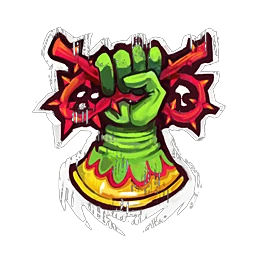

# Elfos Silvanos — EuroBowl 2026 (Tier 1, Team Budget 1060k)

> **#euro26** — [EuroBowl 2026](../../../source/tiers/eurobowl-2026.md). **BB 3ª temporada / BB2025.** Lista alineada con captura del builder (vídeo [EuroBowl / listas — YouTube](https://www.youtube.com/watch?v=wrmKRBFNqcM)). Posiciones: [`source/teams/elfos-silvanos.md`](../../../source/teams/elfos-silvanos.md).

> **Estado:** plantilla **desde captura**. **11 jugadores** (sin Hombre-Árbol en esta lista). No regenerar con `_build_rosters.py` (ver `SKIP_EMIT`). Tag: `eurobowl-2026-wip-competitive`.

## Presupuesto EuroBowl (tier 1)

| Concepto | Valor |
|----------|--------|
| **Tier** | 1 |
| **Team Budget (base)** | 1.060.000 M.O. |
| **Skill Gold (pool)** | 120.000 M.O. |
| **Flowing Funds (máx.)** | 10.000 M.O. |

*En la captura: **Team budget** 1065k / 1060k (**1060k** base + **5k** Flowing a presupuesto de equipo; la flecha roja del builder marca el exceso sobre la base **antes** de contar Flowing como parte del presupuesto gastable); **Skill Gold** 120k / 120k (pool íntegro); **Flowing Funds** 5k / 10k (**5k** a equipo, **5k** sin usar).*

## Alineación

*En **negrita**, avances de Skill Gold. Nombres EN del builder → español del repo.*

| Nº | Nombre | Posición | Coste | MV | FU | AG | PS | AR | Habilidades |
|----|--------|----------|-------|----|----|----|----|----|-------------|
| 1 | ____ | Wardancer | 130k | 8 | 3 | 2+ | 3+ | 8+ | Placar, Esquivar, Saltar, **Placaje defensivo** |
| 2 | ____ | Wardancer | 130k | 8 | 3 | 2+ | 3+ | 8+ | Placar, Esquivar, Saltar, **Robar balón** |
| 3 | ____ | Elfo Silvano Catcher | 90k | 8 | 2 | 2+ | 3+ | 8+ | Atrapar, Esprintar, Esquivar, **Echarse a un lado** |
| 4 | ____ | Elfo Silvano Catcher | 90k | 8 | 2 | 2+ | 3+ | 8+ | Atrapar, Esprintar, Esquivar |
| 5 | ____ | Elfo Silvano Thrower | 85k | 7 | 3 | 2+ | 2+ | 8+ | Pasar, Proteger el cuero, **Líder** |
| 6 | ____ | Elfo Silvano Línea | 65k | 7 | 3 | 2+ | 3+ | 8+ | **Forcejeo** |
| 7 | ____ | Elfo Silvano Línea | 65k | 7 | 3 | 2+ | 3+ | 8+ | **Forcejeo** |
| 8 | ____ | Elfo Silvano Línea | 65k | 7 | 3 | 2+ | 3+ | 8+ | — |
| 9 | ____ | Elfo Silvano Línea | 65k | 7 | 3 | 2+ | 3+ | 8+ | — |
| 10 | ____ | Elfo Silvano Línea | 65k | 7 | 3 | 2+ | 3+ | 8+ | — |
| 11 | ____ | Elfo Silvano Línea | 65k | 7 | 3 | 2+ | 3+ | 8+ | — |

**Total jugadores:** 11 | **Suma jugadores:** 915.000 M.O.

**Desglose presupuesto de equipo (captura):**

| Concepto | Coste |
|----------|--------|
| Jugadores (2×130k + 2×90k + 85k + 6×65k) | 915.000 |
| Rerolls de equipo (2 × 50.000) | 100.000 |
| Apotecario | 50.000 |
| Asistentes / cheerleaders / Hinchas | 0 |
| **Total presupuesto equipo** | **1.065.000** |
| **Team Budget base (tier 1)** | 1.060.000 |
| **Flowing Funds → presupuesto equipo** | 5.000 |
| **Comprobación** | 1.060.000 + 5.000 = **1.065.000** |

<!-- habilidades-roster:inicio -->
## Habilidades del roster

*Definición de todas las habilidades y rasgos de los jugadores de esta lista (de serie y compradas). Generado con `scripts/habilidades_en_rosters.py`.*

- **[Atrapar](../../../source/habilidades/agilidad.md)** (*Catch* · Agilidad · Activa): Puede **repetir** cualquier chequeo de AG fallido al **intentar atrapar** el balón.
- **[Echarse a un lado](../../../source/habilidades/agilidad.md)** (*Side Step* · Agilidad · Activa): Si es **empujado** por cualquier motivo, su entrenador elige una casilla **adyacente desocupada** (no el rival). Si **no hay** ninguna, la habilidad **no** se usa.
- **[Esprintar](../../../source/habilidades/agilidad.md)** (*Sprint* · Agilidad · Activa): En una acción de **Movimiento** puede intentar **forzar la marcha una vez más** de lo que podría normalmente.
- **[Esquivar](../../../source/habilidades/agilidad.md)** (*Dodge* · Agilidad · Activa (Elite)): **Una vez por turno** puede repetir un **único** chequeo de AG al **intentar esquivar**. Afecta al resultado **Desequilibrado** cuando un rival le hace un Placaje.
- **[Forcejear](../../../source/habilidades/general.md)** (*Wrestle* · General · Activa): En **Placaje** (activo o como blanco), si aplicaría **Ambos derribados**, puede usarla: **ambos** quedan **tumbados boca arriba**, sin importar otras habilidades.
- **[Líder](../../../source/habilidades/pase.md)** (*Leader* · Pase · Pasiva): Con **≥1** con Líder **en campo** al inicio de cualquier mitad: gana **Segunda oportunidad de Líder** (como reroll normal salvo que **Chef Maestro Halfling** no la quite). Si **todos** los Líder salen **antes** de usarla, se **pierde**.
- **[Pasar](../../../source/habilidades/pase.md)** (*Pass* · Pase · Activa): Puede **repetir** cualquier chequeo de **Pase** fallido en acción de **Pase**.
- **[Placaje defensivo](../../../source/habilidades/general.md)** (*Tackle* · General · Activa): Rival que **esquive** para salir de su zona de defensa **no** puede usar **Esquivar**. Si **él** hace un Placaje y sale **Desequilibrado**, el rival se trata **como sin Esquivar**.
- **[Placar](../../../source/habilidades/general.md)** (*Block* · General · Activa (Elite)): En Placaje con **Ambos derribados** puede elegir **no** ser **derribado**.
- **[Proteger el cuero](../../../source/habilidades/agilidad.md)** (*Safe Pair of Hands* · Agilidad · Activa): Si va a ser **derribado**, **caerse** o quedar **tumbado boca arriba** siendo **portador**, **antes** puede dejar el balón en una casilla **adyacente desocupada** a donde caerá él; el balón **no rebota**.
- **[Robar balón](../../../source/habilidades/general.md)** (*Strip Ball* · General · Activa): Placaje al **portador** y **empuje**: el balón **cae y rebota** desde la casilla de destino **antes** de que el rival quede tumbado, pero **después** de que **este jugador** elija si hace **impulso**.
- **[Saltar](../../../source/habilidades/agilidad.md)** (*Leap* · Agilidad · Activa): En **Movimiento** puede **Saltar** una casilla adyacente (como **Brincar**), reduciendo mods. negativos en **1** (mín. **-1**). **No** puede tener el rasgo **Pogo saltarín**.

<!-- habilidades-roster:fin -->

## Información del equipo

| Concepto | Valor |
|----------|--------|
| **Tier NAF / EuroBowl** | 1 |
| **Team Budget (captura)** | 1065k / 1060k (+5k Flowing) |
| **Skill Gold (captura)** | 120k / 120k |
| **Rerolls** | 2 |
| **Apotecario** | Sí |
| **Inducements** | Ninguno |
| **Opción listas** | Sin estrellas |
| **Liga (captura EN)** | Elven Kingdom League |
| **Equivalencia repo (ES)** | **Liga de los Reinos Élficos** (`elfos-silvanos.md`) |

## Skill Gold — avances (según captura)

**Seis** jugadores con **un** bloque de avance cada uno. Desglose que suma **120.000 M.O.** (pool **120k**, sin Flowing a oro): **seis** primarias no élite **20k** (#euro26).

| Nº | Jugador | Habilidad (EN → ES) | Tipo (referencia #euro26) | Coste Skill Gold |
|----|---------|---------------------|---------------------------|------------------|
| 1 Wardancer | Tackle → **Placaje defensivo** | Prim. General no élite | 20.000 |
| 2 Wardancer | Strip Ball → **Robar balón** | Prim. General no élite | 20.000 |
| 3 Catcher | Sidestep → **Echarse a un lado** | Prim. Agilidad no élite | 20.000 |
| 5 Thrower | Leader → **Líder** | Prim. General no élite | 20.000 |
| 6–7 Línea | Wrestle → **Forcejeo** | Prim. General no élite (×2) | 40.000 |
| **Total Skill Gold** | | | **120.000** |

**Límites #euro26:** **0** Stack; **0** secundarios en este desglose; **0** primarias élite.

*Si el builder cobra alguna habilidad como **élite** o **secundaria**, ajusta la tabla manteniendo **120k** y los techos del pack.*

## Estrellas (Tiers 1–4)

Sin Veterans ni Legends en la captura. Listas: [`eurobowl-2026.md`](../../../source/tiers/eurobowl-2026.md).

## Inducements

Solo los permitidos en `eurobowl-2026.md`. Captura: ninguno.

## Estrategia (breve)

- **Wardancers:** uno con **Placaje defensivo** para cortar esquivas; otro con **Robar balón** al portador.
- **Balón:** Catcher con **Echarse a un lado**; Thrower con **Líder** y **Proteger el cuero**.
- **Contacto:** dos líneas con **Forcejeo**; **2** rerolls y apo para soportar el juego abierto.

## Progresión sugerida

Tras #euro26, seguir **AG / AGP** en `elfos-silvanos.md`; valorar Hombre-Árbol si el formato lo permite.
