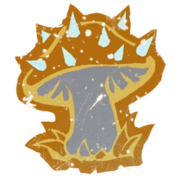

# Gnomos — EuroBowl 2026 (Tier 6, Team Budget 1140k)

> **#euro26** — [EuroBowl 2026](../../../source/tiers/eurobowl-2026.md). **BB 3ª temporada / BB2025.** Lista alineada con captura del builder (15 jugadores, sideline, Skill Gold). Posiciones y costes: [`source/teams/gnomos.md`](../../../source/teams/gnomos.md).

> **Estado:** plantilla **desde captura** (nombres EN → español Nuffle). **Rerolls 50k** (tier 6 Gnomos 2025). No regenerar con `_build_rosters.py` (ver `SKIP_EMIT`). Tag: `eurobowl-2026-wip-competitive`.

## Presupuesto EuroBowl (tier 6)

| Concepto | Valor |
|----------|--------|
| **Tier** | 6 |
| **Team Budget (base)** | 1.140.000 M.O. |
| **Skill Gold (pool)** | 240.000 M.O. |
| **Flowing Funds (máx.)** | 40.000 M.O. |

*En la captura: **Team budget** 1140k / 1140k (todo el presupuesto de equipo en la base **1140k** del tier 6); **Skill Gold** 280k / 240k (**240k** pool + **40k** Flowing íntegros a Skill Gold); **Flowing Funds** 40k / 40k.*

## Alineación

*En **negrita**, avances de Skill Gold. **FU** en tabla = **FU** en fichas ES.*

| Nº | Nombre | Posición | Coste | MV | FU | AG | PS | AR | Habilidades |
|----|--------|----------|-------|----|----|----|----|----|-------------|
| 1 | ____ | Hombre-Árbol | 120k | 2 | 6 | 5+ | 5+ | 11+ | Golpe mortífero, Mantenerse firme, Brazo fuerte, Echar raíces, Cabeza dura, Lanzar compañero, ¡Tronco va!, **Vigilar** |
| 2 | ____ | Hombre-Árbol | 120k | 2 | 6 | 5+ | 5+ | 11+ | Golpe mortífero, Mantenerse firme, Brazo fuerte, Echar raíces, Cabeza dura, Lanzar compañero, ¡Tronco va!, **Ojo de halcón** |
| 3 | ____ | Gnomo Maestro de las Bestias | 55k | 5 | 2 | 3+ | 4+ | 8+ | Vigilar, En pie de un salto, Escurridizo, Forcejeo, **Esquivar** |
| 4 | ____ | Gnomo Maestro de las Bestias | 55k | 5 | 2 | 3+ | 4+ | 8+ | Vigilar, En pie de un salto, Escurridizo, Forcejeo, **Esquivar** |
| 5 | ____ | Gnomo Ilusionista | 50k | 5 | 2 | 3+ | 3+ | 7+ | En pie de un salto, Escurridizo, Embaucador, Forcejeo, **Esquivar** |
| 6 | ____ | Gnomo Ilusionista | 50k | 5 | 2 | 3+ | 3+ | 7+ | En pie de un salto, Escurridizo, Embaucador, Forcejeo, **Esquivar** |
| 7 | ____ | Zorro de Bosque | 50k | 7 | 2 | 2+ | — | 6+ | Esquivar, Mi Balón, Echarse a un lado, Escurridizo |
| 8 | ____ | Zorro de Bosque | 50k | 7 | 2 | 2+ | — | 6+ | Esquivar, Mi Balón, Echarse a un lado, Escurridizo |
| 9 | ____ | Gnomo Línea | 40k | 5 | 2 | 3+ | 4+ | 7+ | En pie de un salto, Humanoide bala, Escurridizo, Forcejeo, **Esquivar** |
| 10 | ____ | Gnomo Línea | 40k | 5 | 2 | 3+ | 4+ | 7+ | En pie de un salto, Humanoide bala, Escurridizo, Forcejeo, **Esquivar** |
| 11 | ____ | Gnomo Línea | 40k | 5 | 2 | 3+ | 4+ | 7+ | En pie de un salto, Humanoide bala, Escurridizo, Forcejeo, **Esquivar** |
| 12 | ____ | Gnomo Línea | 40k | 5 | 2 | 3+ | 4+ | 7+ | En pie de un salto, Humanoide bala, Escurridizo, Forcejeo, **Placaje heroico** |
| 13 | ____ | Gnomo Línea | 40k | 5 | 2 | 3+ | 4+ | 7+ | En pie de un salto, Humanoide bala, Escurridizo, Forcejeo |
| 14 | ____ | Gnomo Línea | 40k | 5 | 2 | 3+ | 4+ | 7+ | En pie de un salto, Humanoide bala, Escurridizo, Forcejeo |
| 15 | ____ | Gnomo Línea | 40k | 5 | 2 | 3+ | 4+ | 7+ | En pie de un salto, Humanoide bala, Escurridizo, Forcejeo |

**Total jugadores:** 15 | **Suma jugadores:** 830.000 M.O.

**Desglose presupuesto de equipo (captura):**

| Concepto | Coste |
|----------|--------|
| Jugadores (2×120k + 2×55k + 2×50k + 2×50k + 7×40k) | 830.000 |
| Rerolls de equipo (5 × 50.000) | 250.000 |
| Apotecario | 50.000 |
| Asistente de entrenador (1 × 10.000) | 10.000 |
| Animadoras / Hinchas | 0 |
| **Total presupuesto equipo** | **1.140.000** |

<!-- habilidades-roster:inicio -->
## Habilidades del roster

*Definición de todas las habilidades y rasgos de los jugadores de esta lista (de serie y compradas). Generado con `scripts/habilidades_en_rosters.py`.*

- **[Brazo fuerte](../../../source/habilidades/fuerza.md)** (*Strong Arm* · Fuerza · Activa): En **Lanzar compañero**: **+1** al chequeo de **Pase**. Requiere el rasgo **Lanzar compañero**.
- **[Cabeza dura](../../../source/habilidades/fuerza.md)** (*Thick Skull* · Fuerza · Pasiva): Tirada de **Heridas**: **Inconsciente** solo con **9**; **8** = **Aturdido**. Con **Escurridizo**: Inconsciente con **8**, **7** = Aturdido.
- **[Defensa](../../../source/habilidades/fuerza.md)** (*Guard* · Fuerza · Activa (Elite)): Siempre puede **apoyar** (ofensivo y defensivo) en Placajes aunque lo marquen **varios** rivales.
- **[Echar raíces](../../../source/habilidades/rasgos.md)** (*Take Root* · Rasgo · Pasiva (obligatoria)): Tras declarar acción, si está **en pie**: **1D6** **2+** normal; **1** = **raíces**: sin Movimiento, sin impulso, **no** empujable, no sale de casilla salvo KO/Lesión. Termina al **fin de entrada** o si **derribado/tumbado boca arriba**.
- **[Echarse a un lado](../../../source/habilidades/agilidad.md)** (*Side Step* · Agilidad · Activa): Si es **empujado** por cualquier motivo, su entrenador elige una casilla **adyacente desocupada** (no el rival). Si **no hay** ninguna, la habilidad **no** se usa.
- **[El balón es mío](../../../source/habilidades/rasgos.md)** (*My Ball* · Rasgo · Pasiva (obligatoria)): Portador: **no** puede soltar voluntariamente (ni Pase, Entregar, ni habilidades que cedan balón). Solo suelta por derribo/caída/tumba o efecto **rival**.
- **[Embustero](../../../source/habilidades/rasgos.md)** (*Trickster* · Rasgo · Activa): Ante Placaje o acción especial que lo tome como blanco (**no** el Placaje de Bola con cadena): **antes** de determinar los dados, puede **retirarse del campo** y colocarse en otra casilla **desocupada adyacente** al atacante; la acción sigue normal. Elimina la condición **Masticado** (FAQ). Si es portador y va a zona de anotación rival, el Placaje se resuelve **antes** del TD. Si recoloca al balón, puede **recoger** antes de dados.
- **[En pie de un salto](../../../source/habilidades/agilidad.md)** (*Jump Up* · Agilidad · Activa): **Tumbado boca arriba:** puede levantarse sin gastar **tres** casillas de movimiento. Puede declarar **Placaje** estando así: chequeo de **AG con +1**; si falla, sigue tumbado y termina la activación.
- **[Escurridizo](../../../source/habilidades/rasgos.md)** (*Stunty* · Rasgo · Pasiva (obligatoria)): Al **esquivar**, **sin** mods. negativos por marcadores rivales. **-1** al **interceptar**. Heridas en **tabla Escurridizos**.
- **[Esquivar](../../../source/habilidades/agilidad.md)** (*Dodge* · Agilidad · Activa (Elite)): **Una vez por turno** puede repetir un **único** chequeo de AG al **intentar esquivar**. Afecta al resultado **Desequilibrado** cuando un rival le hace un Placaje.
- **[Forcejear](../../../source/habilidades/general.md)** (*Wrestle* · General · Activa): En **Placaje** (activo o como blanco), si aplicaría **Ambos derribados**, puede usarla: **ambos** quedan **tumbados boca arriba**, sin importar otras habilidades.
- **[Golpe mortífero](../../../source/habilidades/fuerza.md)** (*Mighty Blow* · Fuerza · Activa (Elite)): Si **derriba** a un rival en **Placaje** (aunque él también quede derribado), **+1** a **Armadura** **o** a **Heridas** (eliges **después** de tirar ese dado).
- **[Humanoide bala](../../../source/habilidades/rasgos.md)** (*Right Stuff* · Rasgo · Pasiva (obligatoria)): Puede ser **lanzado** aunque esté **tumbado boca arriba**.
- **[Lanzar compañero](../../../source/habilidades/rasgos.md)** (*Throw Team-Mate* · Rasgo · Activa): Puede declarar **Lanzar compañero**.
- **[Mantenerse firme](../../../source/habilidades/fuerza.md)** (*Stand Firm* · Fuerza · Activa): Ante **empuje** por Placaje (incl. cadena) puede **no moverse**. **No** bloquea el **segundo Placaje** de **Furia** si sigue en pie.
- **[Ojo de halcón](../../../source/habilidades/fuerza.md)** (*Bullseye* · Fuerza · Activa): En **Lanzar compañero**, si el resultado es **lanzamiento soberbio**, el compañero **no escora** y aterriza en la **casilla objetivo**. Requiere **Lanzar compañero**.
- **[Placaje heroico](../../../source/habilidades/agilidad.md)** (*Diving Tackle* · Agilidad · Activa): Rival que **esquivando, saltando o brincando** sale de su zona de defensa: **después** de su chequeo de AG (con mods. y repeticiones), este jugador aplica **-2** al rival y se coloca **tumbado boca arriba** en la casilla que deja. **Solo uno** por intento de salida si varios tienen la habilidad.
- **[¡Tronco va!](../../../source/habilidades/rasgos.md)** (*Timmm-ber!* · Rasgo · Pasiva): Si **MV ≤ 2**, **+1** por cada compañero **desmarcado y en pie** adyacente al **intentar levantarse**; **1 natural** sigue fallando.

<!-- habilidades-roster:fin -->

## Información del equipo

| Concepto | Valor |
|----------|--------|
| **Tier NAF / EuroBowl** | 6 |
| **Team Budget (captura)** | 1140k / 1140k |
| **Skill Gold (captura)** | 280k / 240k (+40k Flowing) |
| **Rerolls** | 5 |
| **Apotecario** | Sí |
| **Asistentes** | 1 |
| **Inducements** | Ninguno (captura) |
| **Opción listas** | Sin estrellas (implícito en captura) |
| **Liga / regla (captura EN)** | Halfling Thimble Cup |
| **Equivalencia repo (ES)** | **Copa Dedal Halfling** (`source/teams/gnomos.md`; también **Liga de los Bosques** en listas Nuffle) |

## Skill Gold — avances (según captura)

**Nueve** jugadores con **un** bloque de avance cada uno. Desglose que suma **280.000 M.O.** (**240k** pool + **40k** Flowing a Skill Gold), coherente con #euro26:

| Jugador (Nº) | Habilidad(es) | Tipo (referencia #euro26) | Coste Skill Gold |
|--------------|---------------|---------------------------|------------------|
| 1 Hombre-Árbol | Vigilar (Guard) | Prim. Fuerza **élite** | 30.000 |
| 2 Hombre-Árbol | Ojo de halcón (Bullseye) | Prim. Fuerza **élite** | 30.000 |
| 3–4 Maestro de las Bestias | Esquivar (Dodge) | Prim. Agilidad no élite (×2) | 40.000 |
| 5 Ilusionista | Esquivar (Dodge) | Sec. Agilidad no élite | 40.000 |
| 6 Ilusionista | Esquivar (Dodge) | Sec. Agilidad **élite** | 50.000 |
| 9 Gnomo Línea | Esquivar (Dodge) | Prim. Agilidad **élite** | 30.000 |
| 10–11 Gnomo Línea | Esquivar (Dodge) | Prim. Agilidad no élite (×2) | 40.000 |
| 12 Gnomo Línea | Placaje heroico (Diving Tackle) | Prim. Agilidad no élite | 20.000 |
| **Total Skill Gold** | | | **280.000** |

**Límites #euro26:** **0** Stack; **2** jugadores con avance **Secondary** (Ilusionistas); **3** primarias **élite** en total (2 Hombre-Árbol + 1 Gnomo Línea); **1** secundaria **élite**.

*Otras permutaciones (p. ej. cuál Ilusionista lleva sec. élite, o qué línea lleva Esquivar élite) son válidas si suman **280k** y respetan los techos del pack.*

## Estrellas (Tiers 1–4)

Sin Veterans ni Legends salvo que el pack del torneo indique lo contrario. Listas: [`eurobowl-2026.md`](../../../source/tiers/eurobowl-2026.md).

## Inducements

Solo los permitidos en `eurobowl-2026.md`. Captura: ninguno.

## Descripción breve de avances

* **Vigilar / Ojo de halcón:** ver [`source/habilidades/fuerza.md`](../../../source/habilidades/fuerza.md).
* **Esquivar:** repetir un chequeo de esquiva por turno; ver `source/habilidades/agilidad.md`.
* **Placaje heroico (Diving Tackle):** rival que sale de tu zona de defensa esquivando, saltando o brincando: tras su AG, −2 y tú quedas tumbado boca arriba en la casilla que deja.

## Estrategia (breve)

- **Balón:** Ilusionistas con **Esquivar** y PS 3+; Zorros **Mi Balón** y AG 2+.
- **Contacto:** Maestros de las Bestias con **Vigilar** de serie y **Esquivar** añadido; líneas con **Forcejeo** y mezcla **Esquivar** / **Placaje heroico**.
- **Big Guys:** Hombres-Árbol con **Vigilar** y **Ojo de halcón** para cadenas de **Lanzar compañero**; **5** rerolls para soportar el dado.

## Progresión sugerida

Tras #euro26, seguir tablas **A / AP / F** de `gnomos.md` (movilidad en Zorro, control en Ilusionista, tablero en Hombre-Árbol).
