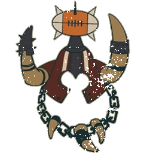

# Ogros — EuroBowl 2026 (Tier 6, Team Budget 1140k)

> **#euro26** — [EuroBowl 2026](../../../source/tiers/eurobowl-2026.md). **BB 3ª temporada / BB2025.** Lista alineada con captura del builder (14 jugadores, sideline, Skill Gold). Posiciones: [`source/teams/ogros.md`](../../../source/teams/ogros.md).

> **Estado:** plantilla **desde captura** (nombres EN → español Nuffle). **Rerolls 70k**. No regenerar con `_build_rosters.py` (ver `SKIP_EMIT`). Tag: `eurobowl-2026-wip-competitive`.

## Presupuesto EuroBowl (tier 6)

| Concepto | Valor |
|----------|--------|
| **Tier** | 6 |
| **Team Budget (base)** | 1.140.000 M.O. |
| **Skill Gold (pool)** | 240.000 M.O. |
| **Flowing Funds (máx.)** | 40.000 M.O. |

*En la captura: **Team budget** 1175k / 1140k (**1140k** base + **35k** Flowing a presupuesto de equipo); **Skill Gold** 230k / 240k (**230k** gastados; **10k** del pool sin usar; **0k** Flowing a oro en esta repartición); **Flowing Funds** 35k / 40k (**5k** Flowing sin asignar).*

## Alineación

*En **negrita**, avances de Skill Gold. **Ogre Blocker** = **Ogro**; **Ogre Runt Punter** = **Runt Punter**; **Gnoblar Lineman** = **Gnoblar**.*

| Nº | Nombre | Posición | Coste | MV | FU | AG | PS | AR | Habilidades |
|----|--------|----------|-------|----|----|----|----|----|-------------|
| 1 | ____ | Ogro | 140k | 5 | 5 | 4+ | 5+ | 10+ | Estúpido, Golpe mortífero(+1), Cabeza dura, Lanzar compañero, **Placar** |
| 2 | ____ | Ogro | 140k | 5 | 5 | 4+ | 5+ | 10+ | Estúpido, Golpe mortífero(+1), Cabeza dura, Lanzar compañero, **Placar** |
| 3 | ____ | Ogro | 140k | 5 | 5 | 4+ | 5+ | 10+ | Estúpido, Golpe mortífero(+1), Cabeza dura, Lanzar compañero, **Placar** |
| 4 | ____ | Ogro | 140k | 5 | 5 | 4+ | 5+ | 10+ | Estúpido, Golpe mortífero(+1), Cabeza dura, Lanzar compañero, **Abrirse paso** |
| 5 | ____ | Ogro | 140k | 5 | 5 | 4+ | 5+ | 10+ | Estúpido, Golpe mortífero(+1), Cabeza dura, Lanzar compañero, **Abrirse paso** |
| 6 | ____ | Runt Punter | 145k | 5 | 5 | 4+ | 4+ | 10+ | Estúpido, Golpe mortífero(+1), Cabeza dura, Chutar compañero, **Líder** |
| 7 | ____ | Gnoblar | 15k | 5 | 1 | 3+ | 4+ | 6+ | Canijo, Esquivar, Echarse a un lado, Escurridizo, Humanoide bala, **Placaje heroico** |
| 8 | ____ | Gnoblar | 15k | 5 | 1 | 3+ | 4+ | 6+ | Canijo, Esquivar, Echarse a un lado, Escurridizo, Humanoide bala |
| 9 | ____ | Gnoblar | 15k | 5 | 1 | 3+ | 4+ | 6+ | Canijo, Esquivar, Echarse a un lado, Escurridizo, Humanoide bala |
| 10 | ____ | Gnoblar | 15k | 5 | 1 | 3+ | 4+ | 6+ | Canijo, Esquivar, Echarse a un lado, Escurridizo, Humanoide bala |
| 11 | ____ | Gnoblar | 15k | 5 | 1 | 3+ | 4+ | 6+ | Canijo, Esquivar, Echarse a un lado, Escurridizo, Humanoide bala |
| 12 | ____ | Gnoblar | 15k | 5 | 1 | 3+ | 4+ | 6+ | Canijo, Esquivar, Echarse a un lado, Escurridizo, Humanoide bala |
| 13 | ____ | Gnoblar | 15k | 5 | 1 | 3+ | 4+ | 6+ | Canijo, Esquivar, Echarse a un lado, Escurridizo, Humanoide bala |
| 14 | ____ | Gnoblar | 15k | 5 | 1 | 3+ | 4+ | 6+ | Canijo, Esquivar, Echarse a un lado, Escurridizo, Humanoide bala |

**Total jugadores:** 14 | **Suma jugadores:** 965.000 M.O.

**Desglose presupuesto de equipo (captura):**

| Concepto | Coste |
|----------|--------|
| Jugadores (5×140k + 1×145k + 8×15k) | 965.000 |
| Rerolls de equipo (3 × 70.000) | 210.000 |
| Apotecario | No (captura) |
| Asistentes / cheerleaders / Hinchas | 0 |
| **Total presupuesto equipo** | **1.175.000** |
| **Team Budget base (tier 6)** | 1.140.000 |
| **Flowing Funds → presupuesto equipo** | 35.000 |
| **Comprobación** | 1.140.000 + 35.000 = **1.175.000** |

<!-- habilidades-roster:inicio -->
## Habilidades del roster

*Definición de todas las habilidades y rasgos de los jugadores de esta lista (de serie y compradas). Generado con `scripts/habilidades_en_rosters.py`.*

- **[Abrirse paso](../../../source/habilidades/fuerza.md)** (*Break Tackle* · Fuerza · Activa): **Una vez por turno**, al **intentar esquivar**: **+1** al AG si **FU ≤ 3**, **+2** si **FU = 4**, **+3** si **FU ≥ 5**.
- **[Cabeza dura](../../../source/habilidades/fuerza.md)** (*Thick Skull* · Fuerza · Pasiva): Tirada de **Heridas**: **Inconsciente** solo con **9**; **8** = **Aturdido**. Con **Escurridizo**: Inconsciente con **8**, **7** = Aturdido.
- **[Canijo](../../../source/habilidades/rasgos.md)** (*Titchy* · Rasgo · Pasiva (obligatoria)): **+1** al AG al **esquivar**. Rivales que esquivan **hacia** una casilla en su ZD: **no** aplica el **-1** por él marcarlos.
- **[Chutar compañero](../../../source/habilidades/rasgos.md)** (*Kick Team-mate* · Rasgo · Pasiva): **Chutar compañero** (**1**/turno): como **Lanzar compañero** salvo que **no** cuenta como la acción de lanzar del equipo ese turno. **Pifia**: Heridas al chutado (Aturdido=Inconsciente); si llevaba balón → rebote. Mismas habilidades/rasgos aplicables que lanzar; SPP como en Lanzar compañero.
- **[Echarse a un lado](../../../source/habilidades/agilidad.md)** (*Side Step* · Agilidad · Activa): Si es **empujado** por cualquier motivo, su entrenador elige una casilla **adyacente desocupada** (no el rival). Si **no hay** ninguna, la habilidad **no** se usa.
- **[Escurridizo](../../../source/habilidades/rasgos.md)** (*Stunty* · Rasgo · Pasiva (obligatoria)): Al **esquivar**, **sin** mods. negativos por marcadores rivales. **-1** al **interceptar**. Heridas en **tabla Escurridizos**.
- **[Esquivar](../../../source/habilidades/agilidad.md)** (*Dodge* · Agilidad · Activa (Elite)): **Una vez por turno** puede repetir un **único** chequeo de AG al **intentar esquivar**. Afecta al resultado **Desequilibrado** cuando un rival le hace un Placaje.
- **[Estúpido](../../../source/habilidades/rasgos.md)** (*Bone Head* · Rasgo · Pasiva (obligatoria)): Tras declarar acción: **1D6** **2+** OK; **1** = **Distraído**.
- **[Golpe mortífero](../../../source/habilidades/fuerza.md)** (*Mighty Blow* · Fuerza · Activa (Elite)): Si **derriba** a un rival en **Placaje** (aunque él también quede derribado), **+1** a **Armadura** **o** a **Heridas** (eliges **después** de tirar ese dado).
- **[Humanoide bala](../../../source/habilidades/rasgos.md)** (*Right Stuff* · Rasgo · Pasiva (obligatoria)): Puede ser **lanzado** aunque esté **tumbado boca arriba**.
- **[Lanzar compañero](../../../source/habilidades/rasgos.md)** (*Throw Team-Mate* · Rasgo · Activa): Puede declarar **Lanzar compañero**.
- **[Líder](../../../source/habilidades/pase.md)** (*Leader* · Pase · Pasiva): Con **≥1** con Líder **en campo** al inicio de cualquier mitad: gana **Segunda oportunidad de Líder** (como reroll normal salvo que **Chef Maestro Halfling** no la quite). Si **todos** los Líder salen **antes** de usarla, se **pierde**.
- **[Placaje heroico](../../../source/habilidades/agilidad.md)** (*Diving Tackle* · Agilidad · Activa): Rival que **esquivando, saltando o brincando** sale de su zona de defensa: **después** de su chequeo de AG (con mods. y repeticiones), este jugador aplica **-2** al rival y se coloca **tumbado boca arriba** en la casilla que deja. **Solo uno** por intento de salida si varios tienen la habilidad.
- **[Placar](../../../source/habilidades/general.md)** (*Block* · General · Activa (Elite)): En Placaje con **Ambos derribados** puede elegir **no** ser **derribado**.

<!-- habilidades-roster:fin -->

## Información del equipo

| Concepto | Valor |
|----------|--------|
| **Tier NAF / EuroBowl** | 6 |
| **Team Budget (captura)** | 1175k / 1140k (+35k Flowing) |
| **Skill Gold (captura)** | 230k / 240k |
| **Rerolls** | 3 |
| **Apotecario** | No (captura) |
| **Inducements** | Ninguno (captura) |
| **Reglas (captura EN)** | Badlands Brawl, Brawlin' Brutes, Low Cost Linemen |
| **Equivalencia repo (ES)** | **Reyerta en las Yermas** (Badlands), **Brutos brutales**, **Líneas Prescindibles** (`ogros.md` / Nuffle) |

## Skill Gold — avances (según captura)

**Siete** jugadores con **un** bloque de avance cada uno. Desglose que suma **230.000 M.O.** y respeta **máx. 3** avances **Secondary** y **máx. 3** primarias **élite** (#euro26):

| Jugador (Nº) | Habilidad | Tipo (referencia #euro26) | Coste Skill Gold |
|--------------|-----------|---------------------------|------------------|
| 1–3 Ogro | Placar (Block) | Sec. General no élite (×3) | 120.000 |
| 4–5 Ogro | Abrirse paso (Break Tackle) | Prim. Fuerza no élite (×2) | 40.000 |
| 6 Runt Punter | Líder (Leader) | Prim. Pase **élite** | 30.000 |
| 7 Gnoblar | Placaje heroico (Diving Tackle) | Prim. Agilidad no élite | 20.000 |
| **Total Skill Gold** | | | **230.000** |

**Límites #euro26:** **3** secundarios (los tres **Placar** en Ogro); **1** primaria **élite** (**Líder**); **0** Stack.

*Si el builder cobra **Placar** como primaria de Fuerza en Ogro en lugar de secundaria, los importes cambian (p. ej. 20k/30k élite) pero la suma debe seguir siendo **230k**.*

## Estrellas (Tiers 1–4)

Sin Veterans ni Legends en la captura.

## Inducements

Solo los permitidos en `eurobowl-2026.md`. Captura: ninguno.

## Estrategia (breve)

- **Ogros:** triple **Placar** (sec.) para cadena; **Abrirse paso** en dos para mover la línea; **Runt Punter** con **Líder** y **Chutar compañero**.
- **Gnoblars:** uno con **Placaje heroico** para cerrar salidas; resto de carne barata y **Canijo**.
- **Dado:** **3** rerolls a **70k** y **sin** apo — priorizar no quedarte sin activaciones por **Estúpido**.

## Progresión sugerida

Tras #euro26, seguir **F / FP / AD** en `ogros.md`; valorar apo en liga si el presupuesto lo permite.
