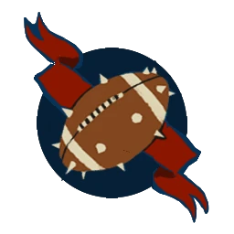

# Alianza del Viejo Mundo — EuroBowl 2026 (Tier 1, Team Budget 1060k)

> **#euro26** — [EuroBowl 2026](../../source/tiers/eurobowl-2026.md). **BB 3ª temporada / BB2025.** Posiciones y costes: [`source/teams/alianza-viejo-mundo.md`](../../source/teams/alianza-viejo-mundo.md).

> **Estado competitivo:** presupuesto EuroBowl válido en cifras; **sin revisión meta**. Repaso táctico pendiente — [README `eurobowl-2026`](README.md) · tag `eurobowl-2026-wip-competitive`.

## Presupuesto EuroBowl

| Concepto | Valor |
|----------|--------|
| **Tier** | 1 |
| **Team Budget (base)** | 1060.000 gp |
| **Skill Gold (pool)** | 120.000 gp |
| **Flowing Funds (máx.)** | 10.000 gp |

*Desglose de equipo = **1060k** gp (debe coincidir con Team Budget base + la parte de Flowing que asignes al equipo). Resto de Flowing puede ir a Skill Gold.*

## Alineación (gasto de presupuesto de equipo)

*Sin avances de Skill Gold. Rellenar nombres. Texto de habilidades resumido.*

| Nº | Nombre | Posición | Coste | MA | ST | AG | PA | AR | Habilidades |
|----|--------|----------|-------|----|----|----|----|----|-------------|
| 1 | ____ | Hombre Árbol | 120k | 2 | 6 | 5+ | 5+ | 11+ | GM, … |
| 2 | ____ | Ogro | 140k | 5 | 5 | 4+ | 5+ | 10+ | Estúpido, GM, … |
| 3 | ____ | Enano Blocker | 70k | 4 | 3 | 4+ | 5+ | 10+ | Cabeza dura, Placar, … |
| 4 | ____ | Enano Blocker | 70k | 4 | 3 | 4+ | 5+ | 10+ | Cabeza dura, Placar, … |
| 5 | ____ | Humano Blitzer | 85k | 7 | 3 | 3+ | 4+ | 9+ | Placaje def., Placar |
| 6 | ____ | Humano Blitzer | 85k | 7 | 3 | 3+ | 4+ | 9+ | Placaje def., Placar |
| 7 | ____ | Humano Thrower | 75k | 6 | 3 | 3+ | 3+ | 9+ | Manos seguras, Pasar |
| 8 | ____ | Humano Catcher | 75k | 8 | 3 | 3+ | 4+ | 8+ | Atrapar, Esquivar |
| 9 | ____ | Humano Línea | 50k | 6 | 3 | 3+ | 4+ | 9+ | – |
| 10 | ____ | Humano Línea | 50k | 6 | 3 | 3+ | 4+ | 9+ | – |
| 11 | ____ | Humano Línea | 50k | 6 | 3 | 3+ | 4+ | 9+ | – |
| 12 | ____ | Humano Línea | 50k | 6 | 3 | 3+ | 4+ | 9+ | – |
| 13 | ____ | Humano Línea | 50k | 6 | 3 | 3+ | 4+ | 9+ | – |

**Total jugadores:** 13 | **Presupuesto equipo usado:** 1060k gp

| Concepto | Coste |
|----------|--------|
| Jugadores (total 970k) | 970.000 |
| Rerolls (1 × 70.000) | 70.000 |
| Apotecario | No (lista del equipo) |
| Fans dedicados (2 × 10.000) | 20.000 |
| **Total** | **1.060.000** |

## Skill Gold — avances (ejemplo editable)

Cada jugador: **un solo bloque** de avance. Máx. **3** Secondary y **3** Stack en todo el equipo. Costes: ver tabla en [`eurobowl-2026.md`](../../source/tiers/eurobowl-2026.md).

| Jugador (Nº) | Tipo | Coste (Skill Gold) |
|--------------|------|---------------------|
| _pendiente_ | 1 primaria no élite | 20.000 |

**Pool Skill Gold base:** 120.000 gp (+ Flowing si lo asignas).

## Estrellas (Tiers 1–4)

Sin Veterans ni Legends. Con estrella (tier 5–6): no avances Secondary ni Stack en jugadores de plantilla.

## Inducements

Solo los listados como permitidos en `eurobowl-2026.md`.
