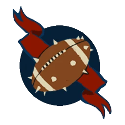

# Alianza del Viejo Mundo — EuroBowl 2026 (Tier 1, Team Budget 1060k)

> **#euro26** — [EuroBowl 2026](../../source/tiers/eurobowl-2026.md). **BB 3ª temporada / BB2025.** Lista alineada con captura del builder (vídeo [EuroBowl / listas — YouTube](https://www.youtube.com/watch?v=wrmKRBFNqcM)). Posiciones: [`source/teams/alianza-viejo-mundo.md`](../../source/teams/alianza-viejo-mundo.md).

> **Estado:** plantilla **desde captura**. **12 jugadores**. No regenerar con `_build_rosters.py` (ver `SKIP_EMIT`). Tag: `eurobowl-2026-wip-competitive`.

## Presupuesto EuroBowl (tier 1)

| Concepto | Valor |
|----------|--------|
| **Tier** | 1 |
| **Team Budget (base)** | 1.060.000 gp |
| **Skill Gold (pool)** | 120.000 gp |
| **Flowing Funds (máx.)** | 10.000 gp |

*En la captura: **Team budget** 1055k / 1060k (**1055k** gastados; **5k** del presupuesto base sin usar); **Skill Gold** 130k / 120k (**120k** pool + **10k** Flowing íntegros a Skill Gold = **130k** gastados en avances); **Flowing Funds** 10k / 10k.*

## Alineación

*En **negrita**, avances de Skill Gold. «**Dwarf Lineman**» en inglés GW = **Enano Blocker** (70k) en `alianza-viejo-mundo.md`.*

| Nº | Nombre | Posición | Coste | MA | ST | AG | PA | AR | Habilidades |
|----|--------|----------|-------|----|----|----|----|----|-------------|
| 1 | ____ | Hombre-Árbol | 120k | 2 | 6 | 5+ | 5+ | 11+ | Golpe Mortífero(+1), Mantenerse Firme, Brazo Fuerte, Echar Raíces, Cabeza Dura, Lanzar Compañero, ¡Tronco va! |
| 2 | ____ | Enano Blitzer | 100k | 5 | 3 | 4+ | 4+ | 10+ | Placar, Placaje Heroico, Placaje Defensivo, Cabeza Dura, **Vigilar** |
| 3 | ____ | Humano Blitzer | 85k | 7 | 3 | 3+ | 4+ | 9+ | Placar, Placaje Defensivo, **Golpe Mortífero** |
| 4 | ____ | Enano Blocker | 70k | 4 | 3 | 4+ | 5+ | 10+ | Placar, Romper Defensas, Cabeza Dura |
| 5 | ____ | Enano Blocker | 70k | 4 | 3 | 4+ | 5+ | 10+ | Placar, Romper Defensas, Cabeza Dura |
| 6 | ____ | Enano Blocker | 70k | 4 | 3 | 4+ | 5+ | 10+ | Placar, Romper Defensas, Cabeza Dura |
| 7 | ____ | Humano Catcher | 75k | 8 | 3 | 3+ | 4+ | 8+ | Atrapar, Esquivar, **Placar** |
| 8 | ____ | Humano Thrower | 75k | 6 | 3 | 3+ | 3+ | 9+ | Pasar, Manos Seguras, **Líder** |
| 9 | ____ | Humano Línea | 50k | 6 | 3 | 3+ | 4+ | 9+ | **Forcejeo** |
| 10 | ____ | Humano Línea | 50k | 6 | 3 | 3+ | 4+ | 9+ | — |
| 11 | ____ | Humano Línea | 50k | 6 | 3 | 3+ | 4+ | 9+ | — |
| 12 | ____ | Humano Línea | 50k | 6 | 3 | 3+ | 4+ | 9+ | — |

**Total jugadores:** 12 | **Suma jugadores:** 865.000 gp

**Desglose presupuesto de equipo (captura):**

| Concepto | Coste |
|----------|--------|
| Jugadores (120k + 100k + 85k + 3×70k + 75k + 75k + 4×50k) | 865.000 |
| Rerolls de equipo (2 × 70.000) | 140.000 |
| Apotecario | 50.000 |
| Asistentes / cheerleaders / fans dedicados | 0 |
| **Total gastado** | **1.055.000** |
| **Team Budget base (tier 1)** | 1.060.000 |
| **Presupuesto equipo sin usar (captura)** | 5.000 |

## Información del equipo

| Concepto | Valor |
|----------|--------|
| **Tier NAF / EuroBowl** | 1 |
| **Team Budget (captura)** | 1055k / 1060k (5k sin gastar) |
| **Skill Gold (captura)** | 130k / 120k (+10k Flowing) |
| **Rerolls** | 2 |
| **Apotecario** | Sí |
| **Inducements** | Ninguno |
| **Opción listas** | Sin estrellas |
| **Liga (captura EN)** | Old World Classic |
| **Equivalencia repo (ES)** | **Clásica del Viejo Mundo** (`alianza-viejo-mundo.md`) |

## Skill Gold — avances (según captura)

**Cinco** jugadores con **un** bloque de avance cada uno. Desglose que suma **130.000 gp** (**120k** pool + **10k** Flowing a Skill Gold):

| Nº | Jugador | Habilidad (EN → ES) | Tipo (referencia #euro26) | Coste Skill Gold |
|----|---------|---------------------|---------------------------|------------------|
| 2 Enano Blitzer | Guard → **Vigilar** | Sec. Fuerza no élite | 40.000 |
| 3 Humano Blitzer | Mighty Blow → **Golpe Mortífero** | Prim. Fuerza **élite** | 30.000 |
| 7 Humano Catcher | Block → **Placar** | Prim. General no élite | 20.000 |
| 8 Humano Thrower | Leader → **Líder** | Prim. General no élite | 20.000 |
| 9 Humano Línea | Wrestle → **Forcejeo** | Prim. General no élite | 20.000 |
| **Total Skill Gold** | | | **130.000** |

**Límites #euro26:** **1** secundario (**Vigilar**); **1** primaria **élite** (**Golpe Mortífero**); **0** Stack.

*Si el builder etiqueta **Vigilar** como primaria de Fuerza en Enano Blitzer, el coste puede ser **20k/30k** en lugar de secundaria; ajusta la tabla manteniendo **130k** y los techos del pack.*

## Estrellas (Tiers 1–4)

Sin Veterans ni Legends en la captura. Listas: [`eurobowl-2026.md`](../../source/tiers/eurobowl-2026.md).

## Inducements

Solo los permitidos en `eurobowl-2026.md`. Captura: ninguno.

## Estrategia (breve)

- **Enano Blitzer** con **Vigilar** y kit de placajes; **Humano Blitzer** con **Golpe Mortífero** para cadena.
- **Balón:** Catcher con **Placar**; Thrower con **Líder** y **Manos Seguras**.
- **Línea:** **Forcejeo** en un Humano Línea; **Hombre-Árbol** para Lanzar compañero y anclaje.

## Progresión sugerida

Tras #euro26, seguir tablas **GF / DG / GP / AG** de `alianza-viejo-mundo.md` por posición.
