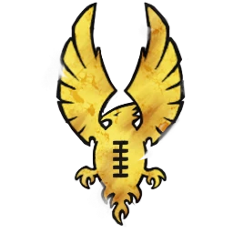

# Altos Elfos — EuroBowl 2026 (Tier 3, Team Budget 1080k)

> **#euro26** — [EuroBowl 2026](../../source/tiers/eurobowl-2026.md). **BB 3ª temporada / BB2025.** Lista alineada con captura del builder (vídeo [EuroBowl / listas — YouTube](https://www.youtube.com/watch?v=wrmKRBFNqcM)). Posiciones y nombres de lista: [`source/teams/altos-elfos.md`](../../source/teams/altos-elfos.md).

> **Estado:** plantilla **desde captura**. **11 jugadores**. No regenerar con `_build_rosters.py` (ver `SKIP_EMIT`). Tag: `eurobowl-2026-wip-competitive`.

## Presupuesto EuroBowl (tier 3)

| Concepto | Valor |
|----------|--------|
| **Tier** | 3 |
| **Team Budget (base)** | 1.080.000 gp |
| **Skill Gold (pool)** | 160.000 gp |
| **Flowing Funds (máx.)** | 30.000 gp |

*En la captura: **Team budget** 1080k / 1080k; **Skill Gold** 190k / 160k (**160k** pool + **30k** Flowing a Skill Gold = **190k** en avances); **Flowing Funds** 30k / 30k.*

## Alineación

*En **negrita**, avances de Skill Gold. Nombres EN del builder → español en `altos-elfos.md`. El roster [`inicio-1000k-altos-elfos-1000k.md`](../iniciales/inicio-1000k-altos-elfos-1000k.md) **no asigna dorsales**; los **Nº 1–11** de esta tabla son **orden de fila** en Euro hasta que los unifiques con tu inicial.*

| Nº | Nombre | Posición | Coste | MA | FU | AG | PA | AR | Habilidades |
|----|--------|----------|-------|----|----|----|----|-----|-------------|
| 1 | ____ | Alto Elfo Dragon Warrior | 110k | 8 | 3 | 2+ | 4+ | 9+ | Placar, El Balón es Mío, Equilibrio Firme, **Esquivar** |
| 2 | ____ | Alto Elfo Dragon Warrior | 110k | 8 | 3 | 2+ | 4+ | 9+ | Placar, El Balón es Mío, Equilibrio Firme, **Esquivar** |
| 3 | ____ | Alto Elfo White Lion Blitzer | 110k | 7 | 3 | 2+ | 3+ | 9+ | Forcejear, Garras, **Esquivar**, **Robar Balón** |
| 4 | ____ | Alto Elfo White Lion Blitzer | 110k | 7 | 3 | 2+ | 3+ | 9+ | Forcejear, Garras, **Esquivar** |
| 5 | ____ | Alto Elfo Phoenix Prince Thrower | 90k | 6 | 3 | 2+ | 2+ | 9+ | Partenubes, Pasar, Pase Seguro, **Líder** |
| 6 | ____ | Alto Elfo Línea | 65k | 6 | 3 | 2+ | 3+ | 9+ | **Forcejeo** |
| 7 | ____ | Alto Elfo Línea | 65k | 6 | 3 | 2+ | 3+ | 9+ | — |
| 8 | ____ | Alto Elfo Línea | 65k | 6 | 3 | 2+ | 3+ | 9+ | — |
| 9 | ____ | Alto Elfo Línea | 65k | 6 | 3 | 2+ | 3+ | 9+ | — |
| 10 | ____ | Alto Elfo Línea | 65k | 6 | 3 | 2+ | 3+ | 9+ | — |
| 11 | ____ | Alto Elfo Línea | 65k | 6 | 3 | 2+ | 3+ | 9+ | — |

**Total jugadores:** 11 | **Suma jugadores:** 920.000 gp

**Desglose presupuesto de equipo (captura):**

| Concepto | Coste |
|----------|--------|
| Jugadores (2×110k + 2×110k + 90k + 6×65k) | 920.000 |
| Rerolls de equipo (2 × 50.000) | 100.000 |
| Apotecario | 50.000 |
| Asistentes (1 × 10.000) | 10.000 |
| Cheerleaders / fans dedicados | 0 |
| **Total gastado** | **1.080.000** |
| **Team Budget base (tier 3)** | 1.080.000 |

## Información del equipo

| Concepto | Valor |
|----------|--------|
| **Tier NAF / EuroBowl** | 3 |
| **Team Budget (captura)** | 1080k / 1080k |
| **Skill Gold (captura)** | 190k / 160k (+30k Flowing) |
| **Flowing Funds (captura)** | 30k / 30k |
| **Rerolls** | 2 |
| **Apotecario** | Sí |
| **Asistentes** | 1 |
| **Inducements** | Ninguno |
| **Opción listas** | Sin estrellas |
| **Liga (captura EN)** | Elven Kingdom League |
| **Equivalencia repo (ES)** | **Liga de los Reinos Élficos** (`altos-elfos.md`) |

## Skill Gold — avances (según captura)

**Seis** jugadores con **un** bloque de avance cada uno (White Lion #3 usa **Stack** de dos primarias). Desglose que suma **190.000 gp**:

| Nº | Jugador | Habilidad (EN → ES) | Tipo (referencia #euro26) | Coste Skill Gold |
|----|---------|---------------------|---------------------------|------------------|
| 1 Dragon Warrior | Dodge → **Esquivar** | Prim. Agilidad no élite | 20.000 |
| 2 Dragon Warrior | Dodge → **Esquivar** | Prim. Agilidad no élite | 20.000 |
| 3 White Lion | Dodge + Strip Ball → **Esquivar** + **Robar Balón** | **Stack** (2× prim. no élite) | 50.000 |
| 4 White Lion | Dodge → **Esquivar** | Sec. General no élite | 40.000 |
| 5 Phoenix Thrower | Leader → **Líder** | Prim. General no élite | 20.000 |
| 6 Línea | Wrestle → **Forcejeo** | Sec. General no élite | 40.000 |
| **Total Skill Gold** | | | **190.000** |

**Límites #euro26:** **1** Stack; **2** secundarios (**Esquivar** en White Lion #4, **Forcejeo** en Línea); **0** primarias **élite**.

*Si el builder marca **Esquivar** en White Lion #4 como **primaria** de Agilidad (20k), el total baja **20k**; compensa con otra reclasificación permitida por el pack o revisa el export del torneo.*

## Estrellas (Tiers 1–4)

Sin Veterans ni Legends en la captura. Listas: [`eurobowl-2026.md`](../../source/tiers/eurobowl-2026.md).

## Inducements

Solo los permitidos en `eurobowl-2026.md`. Captura: ninguno.

## Estrategia (breve)

- **Dragon Warrior** con **Placar**, **El Balón es Mío** y **Esquivar** para portadores duros.
- **White Lion** con **Garras** y cadena **Esquivar** / **Robar Balón** en uno de ellos.
- **Phoenix** con **Líder** y pase **Partenubes** + **Pase Seguro**; **Línea** con **Forcejeo** para bajar rivales.

## Progresión sugerida

Tras #euro26, seguir tablas **AG / GP / PF** de `altos-elfos.md` por posición.
