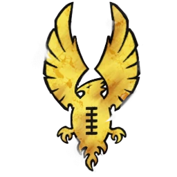

# Altos Elfos — EuroBowl 2026 (Tier 3)

> **#euro26 · [reglamento EuroBowl 2026](../../source/tiers/eurobowl-2026.md).** Posiciones y costes: [`source/teams/altos-elfos.md`](../../source/teams/altos-elfos.md). Generado con `_build_rosters.py`.
>
> **Origen de la build:** [AndyDavo — Eurobowl Ruleset Review 2026](https://www.youtube.com/watch?v=wrmKRBFNqcM) (abr. 2026, reglamento preliminar), con el ajuste de [Artemis Black — Road to Eurobowl 2026](https://www.youtube.com/watch?v=yI7pBwzeecE) (sept. 2026).
>
> **Estado competitivo:** válida en cifras; revisión táctica propia pendiente.

## Presupuesto

| Concepto | Disponible | Usado |
|----------|-----------|-------|
| **Presupuesto de equipo** | 1.080.000 M.O. | 1.080.000 M.O. |
| **Skill Gold** | 160.000 M.O. | 190.000 M.O. |
| **Flowing Funds** | 30.000 M.O. | 0 → equipo · 30.000 → Skill Gold |

## Alineación

*Rellenar nombres. Habilidades compradas con Skill Gold en **negrita**.*

| Nº | Nombre | Posición | Coste | MV | FU | AG | PS | AR | Habilidades | Skill Gold |
|----|--------|----------|-------|----|----|----|----|----|-------------|------------|
| 1 | ____ | Alto Elfo Dragon Warrior | 110k | 8 | 3 | 2+ | 4+ | 9+ | El balón es mío, Equilibrio firme, Placar, **Esquivar** | Primaria élite 30k |
| 2 | ____ | Alto Elfo Dragon Warrior | 110k | 8 | 3 | 2+ | 4+ | 9+ | El balón es mío, Equilibrio firme, Placar, **Esquivar** | Primaria élite 30k |
| 3 | ____ | Alto Elfo White Lion Blitzer | 110k | 7 | 3 | 2+ | 3+ | 9+ | Forcejear, Garras, **Esquivar**, **Placaje defensivo** | Stack 60k |
| 4 | ____ | Alto Elfo White Lion Blitzer | 110k | 7 | 3 | 2+ | 3+ | 9+ | Forcejear, Garras, **Esquivar** | Primaria élite 30k |
| 5 | ____ | Alto Elfo Phoenix Prince Thrower | 90k | 6 | 3 | 2+ | 2+ | 9+ | Partenubes, Pasar, Pase seguro, **Líder** | Primaria 20k |
| 6 | ____ | Alto Elfo Línea | 65k | 6 | 3 | 2+ | 3+ | 9+ | **Forcejear** | Primaria 20k |
| 7 | ____ | Alto Elfo Línea | 65k | 6 | 3 | 2+ | 3+ | 9+ | – | – |
| 8 | ____ | Alto Elfo Línea | 65k | 6 | 3 | 2+ | 3+ | 9+ | – | – |
| 9 | ____ | Alto Elfo Línea | 65k | 6 | 3 | 2+ | 3+ | 9+ | – | – |
| 10 | ____ | Alto Elfo Línea | 65k | 6 | 3 | 2+ | 3+ | 9+ | – | – |
| 11 | ____ | Alto Elfo Línea | 65k | 6 | 3 | 2+ | 3+ | 9+ | – | – |

**Total jugadores:** 11

| Concepto | Coste |
|----------|--------|
| Jugadores | 920.000 |
| Segundas oportunidades (2 × 50.000) | 100.000 |
| Apotecario | 50.000 |
| Ayudantes del entrenador (1 × 10.000) | 10.000 |
| **Total** | **1.080.000** |

<!-- habilidades-roster:inicio -->
## Habilidades del roster

*Definición de todas las habilidades y rasgos de los jugadores de esta lista (de serie y compradas). Generado con `scripts/habilidades_en_rosters.py`.*

- **[El balón es mío](../../source/habilidades/rasgos.md)** (*My Ball* · Rasgo · Pasiva (obligatoria)): Portador: **no** puede soltar voluntariamente (ni Pase, Entregar, ni habilidades que cedan balón). Solo suelta por derribo/caída/tumba o efecto **rival**.
- **[Equilibrio firme](../../source/habilidades/general.md)** (*Steady Footing* · General · Activa): Al ir a ser **derribado** o **caerse** por cualquier motivo: **1D6**; con **6** **no** cae (sin Armadura ni **cambio de turno**); si es en **su activación**, la continúa. **No** se activa si queda **tumbado** sin ser «derribado»/«caerse» (p. ej. **Forcejear**, **Motosierra**) (FAQ).
- **[Esquivar](../../source/habilidades/agilidad.md)** (*Dodge* · Agilidad · Activa (Elite)): **Una vez por turno** puede repetir un **único** chequeo de AG al **intentar esquivar**. Afecta al resultado **Desequilibrado** cuando un rival le hace un Placaje.
- **[Forcejear](../../source/habilidades/general.md)** (*Wrestle* · General · Activa): En **Placaje** (activo o como blanco), si aplicaría **Ambos derribados**, puede usarla: **ambos** quedan **tumbados boca arriba**, sin importar otras habilidades.
- **[Garras](../../source/habilidades/mutaciones.md)** (*Claws* · Mutaciones · Pasiva): Tirada de **Armadura** vs rival **derribado** en **Placaje** (aunque él también caiga): **8+ natural** en el dado de armadura **rompe** armadura sea cual sea **AR** del rival.
- **[Líder](../../source/habilidades/pase.md)** (*Leader* · Pase · Pasiva): Con **≥1** con Líder **en campo** al inicio de cualquier mitad: gana **Segunda oportunidad de Líder** (como reroll normal salvo que **Chef Maestro Halfling** no la quite). Si **todos** los Líder salen **antes** de usarla, se **pierde**.
- **[Partenubes](../../source/habilidades/pase.md)** (*Cloud Burster* · Pase · Activa): En su **Pase**, rivales **no** pueden **interceptar**.
- **[Pasar](../../source/habilidades/pase.md)** (*Pass* · Pase · Activa): Puede **repetir** cualquier chequeo de **Pase** fallido en acción de **Pase**.
- **[Pase seguro](../../source/habilidades/pase.md)** (*Safe Pass* · Pase · Activa): **1 natural** en chequeo de Pase: **no** balón perdido; **mantiene** balón y **termina activación** (sin cambio de turno).
- **[Placaje defensivo](../../source/habilidades/general.md)** (*Tackle* · General · Activa): Rival que **esquive** para salir de su zona de defensa **no** puede usar **Esquivar**. Si **él** hace un Placaje y sale **Desequilibrado**, el rival se trata **como sin Esquivar**.
- **[Placar](../../source/habilidades/general.md)** (*Block* · General · Activa (Elite)): En Placaje con **Ambos derribados** puede elegir **no** ser **derribado**.

<!-- habilidades-roster:fin -->

## Skill Gold

Un avance por jugador. Secundarias: **0/3** · Stacks: **1/3**.

| Jugador (Nº) | Avance | Tipo | Coste |
|--------------|--------|------|-------|
| 1 Alto Elfo Dragon Warrior | Esquivar | Primaria élite | 30.000 |
| 2 Alto Elfo Dragon Warrior | Esquivar | Primaria élite | 30.000 |
| 3 Alto Elfo White Lion Blitzer | Esquivar + Placaje defensivo | Stack | 60.000 |
| 4 Alto Elfo White Lion Blitzer | Esquivar | Primaria élite | 30.000 |
| 5 Alto Elfo Phoenix Prince Thrower | Líder | Primaria | 20.000 |
| 6 Alto Elfo Línea | Forcejear | Primaria | 20.000 |
| **Total** | | | **190.000** |

## Notas de la build

- Esquivar en los 2 Dragon Warriors y los 2 White Lions, Líder en el Phoenix; 2 segundas oportunidades + apotecario + ayudante (patrón de Artemis Black).
- Cambio: el stack del White Lion pasa de Esquivar + Robar balón a Esquivar + Placaje defensivo, la preferencia de Artemis Black; mismo coste (60k).
- Tier 3 igual en el reglamento de abril y en el actual: presupuesto y Skill Gold idénticos (Flowing 30k → Skill Gold).
