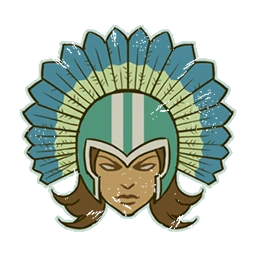

# Amazonas — EuroBowl 2026 FINAL (Tier 2)

> **#euro26 · reglamento [FINAL](../../source/tiers/eurobowl-2026-final.md).** Posiciones y costes: [`source/teams/amazonas.md`](../../source/teams/amazonas.md). Generado con `_build_final.py`.
>
> **Origen de la build:** [AndyDavo — Eurobowl Ruleset Review 2026](https://www.youtube.com/watch?v=wrmKRBFNqcM) (abr. 2026, BETA); mismo tier y presupuesto en FINAL, sin cambios.
>
> **Estado competitivo:** válida en cifras; revisión táctica propia pendiente.

## Presupuesto

| Concepto | Disponible | Usado |
|----------|-----------|-------|
| **Presupuesto de equipo** | 1.070.000 M.O. | 1.070.000 M.O. |
| **Skill Gold** | 140.000 M.O. | 160.000 M.O. |
| **Flowing Funds** | 20.000 M.O. | 0 → equipo · 20.000 → Skill Gold |

## Alineación

*Rellenar nombres. Habilidades compradas con Skill Gold en **negrita**.*

| Nº | Nombre | Posición | Coste | MV | FU | AG | PS | AR | Habilidades | Skill Gold |
|----|--------|----------|-------|----|----|----|----|----|-------------|------------|
| 1 | ____ | Guerrera Jaguar Blocker | 110k | 6 | 4 | 3+ | 4+ | 9+ | Esquivar, Romper defensas, **Placar** | Primaria élite 30k |
| 2 | ____ | Guerrera Jaguar Blocker | 110k | 6 | 4 | 3+ | 4+ | 9+ | Esquivar, Romper defensas, **Defensa** | Primaria élite 30k |
| 3 | ____ | Guerrera Piraña Blitzer | 90k | 7 | 3 | 3+ | 4+ | 8+ | Esquivar, Golpe a la carrera, En pie de un salto, **Placar** | Primaria élite 30k |
| 4 | ____ | Guerrera Piraña Blitzer | 90k | 7 | 3 | 3+ | 4+ | 8+ | Esquivar, Golpe a la carrera, En pie de un salto, **Placar** | Primaria élite 30k |
| 5 | ____ | Guerrera Pitón Thrower | 80k | 6 | 3 | 3+ | 3+ | 8+ | Atento al balón, Esquivar, Pasar, Pase seguro, **Líder** | Primaria 20k |
| 6 | ____ | Guerrera Águila Línea | 50k | 6 | 3 | 3+ | 4+ | 8+ | Esquivar, **Forcejear** | Primaria 20k |
| 7 | ____ | Guerrera Águila Línea | 50k | 6 | 3 | 3+ | 4+ | 8+ | Esquivar | – |
| 8 | ____ | Guerrera Águila Línea | 50k | 6 | 3 | 3+ | 4+ | 8+ | Esquivar | – |
| 9 | ____ | Guerrera Águila Línea | 50k | 6 | 3 | 3+ | 4+ | 8+ | Esquivar | – |
| 10 | ____ | Guerrera Águila Línea | 50k | 6 | 3 | 3+ | 4+ | 8+ | Esquivar | – |
| 11 | ____ | Guerrera Águila Línea | 50k | 6 | 3 | 3+ | 4+ | 8+ | Esquivar | – |
| 12 | ____ | Guerrera Águila Línea | 50k | 6 | 3 | 3+ | 4+ | 8+ | Esquivar | – |
| 13 | ____ | Guerrera Águila Línea | 50k | 6 | 3 | 3+ | 4+ | 8+ | Esquivar | – |

**Total jugadores:** 13

| Concepto | Coste |
|----------|--------|
| Jugadores | 880.000 |
| Segundas oportunidades (2 × 60.000) | 120.000 |
| Apotecario | 50.000 |
| Ayudantes del entrenador (2 × 10.000) | 20.000 |
| **Total** | **1.070.000** |

<!-- habilidades-roster:inicio -->
## Habilidades del roster

*Definición de todas las habilidades y rasgos de los jugadores de esta lista (de serie y compradas). Generado con `scripts/habilidades_en_rosters.py`.*

- **[Atento al balón](../../source/habilidades/pase.md)** (*On the Ball* · Pase · Activa): Tras **objetivo** de **Pase** rival y **antes** del chequeo de Pase: mueve **hasta 3** (sin forzar marcha); si **cae**, termina el movimiento y sigue el pase. Varios con la habilidad **uno tras otro**. Tras **desvío** en inicio, **un** desmarcado receptor puede mover **hasta 3** antes del evento de patada (**no** con recepción libre; **no** cruzar mitad rival).
- **[Defensa](../../source/habilidades/fuerza.md)** (*Guard* · Fuerza · Activa (Elite)): Siempre puede **apoyar** (ofensivo y defensivo) en Placajes aunque lo marquen **varios** rivales.
- **[En pie de un salto](../../source/habilidades/agilidad.md)** (*Jump Up* · Agilidad · Activa): **Tumbado boca arriba:** puede levantarse sin gastar **tres** casillas de movimiento. Puede declarar **Placaje** estando así: chequeo de **AG con +1**; si falla, sigue tumbado y termina la activación.
- **[Esquivar](../../source/habilidades/agilidad.md)** (*Dodge* · Agilidad · Activa (Elite)): **Una vez por turno** puede repetir un **único** chequeo de AG al **intentar esquivar**. Afecta al resultado **Desequilibrado** cuando un rival le hace un Placaje.
- **[Forcejear](../../source/habilidades/general.md)** (*Wrestle* · General · Activa): En **Placaje** (activo o como blanco), si aplicaría **Ambos derribados**, puede usarla: **ambos** quedan **tumbados boca arriba**, sin importar otras habilidades.
- **[Golpe a la carrera](../../source/habilidades/agilidad.md)** (*Hit and Run* · Agilidad · Activa): Tras **Placaje** o acción especial **Apuñalar**, si sigue **en pie**: mueve **1 casilla** gratis ignorando zonas de defensa; al acabar **no** puede estar marcado ni marcando. **No** puede tener **Furia**.
- **[Líder](../../source/habilidades/pase.md)** (*Leader* · Pase · Pasiva): Con **≥1** con Líder **en campo** al inicio de cualquier mitad: gana **Segunda oportunidad de Líder** (como reroll normal salvo que **Chef Maestro Halfling** no la quite). Si **todos** los Líder salen **antes** de usarla, se **pierde**.
- **[Pasar](../../source/habilidades/pase.md)** (*Pass* · Pase · Activa): Puede **repetir** cualquier chequeo de **Pase** fallido en acción de **Pase**.
- **[Pase seguro](../../source/habilidades/pase.md)** (*Safe Pass* · Pase · Activa): **1 natural** en chequeo de Pase: **no** balón perdido; **mantiene** balón y **termina activación** (sin cambio de turno).
- **[Placar](../../source/habilidades/general.md)** (*Block* · General · Activa (Elite)): En Placaje con **Ambos derribados** puede elegir **no** ser **derribado**.
- **[Romper defensas](../../source/habilidades/agilidad.md)** (*Defensive* · Agilidad · Activa): En **turnos rivales**, rivales que esté **marcando** no pueden usar **Defensa** ni **Meter la bota**.

<!-- habilidades-roster:fin -->

## Skill Gold

Un avance por jugador. Secundarias: **0/3** · Stacks: **0/3**.

| Jugador (Nº) | Avance | Tipo | Coste |
|--------------|--------|------|-------|
| 1 Guerrera Jaguar Blocker | Placar | Primaria élite | 30.000 |
| 2 Guerrera Jaguar Blocker | Defensa | Primaria élite | 30.000 |
| 3 Guerrera Piraña Blitzer | Placar | Primaria élite | 30.000 |
| 4 Guerrera Piraña Blitzer | Placar | Primaria élite | 30.000 |
| 5 Guerrera Pitón Thrower | Líder | Primaria | 20.000 |
| 6 Guerrera Águila Línea | Forcejear | Primaria | 20.000 |
| **Total** | | | **160.000** |

## Notas de la build

- Placar en las Pirañas y en una Jaguar; Defensa en la otra Jaguar; Líder en la Pitón.
- 13 jugadores con Esquivar de base; 2 ayudantes del entrenador.
- Tier 2 igual en BETA y FINAL (1070k / 140k / 20k): la lista se mantiene.
