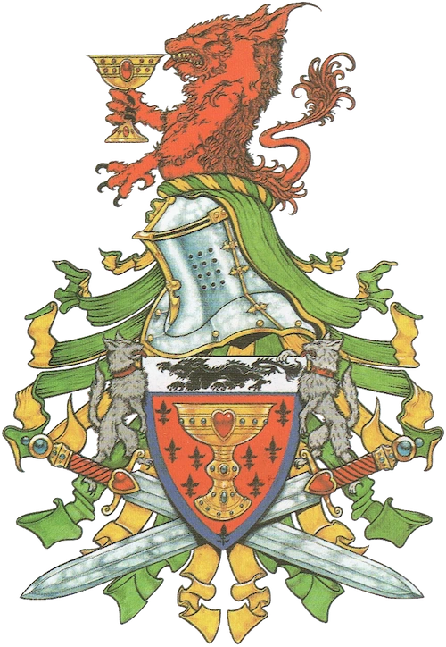

# Bretonia — EuroBowl 2026 (Tier 5, Team Budget 1120k)

> **#euro26** — [EuroBowl 2026](../../source/tiers/eurobowl-2026.md). **BB 3ª temporada / BB2025.** Posiciones y costes: [`source/teams/bretonia.md`](../../source/teams/bretonia.md).

> **Build de referencia:** [AndyDavo — Eurobowl Ruleset Review 2026](https://www.youtube.com/watch?v=wrmKRBFNqcM) (abr. 2026, ruleset previo a `EB2026_04`), revalidada contra las fichas BB2025 actuales y [`eurobowl-2026.md`](../../source/tiers/eurobowl-2026.md).
>
> **Estado competitivo:** build de un comentarista, **sin revisión propia**. — [README `eurobowl-2026`](README.md) · tag `eurobowl-2026-wip-competitive`.

## Presupuesto EuroBowl

| Concepto | Disponible | Usado |
|----------|-----------|-------|
| **Tier** | 5 | |
| **Team Budget** | 1.120.000 M.O. | 1.120.000 M.O. |
| **Skill Gold** | 220.000 M.O. | 250.000 M.O. |
| **Flowing Funds** | 30.000 M.O. | 0 → equipo · 30.000 → Skill Gold |

## Alineación

*Rellenar nombres. Habilidades de Skill Gold en **negrita**.*

| Nº | Nombre | Posición | Coste | MV | FU | AG | PS | AR | Habilidades | Skill Gold |
|----|--------|----------|-------|----|----|----|----|----|-------------|------------|
| 1 | ____ | Caballero del Grial | 95k | 7 | 3 | 3+ | 4+ | 10+ | Agallas, Equilibrio firme, Placar, **Defensa** | Primaria élite 30k |
| 2 | ____ | Caballero del Grial | 95k | 7 | 3 | 3+ | 4+ | 10+ | Agallas, Equilibrio firme, Placar, **Defensa** | Primaria élite 30k |
| 3 | ____ | Caballero Receptor | 85k | 7 | 3 | 3+ | 4+ | 9+ | Agallas, Atrapar, Nervios de acero, **Placar**, **Esquivar** | Stack 70k |
| 4 | ____ | Caballero Receptor | 85k | 7 | 3 | 3+ | 4+ | 9+ | Agallas, Atrapar, Nervios de acero, **Placar**, **Esquivar** | Stack 70k |
| 5 | ____ | Caballero Lanzador | 80k | 6 | 3 | 3+ | 3+ | 9+ | Agallas, Pasar, Nervios de acero, **Forcejear** | Primaria 20k |
| 6 | ____ | Caballero Lanzador | 80k | 6 | 3 | 3+ | 3+ | 9+ | Agallas, Pasar, Nervios de acero, **Placar** | Primaria élite 30k |
| 7 | ____ | Escuderos | 50k | 6 | 3 | 3+ | 4+ | 8+ | Forcejear | – |
| 8 | ____ | Escuderos | 50k | 6 | 3 | 3+ | 4+ | 8+ | Forcejear | – |
| 9 | ____ | Escuderos | 50k | 6 | 3 | 3+ | 4+ | 8+ | Forcejear | – |
| 10 | ____ | Escuderos | 50k | 6 | 3 | 3+ | 4+ | 8+ | Forcejear | – |
| 11 | ____ | Escuderos | 50k | 6 | 3 | 3+ | 4+ | 8+ | Forcejear | – |
| 12 | ____ | Escuderos | 50k | 6 | 3 | 3+ | 4+ | 8+ | Forcejear | – |
| 13 | ____ | Escuderos | 50k | 6 | 3 | 3+ | 4+ | 8+ | Forcejear | – |

**Total jugadores:** 13

| Concepto | Coste |
|----------|--------|
| Jugadores | 870.000 |
| Rerolls (3 × 60.000) | 180.000 |
| Apotecario | 50.000 |
| Ayudantes del entrenador (2 × 10.000) | 20.000 |
| **Total** | **1.120.000** |

## Skill Gold — avances

Un bloque por jugador. Secundarias: **0/3** · Stacks: **2/3**. Costes: [`eurobowl-2026.md`](../../source/tiers/eurobowl-2026.md).

| Jugador (Nº) | Avance | Tipo | Coste |
|--------------|--------|------|-------|
| 1 Caballero del Grial | Defensa | Primaria élite | 30.000 |
| 2 Caballero del Grial | Defensa | Primaria élite | 30.000 |
| 3 Caballero Receptor | Placar + Esquivar | Stack | 70.000 |
| 4 Caballero Receptor | Placar + Esquivar | Stack | 70.000 |
| 5 Caballero Lanzador | Forcejear | Primaria | 20.000 |
| 6 Caballero Lanzador | Placar | Primaria élite | 30.000 |
| **Total** | | | **250.000** |

## Notas de la build

- Sin estrella: los 6 posicionales y 13 jugadores.
- Alternativa de AndyDavo: Karla von Kill y/o The Mighty Zug como Veterans (sin Stacks ni Secundarias).

## Estrellas e incentivos

Sin estrellas. Incentivos solo de la lista permitida en `eurobowl-2026.md`.
