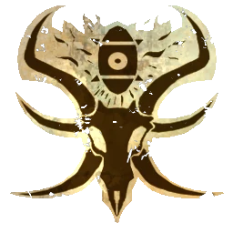

# Elegidos del Caos — EuroBowl 2026 FINAL (Tier 5)

> **#euro26 · reglamento [FINAL](../../source/tiers/eurobowl-2026-final.md).** Posiciones y costes: [`source/teams/elegidos-del-caos.md`](../../source/teams/elegidos-del-caos.md). Generado con `_build_final.py`.
>
> **Origen de la build:** [AndyDavo — Eurobowl Ruleset Review 2026](https://www.youtube.com/watch?v=wrmKRBFNqcM) (abr. 2026, BETA), adaptada al presupuesto FINAL (sube de tier 4 a tier 5).
>
> **Estado competitivo:** válida en cifras; revisión táctica propia pendiente.

## Presupuesto

| Concepto | Disponible | Usado |
|----------|-----------|-------|
| **Presupuesto de equipo** | 1.120.000 M.O. | 1.150.000 M.O. |
| **Skill Gold** | 220.000 M.O. | 220.000 M.O. |
| **Flowing Funds** | 30.000 M.O. | 30.000 → equipo · 0 → Skill Gold |

## Alineación

*Rellenar nombres. Habilidades compradas con Skill Gold en **negrita**.*

| Nº | Nombre | Posición | Coste | MV | FU | AG | PS | AR | Habilidades | Skill Gold |
|----|--------|----------|-------|----|----|----|----|----|-------------|------------|
| 1 | ____ | Ogro del Caos | 140k | 5 | 5 | 4+ | 5+ | 10+ | Estúpido, Solitario (4+), Golpe mortífero, Cabeza dura, Lanzar compañero, **Defensa** | Primaria élite 30k |
| 2 | ____ | Guerrero Caos | 100k | 5 | 4 | 3+ | 5+ | 10+ | Llave de brazo, **Placar** | Primaria élite 30k |
| 3 | ____ | Guerrero Caos | 100k | 5 | 4 | 3+ | 5+ | 10+ | Llave de brazo, **Placar** | Primaria élite 30k |
| 4 | ____ | Guerrero Caos | 100k | 5 | 4 | 3+ | 5+ | 10+ | Llave de brazo, **Placar** | Primaria élite 30k |
| 5 | ____ | Guerrero Caos | 100k | 5 | 4 | 3+ | 5+ | 10+ | Llave de brazo, **Placar** | Primaria élite 30k |
| 6 | ____ | Beastman | 55k | 6 | 3 | 3+ | 3+ | 9+ | Cuernos, Cabeza dura, **Placar** | Primaria élite 30k |
| 7 | ____ | Beastman | 55k | 6 | 3 | 3+ | 3+ | 9+ | Cuernos, Cabeza dura, **Forcejear** | Primaria 20k |
| 8 | ____ | Beastman | 55k | 6 | 3 | 3+ | 3+ | 9+ | Cuernos, Cabeza dura, **Forcejear** | Primaria 20k |
| 9 | ____ | Beastman | 55k | 6 | 3 | 3+ | 3+ | 9+ | Cuernos, Cabeza dura | – |
| 10 | ____ | Beastman | 55k | 6 | 3 | 3+ | 3+ | 9+ | Cuernos, Cabeza dura | – |
| 11 | ____ | Beastman | 55k | 6 | 3 | 3+ | 3+ | 9+ | Cuernos, Cabeza dura | – |
| 12 | ____ | Beastman | 55k | 6 | 3 | 3+ | 3+ | 9+ | Cuernos, Cabeza dura | – |

**Total jugadores:** 12

| Concepto | Coste |
|----------|--------|
| Jugadores | 925.000 |
| Segundas oportunidades (3 × 50.000) | 150.000 |
| Apotecario | 50.000 |
| Incentivo: Mascota del equipo (1 × 25.000) | 25.000 |
| **Total** | **1.150.000** |

## Skill Gold

Un avance por jugador. Secundarias: **0/3** · Stacks: **0/3**.

| Jugador (Nº) | Avance | Tipo | Coste |
|--------------|--------|------|-------|
| 1 Ogro del Caos | Defensa | Primaria élite | 30.000 |
| 2 Guerrero Caos | Placar | Primaria élite | 30.000 |
| 3 Guerrero Caos | Placar | Primaria élite | 30.000 |
| 4 Guerrero Caos | Placar | Primaria élite | 30.000 |
| 5 Guerrero Caos | Placar | Primaria élite | 30.000 |
| 6 Beastman | Placar | Primaria élite | 30.000 |
| 7 Beastman | Forcejear | Primaria | 20.000 |
| 8 Beastman | Forcejear | Primaria | 20.000 |
| **Total** | | | **220.000** |

## Notas de la build

- Placar en los cuatro Guerreros del Caos y Defensa en el Ogro: línea FU4 muy sólida.
- El Skill Gold de la build original (220k) cuadra exacto con el nuevo tier 5.
- Con los 20k extra de equipo más 30k de Flowing se ficha un 12.º jugador (Beastman): AndyDavo jugaba con solo 11.
