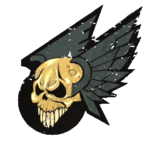

# Elfos Oscuros — EuroBowl 2026 (Tier 3, Team Budget 1080k)

> **#euro26** — [EuroBowl 2026](../../source/tiers/eurobowl-2026.md). **BB 3ª temporada / BB2025.** Lista alineada con captura del builder (vídeo [EuroBowl / listas — YouTube](https://www.youtube.com/watch?v=wrmKRBFNqcM)). Posiciones: [`source/teams/elfos-oscuros.md`](../../source/teams/elfos-oscuros.md).

> **Estado:** plantilla **desde captura**. **11 jugadores**. No regenerar con `_build_rosters.py` (ver `SKIP_EMIT`). Tag: `eurobowl-2026-wip-competitive`.

## Presupuesto EuroBowl (tier 3)

| Concepto | Valor |
|----------|--------|
| **Tier** | 3 |
| **Team Budget (base)** | 1.080.000 gp |
| **Skill Gold (pool)** | 160.000 gp |
| **Flowing Funds (máx.)** | 30.000 gp |

*En la captura: **Team budget** 1075k / 1080k (**1075k** gastados; **5k** del presupuesto base sin usar); **Skill Gold** 190k / 160k (**160k** pool + **30k** Flowing a Skill Gold = **190k** en avances); **Flowing Funds** 30k / 30k.*

## Alineación

*En **negrita**, avances de Skill Gold. Las **tres** líneas sin subidas cuestan **65k** cada una en lista BB2025 (la captura EN puede mostrar **50k** por error de etiqueta en el builder; aquí se usa el coste de `elfos-oscuros.md`).*

| Nº | Nombre | Posición | Coste | MA | FU | AG | PA | AR | Habilidades |
|----|--------|----------|-------|----|----|----|----|-----|-------------|
| 1 | ____ | Bruja Elfa | 110k | 7 | 3 | 2+ | 4+ | 8+ | Esquivar, Furia, En Pie de un Salto, **Forcejeo** |
| 2 | ____ | Bruja Elfa | 110k | 7 | 3 | 2+ | 4+ | 8+ | Esquivar, Furia, En Pie de un Salto, **Forcejeo** |
| 3 | ____ | Elfo Oscuro Blitzer | 105k | 7 | 3 | 2+ | 3+ | 9+ | Placar, **Esquivar** |
| 4 | ____ | Elfo Oscuro Blitzer | 105k | 7 | 3 | 2+ | 3+ | 9+ | Placar, **Esquivar** |
| 5 | ____ | Elfo Oscuro Asesino | 90k | 7 | 3 | 2+ | 4+ | 8+ | Golpe a la Carrera, Perseguir, Apuñalar, **Esquivar** |
| 6 | ____ | Elfo Oscuro Runner | 80k | 7 | 3 | 2+ | 3+ | 8+ | Pase Precipitado, Patada de Despeje, **Líder** |
| 7 | ____ | Elfo Oscuro Línea | 65k | 6 | 3 | 2+ | 3+ | 9+ | **Forcejeo** |
| 8 | ____ | Elfo Oscuro Línea | 65k | 6 | 3 | 2+ | 3+ | 9+ | **Forcejeo** |
| 9 | ____ | Elfo Oscuro Línea | 65k | 6 | 3 | 2+ | 3+ | 9+ | — |
| 10 | ____ | Elfo Oscuro Línea | 65k | 6 | 3 | 2+ | 3+ | 9+ | — |
| 11 | ____ | Elfo Oscuro Línea | 65k | 6 | 3 | 2+ | 3+ | 9+ | — |

**Total jugadores:** 11 | **Suma jugadores:** 925.000 gp

**Desglose presupuesto de equipo (captura):**

| Concepto | Coste |
|----------|--------|
| Jugadores (2×110k + 2×105k + 90k + 80k + 5×65k) | 925.000 |
| Rerolls de equipo (2 × 50.000) | 100.000 |
| Apotecario | 50.000 |
| Asistentes / cheerleaders / fans dedicados | 0 |
| **Total gastado** | **1.075.000** |
| **Team Budget base (tier 3)** | 1.080.000 |
| **Presupuesto equipo sin usar (captura)** | 5.000 |

## Información del equipo

| Concepto | Valor |
|----------|--------|
| **Tier NAF / EuroBowl** | 3 |
| **Team Budget (captura)** | 1075k / 1080k (5k sin gastar) |
| **Skill Gold (captura)** | 190k / 160k (+30k Flowing) |
| **Flowing Funds (captura)** | 30k / 30k |
| **Rerolls** | 2 |
| **Apotecario** | Sí |
| **Inducements** | Ninguno |
| **Opción listas** | Sin estrellas |
| **Liga (captura EN)** | Elven Kingdom League |
| **Equivalencia repo (ES)** | **Liga de los Reinos Élficos** (`elfos-oscuros.md`) |

## Skill Gold — avances (según captura)

**Ocho** jugadores con **un** bloque de avance cada uno. Desglose **orientativo** que suma **190.000 gp** (ajusta tipos si tu builder etiqueta distinto):

| Nº | Jugador | Habilidad (EN → ES) | Tipo (referencia #euro26) | Coste Skill Gold |
|----|---------|---------------------|---------------------------|------------------|
| 1 Bruja Elfa | Wrestle → **Forcejeo** | Sec. General no élite | 40.000 |
| 2 Bruja Elfa | Wrestle → **Forcejeo** | Prim. General no élite | 20.000 |
| 3 Blitzer | Dodge → **Esquivar** | Prim. Agilidad no élite | 20.000 |
| 4 Blitzer | Dodge → **Esquivar** | Prim. Agilidad no élite | 20.000 |
| 5 Asesino | Dodge → **Esquivar** | Prim. Agilidad no élite | 20.000 |
| 6 Runner | Leader → **Líder** | Prim. General **élite** | 30.000 |
| 7 Línea | Wrestle → **Forcejeo** | Prim. General no élite | 20.000 |
| 8 Línea | Wrestle → **Forcejeo** | Prim. General no élite | 20.000 |
| **Total Skill Gold** | | | **190.000** |

**Límites #euro26:** **1** secundario en este desglose; **1** primaria **élite**; **0** Stack.

*Si **Forcejeo** en Brujas / Líneas cuenta todo como **secundaria** (40k), el total sube por encima de **190k** salvo que otras filas bajen de coste (p. ej. **Líder** no élite a **20k**). Mantén **190k** y los techos del pack al alinear con el export del torneo.*

## Estrellas (Tiers 1–4)

Sin Veterans ni Legends en la captura. Listas: [`eurobowl-2026.md`](../../source/tiers/eurobowl-2026.md).

## Inducements

Solo los permitidos en `eurobowl-2026.md`. Captura: ninguno.

## Estrategia (breve)

- **Brujas** con **Forcejeo** y **Furia** para cadena y bajar portadores; **Blitzers** con **Placar** y **Esquivar** en cabeza.
- **Asesino** con **Esquivar** y kit de **Apuñalar** / **Perseguir**; **Runner** con **Líder** y despeje.
- **Líneas** con **Forcejeo** en dos piezas y tres **65k** «limpios» para marcaje y TV.

## Progresión sugerida

Tras #euro26, seguir tablas **AG / AD / DF / GF / GP** de `elfos-oscuros.md` por posición.
