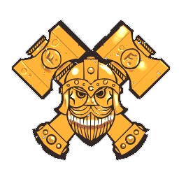

# Enanos — EuroBowl 2026 (Tier 4, Team Budget 1100k)

> **#euro26** — [EuroBowl 2026](../../source/tiers/eurobowl-2026.md). **BB 3ª temporada / BB2025.** Lista alineada con captura del builder en YouTube (*Blood Bowl Eurobowl Ruleset Review — 2026*, canal **AndyDavo's Blood Bowl**). Posiciones y habilidades base: [`source/teams/enanos.md`](../../source/teams/enanos.md). En inglés GW la posición **Troll Slayer** = **MataTrols** en la ficha en español del repo.

> **Estado:** plantilla **desde captura**. **11 jugadores** (sin Apisonadora Enana en esta lista). No regenerar con `_build_rosters.py` (ver `SKIP_EMIT`). Tag: `eurobowl-2026-wip-competitive`.

## Presupuesto EuroBowl (tier 4)

| Concepto | Valor |
|----------|--------|
| **Tier** | 4 |
| **Team Budget (base)** | 1.100.000 gp |
| **Skill Gold (pool)** | 190.000 gp |
| **Flowing Funds (máx.)** | 30.000 gp |

*En la captura: **Team budget** 1095k / 1100k (**1095k** gastados; **5k** sin usar); **Skill Gold** 220k / 190k (**190k** pool + **30k** Flowing a Skill Gold = **220k** en avances); **Flowing Funds** 30k / 30k.*

## Alineación

*En **negrita**, avances de Skill Gold. **Nº** como en la captura del builder (1–11).*

| Nº | Nombre | Posición | Coste | MA | FU | AG | PA | AR | Habilidades |
|----|--------|----------|-------|----|----|----|----|-----|-------------|
| 1 | ____ | MataTrols | 95k | 5 | 3 | 4+ | 5+ | 9+ | Placar, Agallas, Furia, Cabeza Dura, Odio (Troll), **Golpe Mortífero** |
| 2 | ____ | MataTrols | 95k | 5 | 3 | 4+ | 5+ | 9+ | Placar, Agallas, Furia, Cabeza Dura, Odio (Troll), **Vigilar** |
| 3 | ____ | Enano Blitzer | 100k | 5 | 3 | 4+ | 4+ | 10+ | Placar, Placaje Heroico, Placaje Defensivo, Cabeza Dura, **Vigilar**, **Mantenerse Firme** |
| 4 | ____ | Enano Blitzer | 100k | 5 | 3 | 4+ | 4+ | 10+ | Placar, Placaje Heroico, Placaje Defensivo, Cabeza Dura, **Vigilar**, **Mantenerse Firme** |
| 5 | ____ | Enano Runner | 80k | 6 | 3 | 3+ | 4+ | 9+ | Esprintar, Manos Seguras, Cabeza Dura, **Líder** |
| 6 | ____ | Enano Runner | 80k | 6 | 3 | 3+ | 4+ | 9+ | Esprintar, Manos Seguras, Cabeza Dura, **Forcejeo** |
| 7 | ____ | Enano Línea | 70k | 4 | 3 | 4+ | 5+ | 10+ | Placar, Romper Defensas, Cabeza Dura |
| 8 | ____ | Enano Línea | 70k | 4 | 3 | 4+ | 5+ | 10+ | Placar, Romper Defensas, Cabeza Dura |
| 9 | ____ | Enano Línea | 70k | 4 | 3 | 4+ | 5+ | 10+ | Placar, Romper Defensas, Cabeza Dura |
| 10 | ____ | Enano Línea | 70k | 4 | 3 | 4+ | 5+ | 10+ | Placar, Romper Defensas, Cabeza Dura |
| 11 | ____ | Enano Línea | 70k | 4 | 3 | 4+ | 5+ | 10+ | Placar, Romper Defensas, Cabeza Dura |

**Total jugadores:** 11 | **Suma jugadores:** 900.000 gp

**Desglose presupuesto de equipo (captura):**

| Concepto | Coste |
|----------|--------|
| Jugadores (2×95k + 2×100k + 2×80k + 5×70k) | 900.000 |
| Rerolls de equipo (2 × 60.000) | 120.000 |
| Apotecario | 50.000 |
| Team Mascot (×1; inducement permitido #euro26, **25k** según lista común GW / ver [`eurobowl-26-orcos-tier2.md`](eurobowl-26-orcos-tier2.md)) | 25.000 |
| Asistentes / cheerleaders / fans dedicados | 0 |
| **Total gastado** | **1.095.000** |
| **Team Budget base (tier 4)** | 1.100.000 |
| **Presupuesto equipo sin usar (captura)** | 5.000 |

## Información del equipo

| Concepto | Valor |
|----------|--------|
| **Tier NAF / EuroBowl** | 4 |
| **Team Budget (captura)** | 1095k / 1100k (5k sin gastar) |
| **Skill Gold (captura)** | 220k / 190k (+30k Flowing) |
| **Flowing Funds (captura)** | 30k / 30k |
| **Rerolls** | 2 |
| **Apotecario** | Sí |
| **Team Mascot** | 1 |
| **Inducements** | Ninguno más |
| **Opción listas** | Sin estrellas |
| **Ligas / reglas (captura EN)** | Worlds Edge Superleague; Brawlin' Brutes; Bribery and Corruption |
| **Equivalencia repo (ES)** | **Superliga del Fin del Mundo**; **Brutos Brutales**; **Soborno y Corrupción** (`enanos.md`) |

## Skill Gold — avances (según captura)

**Seis** bloques (cada Blitzer **#3** y **#4** usa **Stack** de dos habilidades). Desglose que suma **220.000 gp** (reclasifica si el export del torneo marca **Golpe Mortífero** / **Vigilar** (MataTrols #2) como primaria/secundaria distinta):

| Nº | Jugador | Habilidad (EN → ES) | Tipo (referencia #euro26) | Coste Skill Gold |
|----|---------|---------------------|---------------------------|------------------|
| 1 | MataTrols | Mighty Blow → **Golpe Mortífero** | Prim. General **élite** | 30.000 |
| 2 | MataTrols | Guard → **Vigilar** | Sec. Fuerza **élite** | 50.000 |
| 3 | Enano Blitzer | Guard + Stand Firm → **Vigilar** + **Mantenerse Firme** | **Stack** (2× prim. no élite) | 50.000 |
| 4 | Enano Blitzer | Guard + Stand Firm → **Vigilar** + **Mantenerse Firme** | **Stack** (2× prim. no élite) | 50.000 |
| 5 | Enano Runner | Leader → **Líder** | Prim. General no élite | 20.000 |
| 6 | Enano Runner | Wrestle → **Forcejeo** | Prim. General no élite | 20.000 |
| | **Total Skill Gold** | | | **220.000** |

*Si **Golpe Mortífero** en MataTrols **#1** cuenta como **primaria no élite** (20k), el total baja **10k**; sube **Vigilar** en MataTrols **#2** a **secundaria no élite** (40k) o ajusta otra fila permitida por el pack para mantener **220k**.*

**Límites #euro26:** **2** Stack (Blitzers **#3** y **#4**); **1** secundario **élite** (MataTrols **#2**); **0** secundarios no élite en este desglose base.

## Estrellas (Tiers 1–4)

Sin Veterans ni Legends en la captura. Listas: [`eurobowl-2026.md`](../../source/tiers/eurobowl-2026.md).

## Inducements

Solo los permitidos en `eurobowl-2026.md`. En presupuesto de equipo: **Team Mascot** (ver desglose arriba).

## Estrategia (breve)

- **MataTrols:** uno con **Golpe Mortífero** para heridas; el otro con **Vigilar** y cadena **Furia** / **Odio (Troll)**.
- **Blitzers:** doble **Stack** **Vigilar** + **Mantenerse Firme** con **Placaje Heroico** / **Placaje Defensivo** para anclaje y bajar esquivas.
- **Runners:** **Líder** y **Forcejeo** con **Manos Seguras** / **Esprintar**; cinco **Líneas** base a TV.

## Progresión sugerida

Tras #euro26, seguir tablas **DG / GP / GF / D** de `enanos.md` por posición.
