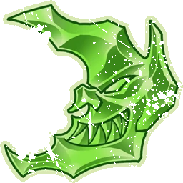

# Habitantes del Inframundo — EuroBowl 2026 (Tier 2, Team Budget 1070k)

> **#euro26** — [EuroBowl 2026](../../source/tiers/eurobowl-2026.md). **BB 3ª temporada / BB2025.** Lista alineada con captura del builder (vídeo [EuroBowl / listas — YouTube](https://www.youtube.com/watch?v=wrmKRBFNqcM)). Equipo mixto **Underworld Denizens**; referencia de habilidades: [`source/teams/skavens.md`](../../source/teams/skavens.md), [`source/teams/goblins.md`](../../source/teams/goblins.md), [`source/teams/snotlings.md`](../../source/teams/snotlings.md) y [`source/teams/habitantes-inframundo.md`](../../source/teams/habitantes-inframundo.md).

> **Estado:** plantilla **desde captura**. **15 jugadores**. No regenerar con `_build_rosters.py` (ver `SKIP_EMIT`). Tag: `eurobowl-2026-wip-competitive`.

## Presupuesto EuroBowl (tier 2)

| Concepto | Valor |
|----------|--------|
| **Tier** | 2 |
| **Team Budget (base)** | 1.070.000 gp |
| **Skill Gold (pool)** | 140.000 gp |
| **Flowing Funds (máx.)** | 20.000 gp |

*En la captura: **Team budget** 1070k / 1070k; **Skill Gold** 150k / 140k (**140k** pool + **10k** Flowing a Skill Gold = **150k** en avances); **Flowing Funds** 10k / 20k (**10k** de Flowing usados hacia Skill Gold; **10k** de Flowing máximo sin asignar en la lectura de la captura).*

## Alineación

*En **negrita**, avances de Skill Gold. **Animosidad (Goblin)** en captura EN = **Animosidad (Goblin)**.*

| Nº | Nombre | Posición | Coste | MA | FU | AG | PA | AR | Habilidades |
|----|--------|----------|-------|----|----|----|----|-----|-------------|
| 1 | ____ | Rata Ogro | 150k | 6 | 5 | 4+ | 6+ | 9+ | Ferocidad Animal, Furia, Solitario (4+), Golpe Mortífero, Cola Prensil, **Imparable** |
| 2 | ____ | Gutter Runner | 85k | 9 | 2 | 2+ | 4+ | 8+ | Animosidad (Goblin), Esquivar, Apuñalar, **Echarse a un Lado**, **Dos Cabezas** |
| 3 | ____ | Blitzer skaven | 90k | 8 | 3 | 3+ | 4+ | 9+ | Animosidad (Goblin), Placar, Robar Balón, **Derribar** |
| 4 | ____ | Clanrat skaven | 50k | 7 | 3 | 3+ | 4+ | 8+ | Animosidad (Goblin), **Forcejeo** |
| 5 | ____ | Clanrat skaven | 50k | 7 | 3 | 3+ | 4+ | 8+ | Animosidad (Goblin), **Jugar Sucio** |
| 6 | ____ | Clanrat skaven | 50k | 7 | 3 | 3+ | 4+ | 8+ | Animosidad (Goblin) |
| 7 | ____ | Lanzador skaven | 80k | 7 | 3 | 3+ | 2+ | 8+ | Animosidad (Goblin), Pasar, Manos Seguras, **Líder** |
| 8 | ____ | Goblin | 40k | 6 | 2 | 3+ | 4+ | 8+ | Esquivar, Humanoide Bala, Escurridizo |
| 9 | ____ | Goblin | 40k | 6 | 2 | 3+ | 4+ | 8+ | Esquivar, Humanoide Bala, Escurridizo |
| 10 | ____ | Goblin | 40k | 6 | 2 | 3+ | 4+ | 8+ | Esquivar, Humanoide Bala, Escurridizo |
| 11 | ____ | Goblin | 40k | 6 | 2 | 3+ | 4+ | 8+ | Esquivar, Humanoide Bala, Escurridizo |
| 12 | ____ | Goblin | 40k | 6 | 2 | 3+ | 4+ | 8+ | Esquivar, Humanoide Bala, Escurridizo |
| 13 | ____ | Snotling | 15k | 5 | 1 | 3+ | 4+ | 6+ | Esquivar, Insignificante, Humanoide Bala, Echarse a un Lado, Escurridizo, Canijo |
| 14 | ____ | Snotling | 15k | 5 | 1 | 3+ | 4+ | 6+ | Esquivar, Insignificante, Humanoide Bala, Echarse a un Lado, Escurridizo, Canijo |
| 15 | ____ | Snotling | 15k | 5 | 1 | 3+ | 4+ | 6+ | Esquivar, Insignificante, Humanoide Bala, Echarse a un Lado, Escurridizo, Canijo |

**Total jugadores:** 15 | **Suma jugadores:** 800.000 gp

**Desglose presupuesto de equipo (captura, cuadrando 1070k):**

| Concepto | Coste |
|----------|--------|
| Jugadores (150k + 85k + 90k + 3×50k + 80k + 5×40k + 3×15k) | 800.000 |
| Rerolls de equipo (2 × 50.000) | 100.000 |
| Apotecario | 0 (no en captura) |
| **Soborno** (×1; equipo con **Soborno y Corrupción** → **50.000** en reglamento GW BB2025) | 50.000 |
| **Biased Referee: Dodgy League Rep** (×1; precio **120.000** «cualquier equipo» en GW BB2025) | 120.000 |
| Asistentes / cheerleaders / fans dedicados | 0 |
| **Total gastado** | **1.070.000** |
| **Team Budget base (tier 2)** | 1.070.000 |

*Con **Soborno y Corrupción**, el **Dodgy League Rep** cuesta **80.000** en el reglamento GW (no 120k); entonces sumaría **1030k** con esta plantilla. La captura a **1070k** encaja tomando el representante a **120k** (precio sin descuento) o el builder aplica otra regla de precio; ajusta estas dos líneas si tu PDF de torneo o el export del builder marcan otra cifra.*

*Inducements en #euro26:* «**Bribes**» = **Soborno**; «**Dodgy League Rep**» = **Árbitro parcial: representante corrupto de la liga** (lista común GW).*

## Información del equipo

| Concepto | Valor |
|----------|--------|
| **Tier NAF / EuroBowl** | 2 |
| **Team Budget (captura)** | 1070k / 1070k |
| **Skill Gold (captura)** | 150k / 140k (+10k Flowing) |
| **Flowing Funds (captura)** | 10k / 20k |
| **Rerolls** | 2 |
| **Apotecario** | No |
| **Inducements** | Soborno (×1); Dodgy League Rep (×1) |
| **Opción listas** | Sin estrellas |
| **Ligas / reglas (captura EN)** | Underworld Challenge; Bribery and Corruption |
| **Equivalencia repo (ES)** | **Reto del Inframundo**; **Soborno y Corrupción** |

## Skill Gold — avances (según captura)

**Seis** jugadores con **un** bloque de avance cada uno (el Gutter Runner usa **Stack** de dos primarias). Desglose que suma **150.000 gp**:

| Nº | Jugador | Habilidad (EN → ES) | Tipo (referencia #euro26) | Coste Skill Gold |
|----|---------|---------------------|---------------------------|------------------|
| 1 Rata Ogro | Juggernaut → **Imparable** | Prim. Fuerza no élite | 20.000 |
| 2 Gutter Runner | Side Step + Two Heads → **Echarse a un Lado** + **Dos Cabezas** | **Stack** (2× prim. no élite) | 50.000 |
| 3 Blitzer skaven | Tackle → **Derribar** | Prim. General no élite | 20.000 |
| 4 Clanrat skaven | Wrestle → **Forcejeo** | Prim. General no élite | 20.000 |
| 5 Clanrat skaven | Dirty Player → **Jugar Sucio** | Prim. General no élite (según acceso Clanrat / pack) | 20.000 |
| 7 Lanzador skaven | Leader → **Líder** | Prim. General no élite | 20.000 |
| **Total Skill Gold** | | | **150.000** |

**Límites #euro26:** **1** Stack; **0** secundarios en este desglose; **0** primarias **élite**.

*Si **Jugar Sucio** aparece como otra categoría (p. ej. mutación / secundaria), reclasifica filas manteniendo **150k** y los techos del pack.*

## Estrellas (Tiers 1–4)

Sin Veterans ni Legends en la captura. Listas: [`eurobowl-2026.md`](../../source/tiers/eurobowl-2026.md).

## Inducements

Permitidos en `eurobowl-2026.md`. En roster: **Soborno** + **Dodgy League Rep** (costes según nota del desglose de presupuesto).

## Estrategia (breve)

- **Rata Ogro** con **Imparable** y cadena **Furia** / **Ferocidad Animal**; **Gutter** con **Echarse a un Lado** y **Dos Cabezas** para esquiva y apuñalar.
- **Blitzer** con **Derribar** y **Robar Balón**; **Clanrats** con **Forcejeo** / **Jugar Sucio**; **Lanzador** con **Líder**.
- **Masas:** cinco **Goblin** y tres **Snotling** para marcaje, balón y faltas; **Soborno** + **representante corrupto** para apoyo arbitral.

## Progresión sugerida

Tras #euro26, seguir accesos de skills por posición en listas GW / Nuffle **2025** para Underworld (skaven + goblin + snotling).
