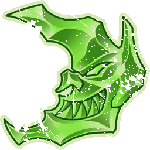

# Habitantes del Inframundo — EuroBowl 2026 FINAL (Tier 2)

> **#euro26 · reglamento [FINAL](../../source/tiers/eurobowl-2026-final.md).** Posiciones y costes: [`source/teams/habitantes-inframundo.md`](../../source/teams/habitantes-inframundo.md). Generado con `_build_final.py`.
>
> **Origen de la build:** [AndyDavo — Eurobowl Ruleset Review 2026](https://www.youtube.com/watch?v=wrmKRBFNqcM) (abr. 2026, BETA), ajustada con el cambio que propone el propio AndyDavo.
>
> **Estado competitivo:** válida en cifras; revisión táctica propia pendiente.

## Presupuesto

| Concepto | Disponible | Usado |
|----------|-----------|-------|
| **Presupuesto de equipo** | 1.070.000 M.O. | 1.070.000 M.O. |
| **Skill Gold** | 140.000 M.O. | 160.000 M.O. |
| **Flowing Funds** | 20.000 M.O. | 0 → equipo · 20.000 → Skill Gold |

## Alineación

*Rellenar nombres. Habilidades compradas con Skill Gold en **negrita**.*

| Nº | Nombre | Posición | Coste | MV | FU | AG | PS | AR | Habilidades | Skill Gold |
|----|--------|----------|-------|----|----|----|----|----|-------------|------------|
| 1 | ____ | Rata Ogro | 150k | 6 | 5 | 4+ | 6+ | 9+ | Cola prensil, Ferocidad animal, Furia, Golpe mortífero, Solitario (4+), **Imparable** | Primaria 20k |
| 2 | ____ | Gutter Runner | 85k | 9 | 2 | 2+ | 4+ | 8+ | Animosidad (Goblin), Apuñalar, Esquivar, **Echarse a un lado**, **Dos cabezas** | Stack 50k |
| 3 | ____ | Skaven Blitzer | 90k | 8 | 3 | 3+ | 4+ | 9+ | Animosidad (Goblin), Placar, Robar balón, **Golpe mortífero** | Primaria élite 30k |
| 4 | ____ | Skaven Thrower | 80k | 7 | 3 | 3+ | 2+ | 8+ | Animosidad (Goblin), Manos seguras, Pasar, **Líder** | Primaria 20k |
| 5 | ____ | Skaven Clanrat (Línea) | 50k | 7 | 3 | 3+ | 4+ | 8+ | Animosidad (Goblin), **Forcejear** | Primaria 20k |
| 6 | ____ | Skaven Clanrat (Línea) | 50k | 7 | 3 | 3+ | 4+ | 8+ | Animosidad (Goblin), **Jugar sucio** | Primaria 20k |
| 7 | ____ | Skaven Clanrat (Línea) | 50k | 7 | 3 | 3+ | 4+ | 8+ | Animosidad (Goblin) | – |
| 8 | ____ | Goblin Línea | 40k | 6 | 2 | 3+ | 4+ | 8+ | Escurridizo, Esquivar, Humanoide bala | – |
| 9 | ____ | Goblin Línea | 40k | 6 | 2 | 3+ | 4+ | 8+ | Escurridizo, Esquivar, Humanoide bala | – |
| 10 | ____ | Goblin Línea | 40k | 6 | 2 | 3+ | 4+ | 8+ | Escurridizo, Esquivar, Humanoide bala | – |
| 11 | ____ | Goblin Línea | 40k | 6 | 2 | 3+ | 4+ | 8+ | Escurridizo, Esquivar, Humanoide bala | – |
| 12 | ____ | Goblin Línea | 40k | 6 | 2 | 3+ | 4+ | 8+ | Escurridizo, Esquivar, Humanoide bala | – |
| 13 | ____ | Snotling Línea | 15k | 5 | 1 | 3+ | 4+ | 6+ | Canijo, Echarse a un lado, Escurridizo, Esquivar, Humanoide bala, Insignificante | – |
| 14 | ____ | Snotling Línea | 15k | 5 | 1 | 3+ | 4+ | 6+ | Canijo, Echarse a un lado, Escurridizo, Esquivar, Humanoide bala, Insignificante | – |
| 15 | ____ | Snotling Línea | 15k | 5 | 1 | 3+ | 4+ | 6+ | Canijo, Echarse a un lado, Escurridizo, Esquivar, Humanoide bala, Insignificante | – |

**Total jugadores:** 15

| Concepto | Coste |
|----------|--------|
| Jugadores | 800.000 |
| Segundas oportunidades (2 × 70.000) | 140.000 |
| Apotecario | No |
| Incentivo: Sobornos (1 × 50.000 (precio reducido por regla del equipo)) | 50.000 |
| Incentivo: Amañafaltas (1 × 80.000 (precio reducido por regla del equipo)) | 80.000 |
| **Total** | **1.070.000** |

<!-- habilidades-roster:inicio -->
## Habilidades del roster

*Definición de todas las habilidades y rasgos de los jugadores de esta lista (de serie y compradas). Generado con `scripts/habilidades_en_rosters.py`.*

- **[Animosidad](../../source/habilidades/rasgos.md)** (*Animosity* · Rasgo · Activa (obligatoria)): Al **Pasar** o **Entregar** a compañero con la **clave** entre paréntesis: **1D6**, **1** = se niega y termina activación. **(todos)** = afecta a **todos** los compañeros.
- **[Apuñalar](../../source/habilidades/rasgos.md)** (*Stab* · Rasgo · Activa): Acción **Apuñalar** (sin límite por turno): rival **en pie** adyacente, **Armadura** sin mods.; si rompe → **Heridas**. Puede **sustituir** Placaje en **Penetración** (activación termina igualmente).
- **[Canijo](../../source/habilidades/rasgos.md)** (*Titchy* · Rasgo · Pasiva (obligatoria)): **+1** al AG al **esquivar**. Rivales que esquivan **hacia** una casilla en su ZD: **no** aplica el **-1** por él marcarlos.
- **[Cola prensil](../../source/habilidades/mutaciones.md)** (*Prehensile Tail* · Mutaciones · Activa): **-1** adicional al AG de rivales que **esquivan, saltan o brincan** desde su zona de defensa. **Solo uno** por intento de salida.
- **[Dos cabezas](../../source/habilidades/mutaciones.md)** (*Two Heads* · Mutaciones · Activa): **+1** al AG al **intentar esquivar**.
- **[Echarse a un lado](../../source/habilidades/agilidad.md)** (*Side Step* · Agilidad · Activa): Si es **empujado** por cualquier motivo, su entrenador elige una casilla **adyacente desocupada** (no el rival). Si **no hay** ninguna, la habilidad **no** se usa.
- **[Escurridizo](../../source/habilidades/rasgos.md)** (*Stunty* · Rasgo · Pasiva (obligatoria)): Al **esquivar**, **sin** mods. negativos por marcadores rivales. **-1** al **interceptar**. Heridas en **tabla Escurridizos**.
- **[Esquivar](../../source/habilidades/agilidad.md)** (*Dodge* · Agilidad · Activa (Elite)): **Una vez por turno** puede repetir un **único** chequeo de AG al **intentar esquivar**. Afecta al resultado **Desequilibrado** cuando un rival le hace un Placaje.
- **[Ferocidad animal](../../source/habilidades/rasgos.md)** (*Animal Savagery* · Rasgo · Pasiva (obligatoria)): Tras declarar: **1D6** (**+2** si Placaje/Penetración). **4+** OK; **1–3** ataca **compañero adyacente en pie** (derribo); sin cambio de turno salvo que llevara el balón; con **Garras**/**Golpe mortífero** debe usarlos vs compañero; después puede seguir su activación (FAQ). **1–3** sin compañero adyacente → **Distraído**.
- **[Forcejear](../../source/habilidades/general.md)** (*Wrestle* · General · Activa): En **Placaje** (activo o como blanco), si aplicaría **Ambos derribados**, puede usarla: **ambos** quedan **tumbados boca arriba**, sin importar otras habilidades.
- **[Furia](../../source/habilidades/general.md)** (*Frenzy* · General · Activa (obligatoria)): Tras **empujar** en Placaje debe **impulso** si puede; si el blanco sigue **en pie**, **segundo Placaje** al mismo (e impulso otra vez). En **Penetración**, el segundo cuesta **movimiento**; si no puede forzar marcha, **no** hay segundo placaje. **No** **Apartar**, **Golpe a la carrera** ni **Placaje múltiple**.
- **[Golpe mortífero](../../source/habilidades/fuerza.md)** (*Mighty Blow* · Fuerza · Activa (Elite)): Si **derriba** a un rival en **Placaje** (aunque él también quede derribado), **+1** a **Armadura** **o** a **Heridas** (eliges **después** de tirar ese dado).
- **[Humanoide bala](../../source/habilidades/rasgos.md)** (*Right Stuff* · Rasgo · Pasiva (obligatoria)): Puede ser **lanzado** aunque esté **tumbado boca arriba**.
- **[Imparable](../../source/habilidades/fuerza.md)** (*Juggernaut* · Fuerza · Activa): En **Penetración**: cada **Ambos derribados** en sus Placajes cuenta como **Empujón**. Rivales **no** pueden **Forcejear**, **Mantenerse firme** ni **Zafarse** frente a sus Placajes en esa Penetración.
- **[Insignificante](../../source/habilidades/rasgos.md)** (*Insignificant* · Rasgo · Pasiva (obligatoria)): En plantilla: **no** más jugadores con este rasgo que **sin** él.
- **[Jugar sucio](../../source/habilidades/triquinuelas.md)** (*Dirty Player* · Triquiñuelas · Activa): En **Falta**: **+1** a **Armadura** o **Heridas** (eliges **después** de tirar ese dado).
- **[Líder](../../source/habilidades/pase.md)** (*Leader* · Pase · Pasiva): Con **≥1** con Líder **en campo** al inicio de cualquier mitad: gana **Segunda oportunidad de Líder** (como reroll normal salvo que **Chef Maestro Halfling** no la quite). Si **todos** los Líder salen **antes** de usarla, se **pierde**.
- **[Manos seguras](../../source/habilidades/general.md)** (*Sure Hands* · General · Activa): Puede **repetir** el **D6** al **recoger** el balón (**no** en **Asegurar el balón**). **Robar balón** **no** puede usarse contra él.
- **[Pasar](../../source/habilidades/pase.md)** (*Pass* · Pase · Activa): Puede **repetir** cualquier chequeo de **Pase** fallido en acción de **Pase**.
- **[Placar](../../source/habilidades/general.md)** (*Block* · General · Activa (Elite)): En Placaje con **Ambos derribados** puede elegir **no** ser **derribado**.
- **[Robar balón](../../source/habilidades/general.md)** (*Strip Ball* · General · Activa): Placaje al **portador** y **empuje**: el balón **cae y rebota** desde la casilla de destino **antes** de que el rival quede tumbado, pero **después** de que **este jugador** elija si hace **impulso**.
- **[Solitario](../../source/habilidades/rasgos.md)** (*Loner* · Rasgo · Pasiva (obligatoria)): Para usar **Segunda oportunidad**: **1D6** vs número entre paréntesis; si falla **no** repite pero **gasta** el reroll.

<!-- habilidades-roster:fin -->

## Skill Gold

Un avance por jugador. Secundarias: **0/3** · Stacks: **1/3**.

| Jugador (Nº) | Avance | Tipo | Coste |
|--------------|--------|------|-------|
| 1 Rata Ogro | Imparable | Primaria | 20.000 |
| 2 Gutter Runner | Echarse a un lado + Dos cabezas | Stack | 50.000 |
| 3 Skaven Blitzer | Golpe mortífero | Primaria élite | 30.000 |
| 4 Skaven Thrower | Líder | Primaria | 20.000 |
| 5 Skaven Clanrat (Línea) | Forcejear | Primaria | 20.000 |
| 6 Skaven Clanrat (Línea) | Jugar sucio | Primaria | 20.000 |
| **Total** | | | **160.000** |

## Notas de la build

- Rata Ogro con Imparable y Gutter Runner con Echarse a un lado + Dos cabezas: piezas de one-turn.
- Plan de faltas: Soborno + Amañafaltas (precio con Sobornos y corrupción) y Jugar sucio en un Clanrat.
- Cambio: el Skaven Blitzer pasa de Placaje defensivo a Golpe mortífero, como sugiere AndyDavo; los 10k que sobraban de Flowing lo pagan.
