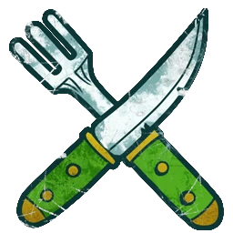

# Halflings — EuroBowl 2026 (Tier 6, Team Budget 1140k)

> **#euro26** — [EuroBowl 2026](../../source/tiers/eurobowl-2026.md). **BB 3ª temporada / BB2025.** Lista alineada con captura del builder (15 jugadores, 2 Veterans, inducement Maestro Cocinero). Posiciones: [`source/teams/halflings.md`](../../source/teams/halflings.md). Estrellas: [`grombrindal.md`](../../source/jugadores-estrella/grombrindal.md), [`rumbelow-sheepskin.md`](../../source/jugadores-estrella/rumbelow-sheepskin.md).

> **Estado:** plantilla **desde captura** (nombres EN → ES). No regenerar con `_build_rosters.py` (ver `SKIP_EMIT`). Tag: `eurobowl-2026-wip-competitive`.

## Presupuesto EuroBowl (tier 6)

| Concepto | Valor |
|----------|--------|
| **Tier** | 6 |
| **Team Budget (base)** | 1.140.000 gp |
| **Skill Gold (pool)** | 240.000 gp |
| **Flowing Funds (máx.)** | 40.000 gp |

*En la captura: **Team budget** 1160k / 1140k (**1140k** base + **20k** Flowing a presupuesto de equipo); **Skill Gold** 230k / 240k (**230k** gastados del pool **240k**, **10k** del pool sin asignar; **0k** Flowing a oro en esta repartición); **Flowing Funds** 20k / 40k.*

## Alineación

*En **negrita**, avances de Skill Gold en plantilla. **Altern Forest Treeman** = **Hombre-Árbol**. Catcher con **PA 4+** según captura (Nuffle 2025 lista **PA 5+** en tabla; ver nota en `halflings.md`).*

| Nº | Nombre | Posición | Coste | MA | ST | AG | PA | AR | Habilidades |
|----|--------|----------|-------|----|----|----|----|----|-------------|
| 1 | ____ | Hombre-Árbol | 120k | 2 | 6 | 5+ | 5+ | 11+ | Golpe Mortífero(+1), Mantenerse Firme, Brazo Fuerte, Echar Raíces, Cabeza Dura, Lanzar Compañero, ¡Tronco va!, **Ojo de Halcón** |
| 2 | ____ | Hombre-Árbol | 120k | 2 | 6 | 5+ | 5+ | 11+ | Golpe Mortífero(+1), Mantenerse Firme, Brazo Fuerte, Echar Raíces, Cabeza Dura, Lanzar Compañero, ¡Tronco va!, **Vigilar** |
| 3 | ____ | Halfling Catcher | 55k | 5 | 2 | 3+ | 4+ | 7+ | Atrapar, Esquivar, Humanoide Bala, Esprintar, Escurridizo, **Pies Firmes** |
| 4 | ____ | Halfling Catcher | 55k | 5 | 2 | 3+ | 4+ | 7+ | Atrapar, Esquivar, Humanoide Bala, Esprintar, Escurridizo, **Pies Firmes** |
| 5 | ____ | Halfling Hefty | 50k | 5 | 2 | 3+ | 3+ | 8+ | Esquivar, Zafarse, Escurridizo, **Líder** |
| 6 | ____ | Halfling Hefty | 50k | 5 | 2 | 3+ | 3+ | 8+ | Esquivar, Zafarse, Escurridizo, **Placaje Heroico** |
| 7 | ____ | Halfling Hopeful | 30k | 5 | 2 | 3+ | 4+ | 7+ | Esquivar, Humanoide Bala, Escurridizo, **Placaje Heroico** |
| 8 | ____ | Halfling Hopeful | 30k | 5 | 2 | 3+ | 4+ | 7+ | Esquivar, Humanoide Bala, Escurridizo |
| 9 | ____ | Halfling Hopeful | 30k | 5 | 2 | 3+ | 4+ | 7+ | Esquivar, Humanoide Bala, Escurridizo |
| 10 | ____ | Halfling Hopeful | 30k | 5 | 2 | 3+ | 4+ | 7+ | Esquivar, Humanoide Bala, Escurridizo |
| 11 | ____ | Halfling Hopeful | 30k | 5 | 2 | 3+ | 4+ | 7+ | Esquivar, Humanoide Bala, Escurridizo |
| 12 | ____ | Halfling Hopeful | 30k | 5 | 2 | 3+ | 4+ | 7+ | Esquivar, Humanoide Bala, Escurridizo |
| 13 | ____ | Halfling Hopeful | 30k | 5 | 2 | 3+ | 4+ | 7+ | Esquivar, Humanoide Bala, Escurridizo |
| 14 | Grombrindal | Estrella (Veteran) | 170k | 5 | 3 | 3+ | 4+ | 10+ | Ver ficha: Placar, Abrirse Paso, Agallas, GM, Mantenerse Firme, Pies Firmes, Cabeza Dura, Solitario (4+); **Sabiduría del Enano Blanco** |
| 15 | Rumbelow Sheepskin | Estrella (Veteran) | 170k | 6 | 3 | 3+ | 5+ | 8+ | Ver ficha: Placar, Cuernos, Imparable, Placaje Defensivo, Cabeza Dura, Solitario (4+); **Embestir** |

**Total jugadores:** 15 (13 plantilla + **2** Veterans) | **Suma costes en plantilla y estrellas:** 1.000.000 gp

**Desglose presupuesto de equipo (captura):**

| Concepto | Coste |
|----------|--------|
| Jugadores y estrellas (2×120k + 2×55k + 2×50k + 7×30k + 2×170k) | 1.000.000 |
| Rerolls de equipo (1 × 60.000) | 60.000 |
| Maestro Cocinero Halfling (inducement ×1) | 100.000 |
| Apotecario | No (captura) |
| Asistentes / cheer / fans | 0 |
| **Total presupuesto equipo** | **1.160.000** |
| **Team Budget base (tier 6)** | 1.140.000 |
| **Flowing Funds → presupuesto equipo** | 20.000 |
| **Comprobación** | 1.140.000 + 20.000 = **1.160.000** |

*Inducement **Halfling Master Chef** a **100.000 gp** según tabla común de inducements BB2025 (p. ej. resumen en [Nuffle Zone — Halflings](https://nufflezone.com/equipos-blood-bowl/halflings/)).*

## Información del equipo

| Concepto | Valor |
|----------|--------|
| **Tier NAF / EuroBowl** | 6 |
| **Opción listas (captura)** | Veterans (2) |
| **Veterans** | Grombrindal, Rumbelow Sheepskin |
| **Rerolls** | 1 |
| **Apotecario** | No (captura) |
| **Inducements** | Maestro Cocinero Halfling ×1 |
| **Liga (captura EN)** | Halfling Thimble Cup |
| **Equivalencia repo (ES)** | **Copa Dedal Halfling** (`halflings.md`) |

## Skill Gold — gasto (captura)

**Oro de habilidades gastado: 230.000 gp** (del pool **240.000 gp**; quedan **10.000 gp** del pool sin usar).

| Concepto | Coste Skill Gold |
|----------|------------------|
| Contratar **2** Veterans (40k c/u, tier 6, #euro26) | 80.000 |
| Avances en jugadores de plantilla (ver tabla siguiente) | 150.000 |
| **Total** | **230.000** |

### Avances en plantilla (7 jugadores, un bloque cada uno)

*Con **Veterans** en el equipo, #euro26 prohíbe avances **Secondary** y **Stack** en jugadores de plantilla; el desglose siguiente usa solo primarias (élite / no élite). Si tu pack o el builder tratan **Placaje Heroico** en Hefty como secundaria, hay que sustituir ese avance por una primaria permitida.*

| Nº | Jugador | Habilidad | Tipo (referencia #euro26) | Coste |
|----|---------|-----------|----------------------------|--------|
| 1 Hombre-Árbol | Ojo de Halcón (Bullseye) | Prim. Fuerza **élite** | 30.000 |
| 2 Hombre-Árbol | Vigilar (Guard) | Prim. Fuerza no élite | 20.000 |
| 3–4 Catcher | Pies Firmes (Sure Feet) | Prim. Agilidad no élite (×2) | 40.000 |
| 5 Hefty | Líder (Leader) | Prim. General no élite | 20.000 |
| 6 Hefty | Placaje Heroico (Diving Tackle) | Prim. Agilidad no élite (tratada como acceso **AP**/tabla Halfling) | 20.000 |
| 7 Hopeful | Placaje Heroico (Diving Tackle) | Prim. Agilidad no élite | 20.000 |
| | **Subtotal avances plantilla** | | **150.000** |

**Límites #euro26:** **1** primaria **élite** en plantilla (Ojo de Halcón); sin Stack ni secundarias declaradas en este desglose.

## Estrellas (Veterans)

Fichas completas y reglas de estrella:

- [Grombrindal — Sabiduría del Enano Blanco](../../source/jugadores-estrella/grombrindal.md) *(captura EN: Wisdom of the White Dwarf; texto de ficha en repo).*
- [Rumbelow Sheepskin — Embestir](../../source/jugadores-estrella/rumbelow-sheepskin.md) *(captura EN: Ram).*

## Inducements

**Maestro Cocinero Halfling** contratado en presupuesto de equipo (incluido arriba). Resto de inducements permitidos: [`eurobowl-2026.md`](../../source/tiers/eurobowl-2026.md).

## Estrategia (breve)

- **Veterans:** Grombrindal aporta **Sabiduría del Enano Blanco**; Rumbelow **Embestir** y penetración con **Imparable** / **Cuernos**.
- **Árboles:** **Ojo de Halcón** + **Vigilar** para apoyar **Lanzar compañero** y cajas.
- **Recepción / balón:** Catchers con **Pies Firmes** y **Esprintar**; Hefty con **Líder** y uno con **Placaje Heroico**; Hopeful con **Placaje Heroico** para cerrar salidas.
- **Meseta:** **Maestro Cocinero** + **1** reroll — gestionar **Solitario (4+)** en estrellas.

## Progresión sugerida

Tras #euro26, sin **Secondary**/**Stack** mientras sigan los Veterans; seguir tablas de `halflings.md` (Líneas, Hefty, Catcher, Hombre-Árbol).
