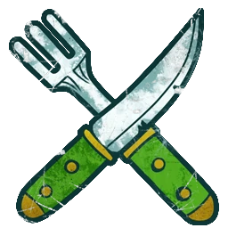

# Halflings — EuroBowl 2026 FINAL (Tier 6)

> **#euro26 · reglamento [FINAL](../../source/tiers/eurobowl-2026-final.md).** Posiciones y costes: [`source/teams/halflings.md`](../../source/teams/halflings.md). Generado con `_build_final.py`.
>
> **Origen de la build:** [AndyDavo — Eurobowl Ruleset Review 2026](https://www.youtube.com/watch?v=wrmKRBFNqcM) (abr. 2026, BETA) (opción Veterans), adaptada al presupuesto FINAL.
>
> **Estado competitivo:** válida en cifras; revisión táctica propia pendiente.

## Presupuesto

| Concepto | Disponible | Usado |
|----------|-----------|-------|
| **Presupuesto de equipo** | 1.140.000 M.O. | 1.160.000 M.O. |
| **Skill Gold** | 240.000 M.O. | 230.000 M.O. |
| **Flowing Funds** | 40.000 M.O. | 20.000 → equipo · 0 → Skill Gold |

## Alineación

*Rellenar nombres. Habilidades compradas con Skill Gold en **negrita**.*

| Nº | Nombre | Posición | Coste | MV | FU | AG | PS | AR | Habilidades | Skill Gold |
|----|--------|----------|-------|----|----|----|----|----|-------------|------------|
| 1 | ____ | Hombre Árbol del Bosque de Athel | 120k | 2 | 6 | 5+ | 5+ | 11+ | Golpe mortífero, Mantenerse firme, Brazo fuerte, Echar raíces, Cabeza dura, Lanzar compañero, ¡Tronco va!, **Ojo de halcón** | Primaria 20k |
| 2 | ____ | Hombre Árbol del Bosque de Athel | 120k | 2 | 6 | 5+ | 5+ | 11+ | Golpe mortífero, Mantenerse firme, Brazo fuerte, Echar raíces, Cabeza dura, Lanzar compañero, ¡Tronco va!, **Defensa** | Primaria élite 30k |
| 3 | ____ | Halfling Catcher | 55k | 5 | 2 | 3+ | 4+ | 7+ | Atrapar, Esquivar, Humanoide bala, Esprintar, Escurridizo, **Pies firmes** | Primaria 20k |
| 4 | ____ | Halfling Catcher | 55k | 5 | 2 | 3+ | 4+ | 7+ | Atrapar, Esquivar, Humanoide bala, Esprintar, Escurridizo, **Pies firmes** | Primaria 20k |
| 5 | ____ | Halfling Hefty | 50k | 5 | 2 | 3+ | 3+ | 8+ | Esquivar, Zafarse, Escurridizo, **Líder** | Primaria 20k |
| 6 | ____ | Halfling Hefty | 50k | 5 | 2 | 3+ | 3+ | 8+ | Esquivar, Zafarse, Escurridizo, **Placaje heroico** | Primaria 20k |
| 7 | ____ | Halfling Hopeful Línea | 30k | 5 | 2 | 3+ | 4+ | 7+ | Esquivar, Humanoide bala, Escurridizo, **Placaje heroico** | Primaria 20k |
| 8 | ____ | Halfling Hopeful Línea | 30k | 5 | 2 | 3+ | 4+ | 7+ | Esquivar, Humanoide bala, Escurridizo | – |
| 9 | ____ | Halfling Hopeful Línea | 30k | 5 | 2 | 3+ | 4+ | 7+ | Esquivar, Humanoide bala, Escurridizo | – |
| 10 | ____ | Halfling Hopeful Línea | 30k | 5 | 2 | 3+ | 4+ | 7+ | Esquivar, Humanoide bala, Escurridizo | – |
| 11 | ____ | Halfling Hopeful Línea | 30k | 5 | 2 | 3+ | 4+ | 7+ | Esquivar, Humanoide bala, Escurridizo | – |
| 12 | ____ | Halfling Hopeful Línea | 30k | 5 | 2 | 3+ | 4+ | 7+ | Esquivar, Humanoide bala, Escurridizo | – |
| 13 | ____ | Halfling Hopeful Línea | 30k | 5 | 2 | 3+ | 4+ | 7+ | Esquivar, Humanoide bala, Escurridizo | – |
| 14 | Grombrindal | Jugador estrella (Veteran) | 170k | | | | | | Ver [jugadores estrella](../../source/jugadores-estrella/README.md) | Recargo 40k |
| 15 | Rumbelow Sheepskin | Jugador estrella (Veteran) | 170k | | | | | | Ver [jugadores estrella](../../source/jugadores-estrella/README.md) | Recargo 40k |

**Total jugadores:** 15

| Concepto | Coste |
|----------|--------|
| Jugadores | 660.000 |
| Jugadores estrella | 340.000 |
| Segundas oportunidades (1 × 60.000) | 60.000 |
| Apotecario | No |
| Incentivo: Chef Maestro Halfling (1 × 100.000 (precio reducido por regla del equipo)) | 100.000 |
| **Total** | **1.160.000** |

<!-- habilidades-roster:inicio -->
## Habilidades del roster

*Definición de todas las habilidades y rasgos de los jugadores de esta lista (de serie y compradas). Generado con `scripts/habilidades_en_rosters.py`.*

- **[Abrirse paso](../../source/habilidades/fuerza.md)** (*Break Tackle* · Fuerza · Activa): **Una vez por turno**, al **intentar esquivar**: **+1** al AG si **FU ≤ 3**, **+2** si **FU = 4**, **+3** si **FU ≥ 5**.
- **[Agallas](../../source/habilidades/general.md)** (*Dauntless* · General · Activa): En **Placaje** contra rival con **FU mayor** (**antes** de mods.): **1D6 + FU** propia; si el total **>** FU **sin modificar** del rival, su FU **iguala** al rival **solo** para ese Placaje; luego mods. normales. Con **Furia**, una tirada **por** Placaje.
- **[Atrapar](../../source/habilidades/agilidad.md)** (*Catch* · Agilidad · Activa): Puede **repetir** cualquier chequeo de AG fallido al **intentar atrapar** el balón.
- **[Brazo fuerte](../../source/habilidades/fuerza.md)** (*Strong Arm* · Fuerza · Activa): En **Lanzar compañero**: **+1** al chequeo de **Pase**. Requiere el rasgo **Lanzar compañero**.
- **[Cabeza dura](../../source/habilidades/fuerza.md)** (*Thick Skull* · Fuerza · Pasiva): Tirada de **Heridas**: **Inconsciente** solo con **9**; **8** = **Aturdido**. Con **Escurridizo**: Inconsciente con **8**, **7** = Aturdido.
- **[Cuernos](../../source/habilidades/mutaciones.md)** (*Horns* · Mutaciones · Activa): En **Penetración**: **+1** a su **FU** en **todos** los Placajes de esa acción.
- **[Defensa](../../source/habilidades/fuerza.md)** (*Guard* · Fuerza · Activa (Elite)): Siempre puede **apoyar** (ofensivo y defensivo) en Placajes aunque lo marquen **varios** rivales.
- **[Echar raíces](../../source/habilidades/rasgos.md)** (*Take Root* · Rasgo · Pasiva (obligatoria)): Tras declarar acción, si está **en pie**: **1D6** **2+** normal; **1** = **raíces**: sin Movimiento, sin impulso, **no** empujable, no sale de casilla salvo KO/Lesión. Termina al **fin de entrada** o si **derribado/tumbado boca arriba**.
- **[Escurridizo](../../source/habilidades/rasgos.md)** (*Stunty* · Rasgo · Pasiva (obligatoria)): Al **esquivar**, **sin** mods. negativos por marcadores rivales. **-1** al **interceptar**. Heridas en **tabla Escurridizos**.
- **[Esprintar](../../source/habilidades/agilidad.md)** (*Sprint* · Agilidad · Activa): En una acción de **Movimiento** puede intentar **forzar la marcha una vez más** de lo que podría normalmente.
- **[Esquivar](../../source/habilidades/agilidad.md)** (*Dodge* · Agilidad · Activa (Elite)): **Una vez por turno** puede repetir un **único** chequeo de AG al **intentar esquivar**. Afecta al resultado **Desequilibrado** cuando un rival le hace un Placaje.
- **[Golpe mortífero](../../source/habilidades/fuerza.md)** (*Mighty Blow* · Fuerza · Activa (Elite)): Si **derriba** a un rival en **Placaje** (aunque él también quede derribado), **+1** a **Armadura** **o** a **Heridas** (eliges **después** de tirar ese dado).
- **[Humanoide bala](../../source/habilidades/rasgos.md)** (*Right Stuff* · Rasgo · Pasiva (obligatoria)): Puede ser **lanzado** aunque esté **tumbado boca arriba**.
- **[Imparable](../../source/habilidades/fuerza.md)** (*Juggernaut* · Fuerza · Activa): En **Penetración**: cada **Ambos derribados** en sus Placajes cuenta como **Empujón**. Rivales **no** pueden **Forcejear**, **Mantenerse firme** ni **Zafarse** frente a sus Placajes en esa Penetración.
- **[Lanzar compañero](../../source/habilidades/rasgos.md)** (*Throw Team-Mate* · Rasgo · Activa): Puede declarar **Lanzar compañero**.
- **[Líder](../../source/habilidades/pase.md)** (*Leader* · Pase · Pasiva): Con **≥1** con Líder **en campo** al inicio de cualquier mitad: gana **Segunda oportunidad de Líder** (como reroll normal salvo que **Chef Maestro Halfling** no la quite). Si **todos** los Líder salen **antes** de usarla, se **pierde**.
- **[Mantenerse firme](../../source/habilidades/fuerza.md)** (*Stand Firm* · Fuerza · Activa): Ante **empuje** por Placaje (incl. cadena) puede **no moverse**. **No** bloquea el **segundo Placaje** de **Furia** si sigue en pie.
- **[Ojo de halcón](../../source/habilidades/fuerza.md)** (*Bullseye* · Fuerza · Activa): En **Lanzar compañero**, si el resultado es **lanzamiento soberbio**, el compañero **no escora** y aterriza en la **casilla objetivo**. Requiere **Lanzar compañero**.
- **[Pies firmes](../../source/habilidades/agilidad.md)** (*Sure Feet* · Agilidad · Activa): **Una vez por turno** puede **repetir** el **1D6** al intentar **forzar la marcha**.
- **[Placaje defensivo](../../source/habilidades/general.md)** (*Tackle* · General · Activa): Rival que **esquive** para salir de su zona de defensa **no** puede usar **Esquivar**. Si **él** hace un Placaje y sale **Desequilibrado**, el rival se trata **como sin Esquivar**.
- **[Placaje heroico](../../source/habilidades/agilidad.md)** (*Diving Tackle* · Agilidad · Activa): Rival que **esquivando, saltando o brincando** sale de su zona de defensa: **después** de su chequeo de AG (con mods. y repeticiones), este jugador aplica **-2** al rival y se coloca **tumbado boca arriba** en la casilla que deja. **Solo uno** por intento de salida si varios tienen la habilidad.
- **[Placar](../../source/habilidades/general.md)** (*Block* · General · Activa (Elite)): En Placaje con **Ambos derribados** puede elegir **no** ser **derribado**.
- **[Solitario](../../source/habilidades/rasgos.md)** (*Loner* · Rasgo · Pasiva (obligatoria)): Para usar **Segunda oportunidad**: **1D6** vs número entre paréntesis; si falla **no** repite pero **gasta** el reroll.
- **[Zafarse](../../source/habilidades/general.md)** (*Fend* · General · Activa): Si es **empujado** por Placaje **contra él**, el rival **no** puede **impulso**. **No** contra **Bola con cadena** ni **Imparable** en **Penetración**.
- **[¡Tronco va!](../../source/habilidades/rasgos.md)** (*Timmm-ber!* · Rasgo · Pasiva): Si **MV ≤ 2**, **+1** por cada compañero **desmarcado y en pie** adyacente al **intentar levantarse**; **1 natural** sigue fallando.

<!-- habilidades-roster:fin -->

## Skill Gold

Un avance por jugador. Secundarias: **0/3** · Stacks: **0/3**.

| Jugador (Nº) | Avance | Tipo | Coste |
|--------------|--------|------|-------|
| 1 Hombre Árbol del Bosque de Athel | Ojo de halcón | Primaria | 20.000 |
| 2 Hombre Árbol del Bosque de Athel | Defensa | Primaria élite | 30.000 |
| 3 Halfling Catcher | Pies firmes | Primaria | 20.000 |
| 4 Halfling Catcher | Pies firmes | Primaria | 20.000 |
| 5 Halfling Hefty | Líder | Primaria | 20.000 |
| 6 Halfling Hefty | Placaje heroico | Primaria | 20.000 |
| 7 Halfling Hopeful Línea | Placaje heroico | Primaria | 20.000 |
| Estrellas | Recargo | — | 80.000 |
| **Total** | | | **230.000** |

## Notas de la build

- Grombrindal y Rumbelow Sheepskin como Veterans (recargo de 40k cada uno). Con estrellas no se permiten secundarias ni stacks: todos los avances son primarios.
- Igual que la captura de AndyDavo: 1 reroll + Chef Maestro Halfling (100k por la Copa Dedal Halfling), que genera rerolls extra cada parte.
