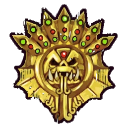

# Hombres Lagarto — EuroBowl 2026 FINAL (Tier 3)

> **#euro26 · reglamento [FINAL](../../source/tiers/eurobowl-2026-final.md).** Posiciones y costes: [`source/teams/hombres-lagarto.md`](../../source/teams/hombres-lagarto.md). Generado con `_build_final.py`.
>
> **Origen de la build:** [AndyDavo — Eurobowl Ruleset Review 2026](https://www.youtube.com/watch?v=wrmKRBFNqcM) (abr. 2026, BETA), adaptada al presupuesto FINAL.
>
> **Estado competitivo:** válida en cifras; revisión táctica propia pendiente.

## Presupuesto

| Concepto | Disponible | Usado |
|----------|-----------|-------|
| **Presupuesto de equipo** | 1.080.000 M.O. | 1.110.000 M.O. |
| **Skill Gold** | 160.000 M.O. | 160.000 M.O. |
| **Flowing Funds** | 30.000 M.O. | 30.000 → equipo · 0 → Skill Gold |

## Alineación

*Rellenar nombres. Habilidades compradas con Skill Gold en **negrita**.*

| Nº | Nombre | Posición | Coste | MV | FU | AG | PS | AR | Habilidades | Skill Gold |
|----|--------|----------|-------|----|----|----|----|----|-------------|------------|
| 1 | ____ | Kroxigor | 140k | 6 | 5 | 5+ | 6+ | 10+ | Cabeza dura, Estúpido, Cola prensil, Golpe mortífero, Solitario (4+) | – |
| 2 | ____ | Saurio | 90k | 6 | 4 | 5+ | 6+ | 10+ | Imparable, Tembloroso, **Placar** | Primaria élite 30k |
| 3 | ____ | Saurio | 90k | 6 | 4 | 5+ | 6+ | 10+ | Imparable, Tembloroso, **Placar** | Primaria élite 30k |
| 4 | ____ | Saurio | 90k | 6 | 4 | 5+ | 6+ | 10+ | Imparable, Tembloroso, **Placar** | Primaria élite 30k |
| 5 | ____ | Saurio | 90k | 6 | 4 | 5+ | 6+ | 10+ | Imparable, Tembloroso, **Placar** | Primaria élite 30k |
| 6 | ____ | Saurio | 90k | 6 | 4 | 5+ | 6+ | 10+ | Imparable, Tembloroso, **Forcejear** | Primaria 20k |
| 7 | ____ | Saurio | 90k | 6 | 4 | 5+ | 6+ | 10+ | Imparable, Tembloroso, **Furia** | Primaria 20k |
| 8 | ____ | Eslizón Línea | 60k | 8 | 2 | 3+ | 4+ | 8+ | Esquivar, Escurridizo | – |
| 9 | ____ | Eslizón Línea | 60k | 8 | 2 | 3+ | 4+ | 8+ | Esquivar, Escurridizo | – |
| 10 | ____ | Eslizón Línea | 60k | 8 | 2 | 3+ | 4+ | 8+ | Esquivar, Escurridizo | – |
| 11 | ____ | Eslizón Línea | 60k | 8 | 2 | 3+ | 4+ | 8+ | Esquivar, Escurridizo | – |

**Total jugadores:** 11

| Concepto | Coste |
|----------|--------|
| Jugadores | 920.000 |
| Segundas oportunidades (2 × 70.000) | 140.000 |
| Apotecario | 50.000 |
| **Total** | **1.110.000** |

<!-- habilidades-roster:inicio -->
## Habilidades del roster

*Definición de todas las habilidades y rasgos de los jugadores de esta lista (de serie y compradas). Generado con `scripts/habilidades_en_rosters.py`.*

- **[Cabeza dura](../../source/habilidades/fuerza.md)** (*Thick Skull* · Fuerza · Pasiva): Tirada de **Heridas**: **Inconsciente** solo con **9**; **8** = **Aturdido**. Con **Escurridizo**: Inconsciente con **8**, **7** = Aturdido.
- **[Cola prensil](../../source/habilidades/mutaciones.md)** (*Prehensile Tail* · Mutaciones · Activa): **-1** adicional al AG de rivales que **esquivan, saltan o brincan** desde su zona de defensa. **Solo uno** por intento de salida.
- **[Escurridizo](../../source/habilidades/rasgos.md)** (*Stunty* · Rasgo · Pasiva (obligatoria)): Al **esquivar**, **sin** mods. negativos por marcadores rivales. **-1** al **interceptar**. Heridas en **tabla Escurridizos**.
- **[Esquivar](../../source/habilidades/agilidad.md)** (*Dodge* · Agilidad · Activa (Elite)): **Una vez por turno** puede repetir un **único** chequeo de AG al **intentar esquivar**. Afecta al resultado **Desequilibrado** cuando un rival le hace un Placaje.
- **[Estúpido](../../source/habilidades/rasgos.md)** (*Bone Head* · Rasgo · Pasiva (obligatoria)): Tras declarar acción: **1D6** **2+** OK; **1** = **Distraído**.
- **[Forcejear](../../source/habilidades/general.md)** (*Wrestle* · General · Activa): En **Placaje** (activo o como blanco), si aplicaría **Ambos derribados**, puede usarla: **ambos** quedan **tumbados boca arriba**, sin importar otras habilidades.
- **[Furia](../../source/habilidades/general.md)** (*Frenzy* · General · Activa (obligatoria)): Tras **empujar** en Placaje debe **impulso** si puede; si el blanco sigue **en pie**, **segundo Placaje** al mismo (e impulso otra vez). En **Penetración**, el segundo cuesta **movimiento**; si no puede forzar marcha, **no** hay segundo placaje. **No** **Apartar**, **Golpe a la carrera** ni **Placaje múltiple**.
- **[Golpe mortífero](../../source/habilidades/fuerza.md)** (*Mighty Blow* · Fuerza · Activa (Elite)): Si **derriba** a un rival en **Placaje** (aunque él también quede derribado), **+1** a **Armadura** **o** a **Heridas** (eliges **después** de tirar ese dado).
- **[Imparable](../../source/habilidades/fuerza.md)** (*Juggernaut* · Fuerza · Activa): En **Penetración**: cada **Ambos derribados** en sus Placajes cuenta como **Empujón**. Rivales **no** pueden **Forcejear**, **Mantenerse firme** ni **Zafarse** frente a sus Placajes en esa Penetración.
- **[Placar](../../source/habilidades/general.md)** (*Block* · General · Activa (Elite)): En Placaje con **Ambos derribados** puede elegir **no** ser **derribado**.
- **[Solitario](../../source/habilidades/rasgos.md)** (*Loner* · Rasgo · Pasiva (obligatoria)): Para usar **Segunda oportunidad**: **1D6** vs número entre paréntesis; si falla **no** repite pero **gasta** el reroll.
- **[Tembloroso](../../source/habilidades/rasgos.md)** (*Unsteady* · Rasgo · Pasiva (obligatoria)): **No** puede **Asegurar el balón**.

<!-- habilidades-roster:fin -->

## Skill Gold

Un avance por jugador. Secundarias: **0/3** · Stacks: **0/3**.

| Jugador (Nº) | Avance | Tipo | Coste |
|--------------|--------|------|-------|
| 2 Saurio | Placar | Primaria élite | 30.000 |
| 3 Saurio | Placar | Primaria élite | 30.000 |
| 4 Saurio | Placar | Primaria élite | 30.000 |
| 5 Saurio | Placar | Primaria élite | 30.000 |
| 6 Saurio | Forcejear | Primaria | 20.000 |
| 7 Saurio | Furia | Primaria | 20.000 |
| **Total** | | | **160.000** |

## Notas de la build

- Seis Saurios: cuatro con Placar, uno con Forcejear y uno con Furia para limpiar el campo.
- Sin cambios respecto a la build de AndyDavo: el Tier 3 FINAL mantiene 1.080k/160k y los 30k de Flowing cubren el exceso del equipo (1.110k).
- Solo 11 jugadores: el apotecario es imprescindible.
