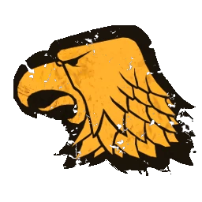

# Humanos — EuroBowl 2026 (Tier 3, Team Budget 1080k)

> **#euro26** — [EuroBowl 2026](../../source/tiers/eurobowl-2026.md). **BB 3ª temporada / BB2025.** Lista alineada con captura del builder (vídeo [EuroBowl / listas — YouTube](https://www.youtube.com/watch?v=wrmKRBFNqcM)). Posiciones: [`source/teams/humanos.md`](../../source/teams/humanos.md).

> **Estado:** plantilla **desde captura**. **13 jugadores**. No regenerar con `_build_rosters.py` (ver `SKIP_EMIT`). Tag: `eurobowl-2026-wip-competitive`.

## Presupuesto EuroBowl (tier 3)

| Concepto | Valor |
|----------|--------|
| **Tier** | 3 |
| **Team Budget (base)** | 1.080.000 gp |
| **Skill Gold (pool)** | 160.000 gp |
| **Flowing Funds (máx.)** | 30.000 gp |

*En la captura: **Team budget** 1075k / 1080k (**1075k** gastados; **5k** sin usar); **Skill Gold** 190k / 160k (**160k** pool + **30k** Flowing a Skill Gold = **190k** en avances); **Flowing Funds** 30k / 30k.*

## Alineación

*En **negrita**, avances de Skill Gold. **Nº = dorsal** desde [`inicio-1000k-humanos-1000k.md`](../iniciales/inicio-1000k-humanos-1000k.md): Ogro **20**, Blitzers **5** y **6**, Catchers **3** y **4**, Líneas **7–12**, Halfling **2**; **Thrower** usa dorsal **1** (reservado en la nota del inicio aunque el 1000k no fichara lanzador). **Pro (Team Captain)** en captura EN: si aplica la regla **Capitán del Equipo**, **Pro** puede no contar en Skill Gold (ver bloque siguiente).*

| Nº | Nombre | Posición | Coste | MA | FU | AG | PA | AR | Habilidades |
|----|--------|----------|-------|----|----|----|----|-----|-------------|
| 20 | ____ | Ogro | 140k | 5 | 5 | 4+ | 5+ | 10+ | Estúpido, Solitario (3+), Golpe Mortífero, Cabeza Dura, Lanzar Compañero, **Vigilar** |
| 5 | ____ | Blitzer | 85k | 7 | 3 | 3+ | 4+ | 9+ | Placar, Placaje Defensivo, **Vigilar** |
| 6 | ____ | Blitzer | 85k | 7 | 3 | 3+ | 4+ | 9+ | Placar, Placaje Defensivo, **Vigilar** |
| 3 | ____ | Catcher | 75k | 8 | 3 | 3+ | 4+ | 8+ | Atrapar, Esquivar, **Furia**, **Forcejeo**, **Pro** (Capitán del Equipo) |
| 4 | ____ | Catcher | 75k | 8 | 3 | 3+ | 4+ | 8+ | Atrapar, Esquivar, **Forcejeo** |
| 1 | ____ | Thrower | 75k | 6 | 3 | 3+ | 3+ | 9+ | Pasar, Manos Seguras, **Placar** |
| 7 | ____ | Línea | 50k | 6 | 3 | 3+ | 4+ | 9+ | — |
| 8 | ____ | Línea | 50k | 6 | 3 | 3+ | 4+ | 9+ | — |
| 9 | ____ | Línea | 50k | 6 | 3 | 3+ | 4+ | 9+ | — |
| 10 | ____ | Línea | 50k | 6 | 3 | 3+ | 4+ | 9+ | — |
| 11 | ____ | Línea | 50k | 6 | 3 | 3+ | 4+ | 9+ | — |
| 12 | ____ | Línea | 50k | 6 | 3 | 3+ | 4+ | 9+ | — |
| 2 | ____ | Halfling | 30k | 5 | 2 | 3+ | 4+ | 7+ | Esquivar, Humanoide Bala, Escurridizo |

**Total jugadores:** 13 | **Suma jugadores:** 865.000 gp

**Desglose presupuesto de equipo (captura):**

| Concepto | Coste |
|----------|--------|
| Jugadores (140k + 2×85k + 2×75k + 75k + 6×50k + 30k) | 865.000 |
| Rerolls de equipo (3 × 50.000) | 150.000 |
| Apotecario | 50.000 |
| Asistentes (1 × 10.000) | 10.000 |
| Cheerleaders / fans dedicados | 0 |
| **Total gastado** | **1.075.000** |
| **Team Budget base (tier 3)** | 1.080.000 |
| **Presupuesto equipo sin usar (captura)** | 5.000 |

## Información del equipo

| Concepto | Valor |
|----------|--------|
| **Tier NAF / EuroBowl** | 3 |
| **Team Budget (captura)** | 1075k / 1080k (5k sin gastar) |
| **Skill Gold (captura)** | 190k / 160k (+30k Flowing) |
| **Flowing Funds (captura)** | 30k / 30k |
| **Rerolls** | 3 |
| **Apotecario** | Sí |
| **Asistentes** | 1 |
| **Inducements** | Ninguno |
| **Opción listas** | Sin estrellas |
| **Ligas / reglas (captura EN)** | Old World Classic; Team Captain |
| **Equivalencia repo (ES)** | **Clásica del Viejo Mundo**; **Capitán del Equipo** (`humanos.md`) |

## Skill Gold — avances (según captura)

**Seis** bloques de avance (el Catcher #4 usa **Stack** de dos primarias; **Pro** puede ser **Capitán del Equipo** sin coste). Desglose que suma **190.000 gp**:

| Nº | Jugador | Habilidad (EN → ES) | Tipo (referencia #euro26) | Coste Skill Gold |
|----|---------|---------------------|---------------------------|------------------|
| 20 | Ogro | Guard → **Vigilar** | Sec. General no élite | 40.000 |
| 5 | Blitzer | Guard → **Vigilar** | Prim. Fuerza no élite | 20.000 |
| 6 | Blitzer | Guard → **Vigilar** | Prim. Fuerza no élite | 20.000 |
| 3 | Catcher | Frenzy + Wrestle → **Furia** + **Forcejeo** | **Stack** (2× prim. no élite) | 50.000 |
| 4 | Catcher | Wrestle → **Forcejeo** | Sec. General no élite | 40.000 |
| 1 | Thrower | Block → **Placar** | Prim. General no élite | 20.000 |
| **Total Skill Gold** | | | **190.000** |

* **Pro (Capitán del Equipo)** en el Catcher dors. **3** (Stack **Furia** + **Forcejeo**): si la regla de equipo lo concede **sin Skill Gold**, la fila del **Stack** sigue siendo el único bloque de pago de ese jugador (**50k**). Si el builder cobra **Pro** aparte, reclasifica filas manteniendo **190k** y los techos del pack.
* *Si **Vigilar** en Ogro cuenta como **primaria** de Fuerza (20k), el total baja **20k**; ajusta otra fila (p. ej. **Forcejeo** en Catcher dors. **4**) para mantener **190k**.*

**Límites #euro26:** **1** Stack; **2** secundarios (Ogro, Catcher dors. **4**); **0** primarias **élite** en este desglose.

## Estrellas (Tiers 1–4)

Sin Veterans ni Legends en la captura. Listas: [`eurobowl-2026.md`](../../source/tiers/eurobowl-2026.md).

## Inducements

Solo los permitidos en `eurobowl-2026.md`. Captura: ninguno.

## Estrategia (breve)

- **Ogro** con **Vigilar** y **Lanzar Compañero** al **Halfling**; **Blitzers** con **Placaje Defensivo** y **Vigilar** para anclaje.
- **Catchers:** dors. **3** con **Stack Furia + Forcejeo** y **Pro** de capitán; dors. **4** con **Forcejeo** para bajar balón.
- **Thrower** con **Placar** y **Manos Seguras**; seis **Líneas** TV; **Halfling** para balón y lanzamientos.

## Progresión sugerida

Tras #euro26, seguir tablas **G / GP / AG / ADF / PF** de `humanos.md` por posición.
