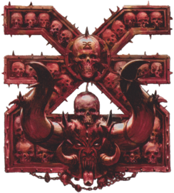

# Khorne — EuroBowl 2026 (Tier 5, Team Budget 1120k)

> **#euro26** — [EuroBowl 2026](../../source/tiers/eurobowl-2026.md). **BB 3ª temporada / BB2025.** Lista alineada con captura del builder del vídeo [EuroBowl / listas — YouTube](https://www.youtube.com/watch?v=wrmKRBFNqcM) (Khorne). Posiciones y costes: [`source/teams/khorne.md`](../../source/teams/khorne.md).

> **Estado:** plantilla **desde captura de vídeo** (nombres en inglés del builder → español del repo). **11 jugadores** (1 BloodSpawn, 4 Bloodseeker, 2 Khorngor, 4 líneas). No regenerar con `_build_rosters.py` (ver `SKIP_EMIT`). Tag: `eurobowl-2026-wip-competitive`.

## Presupuesto EuroBowl (tier 5)

| Concepto | Valor |
|----------|--------|
| **Tier** | 5 |
| **Team Budget (base)** | 1.120.000 gp |
| **Skill Gold (pool)** | 220.000 gp |
| **Flowing Funds (máx.)** | 30.000 gp |

*En la captura: **Team budget** 1150k / 1120k (**1120k** base + **30k** Flowing íntegros a presupuesto de equipo → **1150k** gastables); **Skill Gold** 220k / 220k (**220k** del pool, **0k** Flowing a Skill Gold en esta repartición); **Flowing Funds** 30k / 30k.*

## Alineación

*En **negrita**, habilidades de progresión. Orden captura: BloodSpawn → Bloodseeker ×4 → Khorngor ×2 → líneas ×4.*

| Nº | Nombre | Posición | Coste | MA | ST | AG | PA | AR | Habilidades |
|----|--------|----------|-------|----|----|----|----|----|-------------|
| 1 | ____ | BloodSpawn | 160k | 5 | 5 | 4+ | 6+ | 9+ | Garras, Furia, Golpe Mortífero(+1), Ira Descontrolada, Solitario (4+), **Imparable** |
| 2 | ____ | Bloodseeker | 105k | 5 | 4 | 4+ | 6+ | 10+ | Furia, **Placar** |
| 3 | ____ | Bloodseeker | 105k | 5 | 4 | 4+ | 6+ | 10+ | Furia, **Placar** |
| 4 | ____ | Bloodseeker | 105k | 5 | 4 | 4+ | 6+ | 10+ | Furia, **Placar** |
| 5 | ____ | Bloodseeker | 105k | 5 | 4 | 4+ | 6+ | 10+ | Furia, **Placar** |
| 6 | ____ | Khorngor | 70k | 6 | 3 | 3+ | 4+ | 9+ | Cuernos, Imparable, En Pie de un Salto, Cabeza Dura, **Placar**, **Placaje Defensivo** |
| 7 | ____ | Khorngor | 70k | 6 | 3 | 3+ | 4+ | 9+ | Cuernos, Imparable, En Pie de un Salto, Cabeza Dura, **Forcejear** |
| 8 | ____ | Líneas Marauder Nacidos de la Sangre | 50k | 6 | 3 | 3+ | 4+ | 8+ | Furia |
| 9 | ____ | Líneas Marauder Nacidos de la Sangre | 50k | 6 | 3 | 3+ | 4+ | 8+ | Furia |
| 10 | ____ | Líneas Marauder Nacidos de la Sangre | 50k | 6 | 3 | 3+ | 4+ | 8+ | Furia |
| 11 | ____ | Líneas Marauder Nacidos de la Sangre | 50k | 6 | 3 | 3+ | 4+ | 8+ | Furia |

**Total jugadores:** 11 | **Presupuesto equipo (jugadores):** 920.000 gp

*En el builder en inglés **Bloodborn Marauder** = **Líneas Marauder Nacidos de la Sangre** en `khorne.md`; **Juggernaut** = **Imparable**.*

**Desglose TV (todo lo que tiene precio):**

| Concepto | Coste |
|----------|--------|
| Jugadores (160k + 4×105k + 2×70k + 4×50k) | 920.000 |
| Rerolls de equipo (3 × 60.000) | 180.000 |
| Apotecario | 50.000 |
| Asistentes de entrenador (0 × 10.000) | 0 |
| Cheerleaders (0 × 10.000) | 0 |
| Fans dedicados (0 × 10.000) | 0 |
| **Subtotal gastado** | **1.150.000** |
| **Team Budget base (tier 5)** | 1.120.000 |
| **Flowing Funds → presupuesto equipo (captura)** | 30.000 |
| **Comprobación** | 1.120.000 + 30.000 = **1.150.000** |

## Información del equipo

| Concepto | Valor |
|----------|--------|
| **Tier NAF / EuroBowl** | 5 |
| **Team Budget (efectivo captura)** | 1150k / 1120k (+30k Flowing) |
| **Total plantilla** | 11 jugadores |
| **Rerolls** | 3 |
| **Apotecario** | Sí (captura) |
| **Inducements** | Ninguno (captura) |
| **Opción listas** | Sin estrellas (captura) |
| **Reglas / liga (captura en inglés)** | Chaos Clash, Brawlin' Brutes, Favoured of Khorne |
| **Equivalencia repo (español)** | **Choque del Caos**, **Brutos Brutales**, **Elegido de Khorne** (`source/teams/khorne.md`) |

## Skill Gold — avances (según captura)

**Siete** asignaciones de oro: **un** avance **Stack** en Khorngor nº 6; el resto **un** avance por jugador. Desglose que suma **220k** (pool **220k**, sin Flowing a Skill Gold en esta captura): **una primaria élite (30k)** + **tres primarias no élite (20k)** + **un Stack élite + no élite (60k)** + **una primaria élite (30k)** + **una secundaria no élite (40k)**.

| Jugador (Nº) | Habilidad(es) | Tipo (referencia #euro26) | Coste Skill Gold |
|--------------|---------------|---------------------------|------------------|
| 1 BloodSpawn | Imparable (Juggernaut) | Prim. Mutación **élite** | 30.000 |
| 2–4 Bloodseeker | Placar (Block) | Prim. General no élite (×3) | 60.000 |
| 5 Bloodseeker | Placar (Block) | Prim. General **élite** | 30.000 |
| 6 Khorngor | Placar (Block) + Placaje Defensivo (Tackle) | **Stack** — prim. élite + prim. no élite | 60.000 |
| 7 Khorngor | Forcejear (Wrestle) | Sec. no élite | 40.000 |
| **Total Skill Gold** | | | **220.000** |

**Límites #euro26:** **1** secundario; **1** Stack (máx. **3**); **3** primarias élite (BloodSpawn, un Bloodseeker, parte del Stack).

*Otras permutaciones (p. ej. **Stack** a **50k** con dos primarias no élite y reparto de **élites**) son válidas si suman **220k** y cuadran con el builder.*

## Estrellas (Tiers 1–4)

Sin Veterans ni Legends. Listas y prohibidos: [`eurobowl-2026.md`](../../source/tiers/eurobowl-2026.md).

## Inducements

Solo los permitidos en `eurobowl-2026.md`. Captura: ninguno.

## Descripción oficial de las habilidades

*Rasgos de lista: ver [`khorne.md`](../../source/teams/khorne.md). Avances:*

* **Imparable (Juggernaut) — 30k prim. Mutación élite / 20k prim. según avance:** En Penetración: «Ambos derribados» → Empujón; rival no puede usar Forcejear, Mantenerse Firme ni Zafarse.
* **Placar (Block) — 20k prim. General no élite / 30k prim. élite según avance:** En «Ambos derribados» puede elegir no ser derribado.
* **Placar + Placaje Defensivo (Tackle) — Stack 60k (prim. élite + prim. no élite):** **Placaje Defensivo:** rival que esquivando sale de tu zona de defensa no puede usar Esquivar; en placaje contra él, Desequilibrado trata al rival como sin Esquivar.
* **Forcejear (Wrestle) — 40k sec. no élite / 20k prim. según avance:** En Placaje, si aplicaría «Ambos derribados», puede usarla: ambos tumbados boca arriba salvo que otras habilidades lo impidan.

## Estrategia (breve)

- **Ataque:** BloodSpawn con **Imparable** y **Garras**; Bloodseekers con **Placar** y **Furia** en cadena; Khorngor con **Stack** y **Forcejear** para el balón.
- **Defensa:** **Furia** en toda la línea Marauder; **3** rerolls y apo; gestionar **Ira Descontrolada** y **Solitario** en el BloodSpawn.

## Progresión sugerida

Tras #euro26, seguir **FM / GFM** en `khorne.md`; plantilla puede ampliarse a **12+** jugadores según formato.
