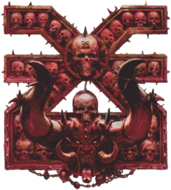

# Khorne — EuroBowl 2026 FINAL (Tier 6)

> **#euro26 · reglamento [FINAL](../../source/tiers/eurobowl-2026-final.md).** Posiciones y costes: [`source/teams/khorne.md`](../../source/teams/khorne.md). Generado con `_build_final.py`.
>
> **Origen de la build:** [AndyDavo — Eurobowl Ruleset Review 2026](https://www.youtube.com/watch?v=wrmKRBFNqcM) (abr. 2026, BETA), adaptada al presupuesto FINAL.
>
> **Estado competitivo:** válida en cifras; revisión táctica propia pendiente.

!!! note "Nota"
    Solo 11 jugadores. Un duodécimo Marauder obligaría a quitar un reroll.

## Presupuesto

| Concepto | Disponible | Usado |
|----------|-----------|-------|
| **Presupuesto de equipo** | 1.140.000 M.O. | 1.150.000 M.O. |
| **Skill Gold** | 240.000 M.O. | 270.000 M.O. |
| **Flowing Funds** | 40.000 M.O. | 10.000 → equipo · 30.000 → Skill Gold |

## Alineación

*Rellenar nombres. Habilidades compradas con Skill Gold en **negrita**.*

| Nº | Nombre | Posición | Coste | MV | FU | AG | PS | AR | Habilidades | Skill Gold |
|----|--------|----------|-------|----|----|----|----|----|-------------|------------|
| 1 | ____ | BloodSpawn | 160k | 5 | 5 | 4+ | 6+ | 9+ | Garras, Furia, Golpe mortífero, Ira descontrolada, Solitario (4+), **Imparable** | Primaria 20k |
| 2 | ____ | Bloodseekers | 105k | 5 | 4 | 4+ | 6+ | 10+ | Furia, **Placar** | Primaria élite 30k |
| 3 | ____ | Bloodseekers | 105k | 5 | 4 | 4+ | 6+ | 10+ | Furia, **Placar** | Primaria élite 30k |
| 4 | ____ | Bloodseekers | 105k | 5 | 4 | 4+ | 6+ | 10+ | Furia, **Placar** | Primaria élite 30k |
| 5 | ____ | Bloodseekers | 105k | 5 | 4 | 4+ | 6+ | 10+ | Furia, **Placar** | Primaria élite 30k |
| 6 | ____ | Khorngors | 70k | 6 | 3 | 3+ | 4+ | 9+ | Cabeza dura, Cuernos, En pie de un salto, Imparable, **Placar**, **Placaje defensivo** | Stack 60k |
| 7 | ____ | Khorngors | 70k | 6 | 3 | 3+ | 4+ | 9+ | Cabeza dura, Cuernos, En pie de un salto, Imparable, **Forcejear** | Primaria 20k |
| 8 | ____ | Líneas Marauder Nacidos de la Sangre | 50k | 6 | 3 | 3+ | 4+ | 8+ | Furia, **Placar** | Primaria élite 30k |
| 9 | ____ | Líneas Marauder Nacidos de la Sangre | 50k | 6 | 3 | 3+ | 4+ | 8+ | Furia, **Forcejear** | Primaria 20k |
| 10 | ____ | Líneas Marauder Nacidos de la Sangre | 50k | 6 | 3 | 3+ | 4+ | 8+ | Furia | – |
| 11 | ____ | Líneas Marauder Nacidos de la Sangre | 50k | 6 | 3 | 3+ | 4+ | 8+ | Furia | – |

**Total jugadores:** 11

| Concepto | Coste |
|----------|--------|
| Jugadores | 920.000 |
| Segundas oportunidades (3 × 60.000) | 180.000 |
| Apotecario | 50.000 |
| **Total** | **1.150.000** |

## Skill Gold

Un avance por jugador. Secundarias: **0/3** · Stacks: **1/3**.

| Jugador (Nº) | Avance | Tipo | Coste |
|--------------|--------|------|-------|
| 1 BloodSpawn | Imparable | Primaria | 20.000 |
| 2 Bloodseekers | Placar | Primaria élite | 30.000 |
| 3 Bloodseekers | Placar | Primaria élite | 30.000 |
| 4 Bloodseekers | Placar | Primaria élite | 30.000 |
| 5 Bloodseekers | Placar | Primaria élite | 30.000 |
| 6 Khorngors | Placar + Placaje defensivo | Stack | 60.000 |
| 7 Khorngors | Forcejear | Primaria | 20.000 |
| 8 Líneas Marauder Nacidos de la Sangre | Placar | Primaria élite | 30.000 |
| 9 Líneas Marauder Nacidos de la Sangre | Forcejear | Primaria | 20.000 |
| **Total** | | | **270.000** |

## Notas de la build

- Los 4 Bloodseekers con Furia + Placar y el BloodSpawn con Imparable sostienen el plan.
- Cambio frente a la BETA: el tier 6 da 20k más de Skill Gold. Con esos 20k y 30k de Flowing (10k cubren el exceso de equipo), dos Marauders reciben Placar y Forcejear.
