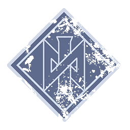

# Nórdicos — EuroBowl 2026 FINAL (Tier 4)

> **#euro26 · reglamento [FINAL](../../source/tiers/eurobowl-2026-final.md).** Posiciones y costes: [`source/teams/nordicos.md`](../../source/teams/nordicos.md). Generado con `_build_final.py`.
>
> **Origen de la build:** [AndyDavo — Eurobowl Ruleset Review 2026](https://www.youtube.com/watch?v=wrmKRBFNqcM) (abr. 2026, BETA), adaptada al presupuesto FINAL.
>
> **Estado competitivo:** válida en cifras; revisión táctica propia pendiente.

## Presupuesto

| Concepto | Disponible | Usado |
|----------|-----------|-------|
| **Presupuesto de equipo** | 1.100.000 M.O. | 1.100.000 M.O. |
| **Skill Gold** | 190.000 M.O. | 220.000 M.O. |
| **Flowing Funds** | 30.000 M.O. | 0 → equipo · 30.000 → Skill Gold |

## Alineación

*Rellenar nombres. Habilidades compradas con Skill Gold en **negrita**.*

| Nº | Nombre | Posición | Coste | MV | FU | AG | PS | AR | Habilidades | Skill Gold |
|----|--------|----------|-------|----|----|----|----|----|-------------|------------|
| 1 | ____ | Ulfwerener | 105k | 6 | 4 | 4+ | 6+ | 9+ | Furia, Tembloroso, **Defensa** | Primaria élite 30k |
| 2 | ____ | Ulfwerener | 105k | 6 | 4 | 4+ | 6+ | 9+ | Furia, Tembloroso, **Defensa** | Primaria élite 30k |
| 3 | ____ | Valkyrie | 95k | 7 | 3 | 3+ | 3+ | 8+ | Atrapar, Agallas, Pasar, Robar balón, **Forcejear** | Primaria 20k |
| 4 | ____ | Valkyrie | 95k | 7 | 3 | 3+ | 3+ | 8+ | Atrapar, Agallas, Pasar, Robar balón, **Placar** | Primaria élite 30k |
| 5 | ____ | Berserker | 90k | 6 | 3 | 3+ | 5+ | 8+ | Placar, Furia, En pie de un salto, **Defensa** | Primaria élite 30k |
| 6 | ____ | Berserker | 90k | 6 | 3 | 3+ | 5+ | 8+ | Placar, Furia, En pie de un salto, **Golpe mortífero** | Primaria élite 30k |
| 7 | ____ | Línea | 50k | 6 | 3 | 3+ | 4+ | 8+ | Borracho, Cabeza dura, Tembloroso, Placar, **Defensa** | Secundaria élite 50k |
| 8 | ____ | Línea | 50k | 6 | 3 | 3+ | 4+ | 8+ | Borracho, Cabeza dura, Tembloroso, Placar | – |
| 9 | ____ | Línea | 50k | 6 | 3 | 3+ | 4+ | 8+ | Borracho, Cabeza dura, Tembloroso, Placar | – |
| 10 | ____ | Línea | 50k | 6 | 3 | 3+ | 4+ | 8+ | Borracho, Cabeza dura, Tembloroso, Placar | – |
| 11 | ____ | Línea | 50k | 6 | 3 | 3+ | 4+ | 8+ | Borracho, Cabeza dura, Tembloroso, Placar | – |
| 12 | ____ | Cerdo Cervecero | 20k | 5 | 1 | 3+ | – | 6+ | Esquivar, El balón ni verlo, Levantar compañero, Escurridizo, Canijo | – |
| 13 | ____ | Cerdo Cervecero | 20k | 5 | 1 | 3+ | – | 6+ | Esquivar, El balón ni verlo, Levantar compañero, Escurridizo, Canijo | – |

**Total jugadores:** 13

| Concepto | Coste |
|----------|--------|
| Jugadores | 870.000 |
| Segundas oportunidades (3 × 60.000) | 180.000 |
| Apotecario | 50.000 |
| **Total** | **1.100.000** |

## Skill Gold

Un avance por jugador. Secundarias: **1/3** · Stacks: **0/3**.

| Jugador (Nº) | Avance | Tipo | Coste |
|--------------|--------|------|-------|
| 1 Ulfwerener | Defensa | Primaria élite | 30.000 |
| 2 Ulfwerener | Defensa | Primaria élite | 30.000 |
| 3 Valkyrie | Forcejear | Primaria | 20.000 |
| 4 Valkyrie | Placar | Primaria élite | 30.000 |
| 5 Berserker | Defensa | Primaria élite | 30.000 |
| 6 Berserker | Golpe mortífero | Primaria élite | 30.000 |
| 7 Línea | Defensa | Secundaria élite | 50.000 |
| **Total** | | | **220.000** |

## Notas de la build

- Mismo equipo que AndyDavo: 3 RR, apotecario y dos Cerdos Cerveceros.
- Sube de Tier 3 a Tier 4: los 1.100k ya no exceden el presupuesto y sobran 50k de Skill Gold (30k de Flowing).
- Ese margen paga Defensa como secundaria en un Línea: tercer jugador con Defensa y Placar en la línea.
