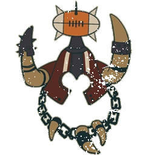

# Ogros — EuroBowl 2026 (Tier 6, Team Budget 1140k)

> **#euro26** — [EuroBowl 2026](../../source/tiers/eurobowl-2026.md). **BB 3ª temporada / BB2025.** Lista alineada con captura del builder (14 jugadores, sideline, Skill Gold). Posiciones: [`source/teams/ogros.md`](../../source/teams/ogros.md).

> **Estado:** plantilla **desde captura** (nombres EN → español Nuffle). **Rerolls 70k**. No regenerar con `_build_rosters.py` (ver `SKIP_EMIT`). Tag: `eurobowl-2026-wip-competitive`.

## Presupuesto EuroBowl (tier 6)

| Concepto | Valor |
|----------|--------|
| **Tier** | 6 |
| **Team Budget (base)** | 1.140.000 gp |
| **Skill Gold (pool)** | 240.000 gp |
| **Flowing Funds (máx.)** | 40.000 gp |

*En la captura: **Team budget** 1175k / 1140k (**1140k** base + **35k** Flowing a presupuesto de equipo); **Skill Gold** 230k / 240k (**230k** gastados; **10k** del pool sin usar; **0k** Flowing a oro en esta repartición); **Flowing Funds** 35k / 40k (**5k** Flowing sin asignar).*

## Alineación

*En **negrita**, avances de Skill Gold. **Ogre Blocker** = **Ogro**; **Ogre Runt Punter** = **Runt Punter**; **Gnoblar Lineman** = **Gnoblar**.*

| Nº | Nombre | Posición | Coste | MA | ST | AG | PA | AR | Habilidades |
|----|--------|----------|-------|----|----|----|----|----|-------------|
| 1 | ____ | Ogro | 140k | 5 | 5 | 4+ | 5+ | 10+ | Estúpido, Golpe Mortífero(+1), Cabeza Dura, Lanzar Compañero, **Placar** |
| 2 | ____ | Ogro | 140k | 5 | 5 | 4+ | 5+ | 10+ | Estúpido, Golpe Mortífero(+1), Cabeza Dura, Lanzar Compañero, **Placar** |
| 3 | ____ | Ogro | 140k | 5 | 5 | 4+ | 5+ | 10+ | Estúpido, Golpe Mortífero(+1), Cabeza Dura, Lanzar Compañero, **Placar** |
| 4 | ____ | Ogro | 140k | 5 | 5 | 4+ | 5+ | 10+ | Estúpido, Golpe Mortífero(+1), Cabeza Dura, Lanzar Compañero, **Abrirse Paso** |
| 5 | ____ | Ogro | 140k | 5 | 5 | 4+ | 5+ | 10+ | Estúpido, Golpe Mortífero(+1), Cabeza Dura, Lanzar Compañero, **Abrirse Paso** |
| 6 | ____ | Runt Punter | 145k | 5 | 5 | 4+ | 4+ | 10+ | Estúpido, Golpe Mortífero(+1), Cabeza Dura, Chutar Compañero, **Líder** |
| 7 | ____ | Gnoblar | 15k | 5 | 1 | 3+ | 4+ | 6+ | Canijo, Esquivar, Echarse a un Lado, Escurridizo, Humanoide Bala, **Placaje Heroico** |
| 8 | ____ | Gnoblar | 15k | 5 | 1 | 3+ | 4+ | 6+ | Canijo, Esquivar, Echarse a un Lado, Escurridizo, Humanoide Bala |
| 9 | ____ | Gnoblar | 15k | 5 | 1 | 3+ | 4+ | 6+ | Canijo, Esquivar, Echarse a un Lado, Escurridizo, Humanoide Bala |
| 10 | ____ | Gnoblar | 15k | 5 | 1 | 3+ | 4+ | 6+ | Canijo, Esquivar, Echarse a un Lado, Escurridizo, Humanoide Bala |
| 11 | ____ | Gnoblar | 15k | 5 | 1 | 3+ | 4+ | 6+ | Canijo, Esquivar, Echarse a un Lado, Escurridizo, Humanoide Bala |
| 12 | ____ | Gnoblar | 15k | 5 | 1 | 3+ | 4+ | 6+ | Canijo, Esquivar, Echarse a un Lado, Escurridizo, Humanoide Bala |
| 13 | ____ | Gnoblar | 15k | 5 | 1 | 3+ | 4+ | 6+ | Canijo, Esquivar, Echarse a un Lado, Escurridizo, Humanoide Bala |
| 14 | ____ | Gnoblar | 15k | 5 | 1 | 3+ | 4+ | 6+ | Canijo, Esquivar, Echarse a un Lado, Escurridizo, Humanoide Bala |

**Total jugadores:** 14 | **Suma jugadores:** 965.000 gp

**Desglose presupuesto de equipo (captura):**

| Concepto | Coste |
|----------|--------|
| Jugadores (5×140k + 1×145k + 8×15k) | 965.000 |
| Rerolls de equipo (3 × 70.000) | 210.000 |
| Apotecario | No (captura) |
| Asistentes / cheerleaders / fans dedicados | 0 |
| **Total presupuesto equipo** | **1.175.000** |
| **Team Budget base (tier 6)** | 1.140.000 |
| **Flowing Funds → presupuesto equipo** | 35.000 |
| **Comprobación** | 1.140.000 + 35.000 = **1.175.000** |

## Información del equipo

| Concepto | Valor |
|----------|--------|
| **Tier NAF / EuroBowl** | 6 |
| **Team Budget (captura)** | 1175k / 1140k (+35k Flowing) |
| **Skill Gold (captura)** | 230k / 240k |
| **Rerolls** | 3 |
| **Apotecario** | No (captura) |
| **Inducements** | Ninguno (captura) |
| **Reglas (captura EN)** | Badlands Brawl, Brawlin' Brutes, Low Cost Linemen |
| **Equivalencia repo (ES)** | **Reyerta en las Yermas** (Badlands), **Brutos Brutales**, **Líneas Prescindibles** (`ogros.md` / Nuffle) |

## Skill Gold — avances (según captura)

**Siete** jugadores con **un** bloque de avance cada uno. Desglose que suma **230.000 gp** y respeta **máx. 3** avances **Secondary** y **máx. 3** primarias **élite** (#euro26):

| Jugador (Nº) | Habilidad | Tipo (referencia #euro26) | Coste Skill Gold |
|--------------|-----------|---------------------------|------------------|
| 1–3 Ogro | Placar (Block) | Sec. General no élite (×3) | 120.000 |
| 4–5 Ogro | Abrirse Paso (Break Tackle) | Prim. Fuerza no élite (×2) | 40.000 |
| 6 Runt Punter | Líder (Leader) | Prim. Pase **élite** | 30.000 |
| 7 Gnoblar | Placaje Heroico (Diving Tackle) | Prim. Agilidad no élite | 20.000 |
| **Total Skill Gold** | | | **230.000** |

**Límites #euro26:** **3** secundarios (los tres **Placar** en Ogro); **1** primaria **élite** (**Líder**); **0** Stack.

*Si el builder cobra **Placar** como primaria de Fuerza en Ogro en lugar de secundaria, los importes cambian (p. ej. 20k/30k élite) pero la suma debe seguir siendo **230k**.*

## Estrellas (Tiers 1–4)

Sin Veterans ni Legends en la captura.

## Inducements

Solo los permitidos en `eurobowl-2026.md`. Captura: ninguno.

## Estrategia (breve)

- **Ogros:** triple **Placar** (sec.) para cadena; **Abrirse Paso** en dos para mover la línea; **Runt Punter** con **Líder** y **Chutar Compañero**.
- **Gnoblars:** uno con **Placaje Heroico** para cerrar salidas; resto de carne barata y **Canijo**.
- **Dado:** **3** rerolls a **70k** y **sin** apo — priorizar no quedarte sin activaciones por **Estúpido**.

## Progresión sugerida

Tras #euro26, seguir **F / FP / AD** en `ogros.md`; valorar apo en liga si el presupuesto lo permite.
