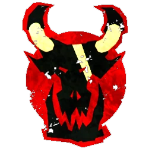

# Orcos Negros — EuroBowl 2026 FINAL (Tier 6)

> **#euro26 · reglamento [FINAL](../../source/tiers/eurobowl-2026-final.md).** Posiciones y costes: [`source/teams/orcos-negros.md`](../../source/teams/orcos-negros.md). Generado con `_build_final.py`.
>
> **Origen de la build:** [AndyDavo — Eurobowl Ruleset Review 2026](https://www.youtube.com/watch?v=wrmKRBFNqcM) (abr. 2026, BETA), adaptada al presupuesto FINAL (sube de tier 5 a tier 6).
>
> **Estado competitivo:** válida en cifras; revisión táctica propia pendiente.

## Presupuesto

| Concepto | Disponible | Usado |
|----------|-----------|-------|
| **Presupuesto de equipo** | 1.140.000 M.O. | 1.170.000 M.O. |
| **Skill Gold** | 240.000 M.O. | 250.000 M.O. |
| **Flowing Funds** | 40.000 M.O. | 30.000 → equipo · 10.000 → Skill Gold |

## Alineación

*Rellenar nombres. Habilidades compradas con Skill Gold en **negrita**.*

| Nº | Nombre | Posición | Coste | MV | FU | AG | PS | AR | Habilidades | Skill Gold |
|----|--------|----------|-------|----|----|----|----|----|-------------|------------|
| 1 | ____ | Black Orc | 90k | 4 | 4 | 4+ | 5+ | 10+ | Luchador, Apartar, **Defensa** | Primaria élite 30k |
| 2 | ____ | Black Orc | 90k | 4 | 4 | 4+ | 5+ | 10+ | Luchador, Apartar, **Defensa** | Primaria élite 30k |
| 3 | ____ | Black Orc | 90k | 4 | 4 | 4+ | 5+ | 10+ | Luchador, Apartar, **Placaje defensivo** | Primaria 20k |
| 4 | ____ | Black Orc | 90k | 4 | 4 | 4+ | 5+ | 10+ | Luchador, Apartar, **Placar** | Primaria élite 30k |
| 5 | ____ | Black Orc | 90k | 4 | 4 | 4+ | 5+ | 10+ | Luchador, Apartar, **Golpe mortífero** | Primaria élite 30k |
| 6 | ____ | Black Orc | 90k | 4 | 4 | 4+ | 5+ | 10+ | Luchador, Apartar, **Golpe mortífero** | Primaria élite 30k |
| 7 | ____ | Troll Adiestrado | 115k | 4 | 5 | 5+ | 5+ | 10+ | Siempre hambriento, Golpe mortífero, Proyectil de vómito, Realmente estúpido, Regeneración, Lanzar compañero, **Defensa** | Primaria élite 30k |
| 8 | ____ | Goblin Bruiser | 45k | 6 | 2 | 3+ | 4+ | 8+ | Esquivar, Humanoide bala, Escurridizo, Cabeza dura, **Esprintar**, **Pies firmes** | Stack 50k |
| 9 | ____ | Goblin Bruiser | 45k | 6 | 2 | 3+ | 4+ | 8+ | Esquivar, Humanoide bala, Escurridizo, Cabeza dura | – |
| 10 | ____ | Goblin Bruiser | 45k | 6 | 2 | 3+ | 4+ | 8+ | Esquivar, Humanoide bala, Escurridizo, Cabeza dura | – |
| 11 | ____ | Goblin Bruiser | 45k | 6 | 2 | 3+ | 4+ | 8+ | Esquivar, Humanoide bala, Escurridizo, Cabeza dura | – |
| 12 | ____ | Goblin Bruiser | 45k | 6 | 2 | 3+ | 4+ | 8+ | Esquivar, Humanoide bala, Escurridizo, Cabeza dura | – |

**Total jugadores:** 12

| Concepto | Coste |
|----------|--------|
| Jugadores | 880.000 |
| Segundas oportunidades (4 × 60.000) | 240.000 |
| Apotecario | 50.000 |
| **Total** | **1.170.000** |

<!-- habilidades-roster:inicio -->
## Habilidades del roster

*Definición de todas las habilidades y rasgos de los jugadores de esta lista (de serie y compradas). Generado con `scripts/habilidades_en_rosters.py`.*

- **[Apartar](../../source/habilidades/fuerza.md)** (*Grab* · Fuerza · Activa): Al **declarar Placaje** (no en **Penetración**, FAQ), si el blanco es **empujado**, su entrenador elige casilla **adyacente desocupada** para el empuje; si no hay, no aplica. El blanco **no** puede usar **Echarse a un lado**. **No** puede tener **Furia**.
- **[Cabeza dura](../../source/habilidades/fuerza.md)** (*Thick Skull* · Fuerza · Pasiva): Tirada de **Heridas**: **Inconsciente** solo con **9**; **8** = **Aturdido**. Con **Escurridizo**: Inconsciente con **8**, **7** = Aturdido.
- **[Defensa](../../source/habilidades/fuerza.md)** (*Guard* · Fuerza · Activa (Elite)): Siempre puede **apoyar** (ofensivo y defensivo) en Placajes aunque lo marquen **varios** rivales.
- **[Escurridizo](../../source/habilidades/rasgos.md)** (*Stunty* · Rasgo · Pasiva (obligatoria)): Al **esquivar**, **sin** mods. negativos por marcadores rivales. **-1** al **interceptar**. Heridas en **tabla Escurridizos**.
- **[Esprintar](../../source/habilidades/agilidad.md)** (*Sprint* · Agilidad · Activa): En una acción de **Movimiento** puede intentar **forzar la marcha una vez más** de lo que podría normalmente.
- **[Esquivar](../../source/habilidades/agilidad.md)** (*Dodge* · Agilidad · Activa (Elite)): **Una vez por turno** puede repetir un **único** chequeo de AG al **intentar esquivar**. Afecta al resultado **Desequilibrado** cuando un rival le hace un Placaje.
- **[Golpe mortífero](../../source/habilidades/fuerza.md)** (*Mighty Blow* · Fuerza · Activa (Elite)): Si **derriba** a un rival en **Placaje** (aunque él también quede derribado), **+1** a **Armadura** **o** a **Heridas** (eliges **después** de tirar ese dado).
- **[Humanoide bala](../../source/habilidades/rasgos.md)** (*Right Stuff* · Rasgo · Pasiva (obligatoria)): Puede ser **lanzado** aunque esté **tumbado boca arriba**.
- **[Lanzar compañero](../../source/habilidades/rasgos.md)** (*Throw Team-Mate* · Rasgo · Activa): Puede declarar **Lanzar compañero**.
- **[Luchador](../../source/habilidades/fuerza.md)** (*Brawler* · Fuerza · Activa): Al **declarar Placaje** puede **repetir un único** resultado de **Ambos derribados**. **No** en **Penetración**; **una vez por activación** aunque haga varios Placajes (p. ej. con **Furia**) (FAQ).
- **[Pies firmes](../../source/habilidades/agilidad.md)** (*Sure Feet* · Agilidad · Activa): **Una vez por turno** puede **repetir** el **1D6** al intentar **forzar la marcha**.
- **[Placaje defensivo](../../source/habilidades/general.md)** (*Tackle* · General · Activa): Rival que **esquive** para salir de su zona de defensa **no** puede usar **Esquivar**. Si **él** hace un Placaje y sale **Desequilibrado**, el rival se trata **como sin Esquivar**.
- **[Placar](../../source/habilidades/general.md)** (*Block* · General · Activa (Elite)): En Placaje con **Ambos derribados** puede elegir **no** ser **derribado**.
- **[Proyectil de vómito](../../source/habilidades/rasgos.md)** (*Projectile Vomit* · Rasgo · Activa): **Proyectil de vómito** (varios/turno): rival adyacente **en pie**, **1D6** **2+** Armadura sin mods. (rompe → Heridas); **1** Armadura sin mods. a **ti**. Puede sustituir Placaje en **Penetración** (activación termina).
- **[Realmente estúpido](../../source/habilidades/rasgos.md)** (*Really Stupid* · Rasgo · Pasiva (obligatoria)): Tras declarar: **1D6** (**+2** si adyacente a compañero **en pie**, no Distraído, sin este rasgo). **4+** OK; **1–3** Distraído.
- **[Regeneración](../../source/habilidades/rasgos.md)** (*Regeneration* · Rasgo · Pasiva): Al sufrir **Lesión**, antes de tabla de lesiones: **1D6** **1–3** normal; **4+** **regenera** (ignora lesión; SPP al causante igual); va a **reservas**.
- **[Siempre hambriento](../../source/habilidades/rasgos.md)** (*Always Hungry* · Rasgo · Activa (obligatoria)): En **Lanzar compañero**, **antes** del chequeo de Pase: **1D6** **2+** OK; **1** intenta comérselo → **1D6** **2+** pifia de lanzamiento; **1** **devorado** (se retira de la plantilla; sin apo ni regen); si el compañero llevaba el balón, rebota desde **su** casilla. El texto dice «se produce cambio de turno», pero la FAQ aclara que solo si el devorado llevaba el balón.

<!-- habilidades-roster:fin -->

## Skill Gold

Un avance por jugador. Secundarias: **0/3** · Stacks: **1/3**.

| Jugador (Nº) | Avance | Tipo | Coste |
|--------------|--------|------|-------|
| 1 Black Orc | Defensa | Primaria élite | 30.000 |
| 2 Black Orc | Defensa | Primaria élite | 30.000 |
| 3 Black Orc | Placaje defensivo | Primaria | 20.000 |
| 4 Black Orc | Placar | Primaria élite | 30.000 |
| 5 Black Orc | Golpe mortífero | Primaria élite | 30.000 |
| 6 Black Orc | Golpe mortífero | Primaria élite | 30.000 |
| 7 Troll Adiestrado | Defensa | Primaria élite | 30.000 |
| 8 Goblin Bruiser | Esprintar + Pies firmes | Stack | 50.000 |
| **Total** | | | **250.000** |

## Notas de la build

- Seis Black Orcs con Defensa, Placar, Placaje defensivo y Golpe mortífero; Troll con Defensa.
- Goblin Bruiser con stack Esprintar + Pies firmes como portador/anotador.
- Cambio: el tier 6 da 20k más de equipo, 20k más de Skill Gold y 10k más de Flowing; se invierten en un cuarto reroll (60k) para un equipo AG4+.
