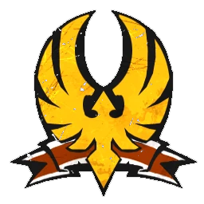

# Unión Élfica — EuroBowl 2026 FINAL (Tier 5)

> **#euro26 · reglamento [FINAL](../../source/tiers/eurobowl-2026-final.md).** Posiciones y costes: [`source/teams/union-elfica.md`](../../source/teams/union-elfica.md). Generado con `_build_final.py`.
>
> **Origen de la build:** [AndyDavo — Eurobowl Ruleset Review 2026](https://www.youtube.com/watch?v=wrmKRBFNqcM) (abr. 2026, BETA), ajustada con [Artemis Black — Road to Eurobowl: Elven Union & HE](https://www.youtube.com/watch?v=GgfTtYKR3Ec) (sep. 2026, roster real de selección).
>
> **Estado competitivo:** válida en cifras; revisión táctica propia pendiente.

## Presupuesto

| Concepto | Disponible | Usado |
|----------|-----------|-------|
| **Presupuesto de equipo** | 1.120.000 M.O. | 1.120.000 M.O. |
| **Skill Gold** | 220.000 M.O. | 250.000 M.O. |
| **Flowing Funds** | 30.000 M.O. | 0 → equipo · 30.000 → Skill Gold |

## Alineación

*Rellenar nombres. Habilidades compradas con Skill Gold en **negrita**.*

| Nº | Nombre | Posición | Coste | MV | FU | AG | PS | AR | Habilidades | Skill Gold |
|----|--------|----------|-------|----|----|----|----|----|-------------|------------|
| 1 | ____ | Elfo Blitzer | 115k | 7 | 3 | 2+ | 3+ | 9+ | Echarse a un lado, Placar, **Esquivar** | Primaria élite 30k |
| 2 | ____ | Elfo Blitzer | 115k | 7 | 3 | 2+ | 3+ | 9+ | Echarse a un lado, Placar, **Esquivar**, **Placaje heroico** | Stack 60k |
| 3 | ____ | Elfo Catcher | 100k | 8 | 3 | 2+ | 4+ | 8+ | Atrapar, Nervios de acero, Recepción heroica, **Esquivar**, **Echarse a un lado** | Stack 60k |
| 4 | ____ | Elfo Catcher | 100k | 8 | 3 | 2+ | 4+ | 8+ | Atrapar, Nervios de acero, Recepción heroica, **Esquivar** | Primaria élite 30k |
| 5 | ____ | Elfo Lanzador | 75k | 6 | 3 | 2+ | 2+ | 8+ | Pasar, Pase a lo loco, **Líder** | Primaria 20k |
| 6 | ____ | Elfo Línea | 65k | 6 | 3 | 2+ | 3+ | 8+ | Dejada, **Esquivar** | Primaria élite 30k |
| 7 | ____ | Elfo Línea | 65k | 6 | 3 | 2+ | 3+ | 8+ | Dejada, **Forcejear** | Primaria 20k |
| 8 | ____ | Elfo Línea | 65k | 6 | 3 | 2+ | 3+ | 8+ | Dejada | – |
| 9 | ____ | Elfo Línea | 65k | 6 | 3 | 2+ | 3+ | 8+ | Dejada | – |
| 10 | ____ | Elfo Línea | 65k | 6 | 3 | 2+ | 3+ | 8+ | Dejada | – |
| 11 | ____ | Elfo Línea | 65k | 6 | 3 | 2+ | 3+ | 8+ | Dejada | – |
| 12 | ____ | Elfo Línea | 65k | 6 | 3 | 2+ | 3+ | 8+ | Dejada | – |

**Total jugadores:** 12

| Concepto | Coste |
|----------|--------|
| Jugadores | 960.000 |
| Segundas oportunidades (2 × 50.000) | 100.000 |
| Apotecario | 50.000 |
| Ayudantes del entrenador (1 × 10.000) | 10.000 |
| **Total** | **1.120.000** |

<!-- habilidades-roster:inicio -->
## Habilidades del roster

*Definición de todas las habilidades y rasgos de los jugadores de esta lista (de serie y compradas). Generado con `scripts/habilidades_en_rosters.py`.*

- **[Atrapar](../../source/habilidades/agilidad.md)** (*Catch* · Agilidad · Activa): Puede **repetir** cualquier chequeo de AG fallido al **intentar atrapar** el balón.
- **[Dejada](../../source/habilidades/triquinuelas.md)** (*Fumblerooski* · Triquiñuelas · Activa): Portador en **Movimiento** puede **dejar** el balón en una casilla que **abandone** (sin cambio de turno).
- **[Echarse a un lado](../../source/habilidades/agilidad.md)** (*Side Step* · Agilidad · Activa): Si es **empujado** por cualquier motivo, su entrenador elige una casilla **adyacente desocupada** (no el rival). Si **no hay** ninguna, la habilidad **no** se usa.
- **[Esquivar](../../source/habilidades/agilidad.md)** (*Dodge* · Agilidad · Activa (Elite)): **Una vez por turno** puede repetir un **único** chequeo de AG al **intentar esquivar**. Afecta al resultado **Desequilibrado** cuando un rival le hace un Placaje.
- **[Forcejear](../../source/habilidades/general.md)** (*Wrestle* · General · Activa): En **Placaje** (activo o como blanco), si aplicaría **Ambos derribados**, puede usarla: **ambos** quedan **tumbados boca arriba**, sin importar otras habilidades.
- **[Líder](../../source/habilidades/pase.md)** (*Leader* · Pase · Pasiva): Con **≥1** con Líder **en campo** al inicio de cualquier mitad: gana **Segunda oportunidad de Líder** (como reroll normal salvo que **Chef Maestro Halfling** no la quite). Si **todos** los Líder salen **antes** de usarla, se **pierde**.
- **[Nervios de acero](../../source/habilidades/pase.md)** (*Nerves of Steel* · Pase · Activa): **Ignora** mods. por **marcado** en chequeos de **AG** (atrapar) y de **Pase**.
- **[Pasar](../../source/habilidades/pase.md)** (*Pass* · Pase · Activa): Puede **repetir** cualquier chequeo de **Pase** fallido en acción de **Pase**.
- **[Pase a lo loco](../../source/habilidades/pase.md)** (*Hail Mary Pass* · Pase · Activa): En **Pase** o **Lanzar bomba** puede elegir **cualquier** casilla como objetivo (sin regla de alcance); chequeo como **bomba larga**; preciso → **impreciso**. **No** interceptable.
- **[Placaje heroico](../../source/habilidades/agilidad.md)** (*Diving Tackle* · Agilidad · Activa): Rival que **esquivando, saltando o brincando** sale de su zona de defensa: **después** de su chequeo de AG (con mods. y repeticiones), este jugador aplica **-2** al rival y se coloca **tumbado boca arriba** en la casilla que deja. **Solo uno** por intento de salida si varios tienen la habilidad.
- **[Placar](../../source/habilidades/general.md)** (*Block* · General · Activa (Elite)): En Placaje con **Ambos derribados** puede elegir **no** ser **derribado**.
- **[Recepción heroica](../../source/habilidades/agilidad.md)** (*Diving Catch* · Agilidad · Activa): Puede intentar atrapar si el balón **cae** en su zona de defensa por **pase**, **patada inicial** o **devolución** (**no** si solo **rebota** ahí). **+1** al AG al atrapar como parte de un **Pase** si está en la **casilla objetivo**.

<!-- habilidades-roster:fin -->

## Skill Gold

Un avance por jugador. Secundarias: **0/3** · Stacks: **2/3**.

| Jugador (Nº) | Avance | Tipo | Coste |
|--------------|--------|------|-------|
| 1 Elfo Blitzer | Esquivar | Primaria élite | 30.000 |
| 2 Elfo Blitzer | Esquivar + Placaje heroico | Stack | 60.000 |
| 3 Elfo Catcher | Esquivar + Echarse a un lado | Stack | 60.000 |
| 4 Elfo Catcher | Esquivar | Primaria élite | 30.000 |
| 5 Elfo Lanzador | Líder | Primaria | 20.000 |
| 6 Elfo Línea | Esquivar | Primaria élite | 30.000 |
| 7 Elfo Línea | Forcejear | Primaria | 20.000 |
| **Total** | | | **250.000** |

## Notas de la build

- Esquivar en los dos Blitzers y los dos Catchers, y Líder en el Lanzador (con solo 2 rerolls), como en el roster real comentado por Artemis Black.
- Stack Esquivar + Echarse a un lado en un Catcher (Artemis) y Esquivar + Placaje heroico en un Blitzer (AndyDavo).
- Cambio frente a AndyDavo: se sustituyen los stacks Placar + Esquivar y Furia + Forcejear de los Catchers por más Esquivar (también en un Línea); mismo tier y presupuesto.
