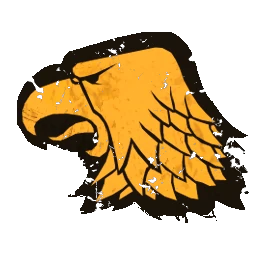

# Humanos — Inicio 1000k (1.000k)

> **BB 3ª temporada / BB2025.** Roster de inicio según [`source/teams/humanos.md`](../../source/teams/humanos.md). Reglamento: [`reglamento-bb3-season3.pdf`](../../source/reglamento/reglamento-bb3-season3.pdf). Algunos desgloses añaden **2 × fans dedicados** (TV **1.010k** si cuentas todo); esta ficha usa **1 fan** para cerrar **1.000k** exactos con **1 Ogro, 2 Blitzers, 2 Catchers, 1 Halfling, 6 Líneas, 3 RR, apotecario**.

## Alineación

*Roster inicial sin habilidades de progresión. **Dorsales:** Catchers **3** y **4**, Blitzers **5** y **6**, Líneas **7–12**, Halfling **2**, Ogro **20**. Stats: [`source/teams/humanos.md`](../../source/teams/humanos.md).*

| Nº | Nombre | Posición | Coste | MA | ST | AG | PA | AR | Habilidades |
|----|--------|----------|-------|----|----|----|----|----|-------------|
| 20 | ____ | Ogro | 140k | 5 | 5 | 4+ | 5+ | 10+ | Estúpido, Solitario (3+), Golpe Mortífero, Cabeza Dura, Lanzar Compañero |
| 5 | ____ | Blitzer | 85k | 7 | 3 | 3+ | 4+ | 9+ | Placar, Placaje Defensivo |
| 6 | ____ | Blitzer | 85k | 7 | 3 | 3+ | 4+ | 9+ | Placar, Placaje Defensivo |
| 3 | ____ | Catcher | 75k | 8 | 3 | 3+ | 4+ | 8+ | Atrapar, Esquivar |
| 4 | ____ | Catcher | 75k | 8 | 3 | 3+ | 4+ | 8+ | Atrapar, Esquivar |
| 2 | ____ | Halfling | 30k | 5 | 2 | 3+ | 4+ | 7+ | Escurridizo, Esquivar, Humanoide Bala |
| 7 | ____ | Línea | 50k | 6 | 3 | 3+ | 4+ | 9+ | — |
| 8 | ____ | Línea | 50k | 6 | 3 | 3+ | 4+ | 9+ | — |
| 9 | ____ | Línea | 50k | 6 | 3 | 3+ | 4+ | 9+ | — |
| 10 | ____ | Línea | 50k | 6 | 3 | 3+ | 4+ | 9+ | — |
| 11 | ____ | Línea | 50k | 6 | 3 | 3+ | 4+ | 9+ | — |
| 12 | ____ | Línea | 50k | 6 | 3 | 3+ | 4+ | 9+ | — |

**Total jugadores:** 12 | **TV:** 1.000k

**Desglose TV (todo lo que tiene precio):** Referencia de precios: Reroll 50.000 | Apotecario 50.000 | Fans dedicados 10.000 c/u.

| Concepto | Coste |
|----------|--------|
| Jugadores (1 Ogro 140k, 2 Blitzers 170k, 2 Catchers 150k, 1 Halfling 30k, 6 Líneas 300k) | 790.000 |
| Rerolls (3 × 50.000) | 150.000 |
| Apotecario | 50.000 |
| Fans dedicados (1 × 10.000) | 10.000 |
| **Total TV** | **1.000.000** |

## Información del equipo

| Concepto | Valor |
|----------|--------|
| **Tier NAF** | Tier 2 |
| **Valoración del equipo (TV)** | 1.000k |
| **Total plantilla** | 12 jugadores |
| **Tesorería actual** | 0 |
| **Rerolls** | 3 |
| **Asistentes de entrenador** | 0 |
| **Cheerleaders** | 0 |
| **Fans dedicados** | 1 |
| **Apotecario** | Sí |

## Descripción oficial de las habilidades

* **Atrapar (Catch) — incl.:** Puede repetir chequeo de AG fallido al atrapar el balón.
* **Cabeza Dura (Thick Skull) — incl.:** En tirada de Heridas: Inconsciente solo con 9; 8 = Aturdido. Con Escurridizo: Inconsciente con 8, 7 = Aturdido.
* **Escurridizo (Stunty) — incl.:** No sufre -1 por estar marcado al esquivar; -1 AG al interceptar; tirada de Heridas en tabla Escurridizos.
* **Esquivar (Dodge) — incl.:** Repetir un chequeo de esquivar por turno; afecta a Desequilibrado en placajes recibidos.
* **Estúpido (Bone Head) — incl.:** Al activarse: 1D6; 1 = Distraído.
* **Golpe Mortífero (Mighty Blow) — incl.:** Al derribar en Placaje puede aplicar +1 a tirada de Armadura o de Heridas (decidir después de tirar).
* **Humanoide Bala (Right Stuff) — incl.:** Puede ser lanzado por compañero con Lanzar compañero (incluso tumbado).
* **Lanzar Compañero (Throw Team-Mate) — incl.:** Puede declarar la acción de Lanzar compañero.
* **Placar (Block) — incl.:** En placaje con «Ambos derribados» puede elegir no ser derribado.
* **Placaje Defensivo (Tackle) — incl.:** Rival que esquivando sale de su zona de defensa no puede usar Esquivar; en placaje contra él, Desequilibrado trata al rival como sin Esquivar.
* **Solitario (Loner) — incl.:** Para usar Segunda oportunidad en su tirada debe tirar 1D6 ≥ número entre paréntesis; si no, la RR se gasta pero no repite.

## Inducements

- Rerolls y fans adicionales según torneo y diferencia de TV.

## Estrategia

- **Ataque:** Catchers (MA8, Atrapar, Esquivar) para anotar; Halfling como pieza de truco o balón suelto; Ogro para pantalla y Lanzar compañero; Blitzers para abrir huecos (Placar, Placaje Defensivo vs rivales con Esquivar). Equipo equilibrado con opción de juego aéreo sin Thrower inicial (compra posterior o mercenario).
- **Defensa:** Blitzers marcan receptores; Ogro en el medio con cuidado a Estúpido y Solitario; Líneas rellenan la línea de scrimmage.

## Progresión recomendada

- **Blitzer:** Primaria Golpe Mortífero o Defensa; secundarias Forcejear, Manos Seguras (GF / AP según `source/teams/humanos.md`).
- **Catcher:** Primaria Echarse a un Lado o Esquivar; secundarias Manos Seguras, Placar (AG / PF).
- **Línea:** Primaria Placar; secundarias Echarse a un Lado, Manos Seguras (G / ADF).
- **Halfling:** Primaria Esquivar o Manos Seguras; secundarias Pies Firmes, Atento al Balón (A / DGF).
- **Ogro:** Primaria Defensa o Abrirse Paso; secundarias Mantenerse Firme, Manos Seguras (F / AG).
