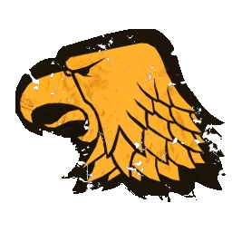

# Humanos — Inicio 1000k (1.000k)

> **BB 3ª temporada / BB2025.** Roster de inicio según [`source/teams/humanos.md`](../../source/teams/humanos.md). Reglamento: `reglamento-bb3-season3.pdf` *(copia local, no publicada)*. Algunos desgloses añaden **2 × Hinchas** (TV **1.010k** si cuentas todo); esta ficha usa **1 fan** para cerrar **1.000k** exactos con **1 Ogro, 2 Blitzers, 2 Catchers, 1 Halfling, 6 Líneas, 3 RR, apotecario**.

## Alineación

*Roster inicial sin habilidades de progresión. **Dorsales:** Catchers **3** y **4**, Blitzers **5** y **6**, Líneas **7–12**, Halfling **2**, Ogro **20**. Stats: [`source/teams/humanos.md`](../../source/teams/humanos.md).*

| Nº | Nombre | Posición | Coste | MV | FU | AG | PS | AR | Habilidades |
|----|--------|----------|-------|----|----|----|----|----|-------------|
| 20 | ____ | Ogro | 140k | 5 | 5 | 4+ | 5+ | 10+ | Estúpido, Solitario (3+), Golpe mortífero, Cabeza dura, Lanzar compañero |
| 5 | ____ | Blitzer | 85k | 7 | 3 | 3+ | 4+ | 9+ | Placar, Placaje defensivo |
| 6 | ____ | Blitzer | 85k | 7 | 3 | 3+ | 4+ | 9+ | Placar, Placaje defensivo |
| 3 | ____ | Catcher | 75k | 8 | 3 | 3+ | 4+ | 8+ | Atrapar, Esquivar |
| 4 | ____ | Catcher | 75k | 8 | 3 | 3+ | 4+ | 8+ | Atrapar, Esquivar |
| 2 | ____ | Halfling | 30k | 5 | 2 | 3+ | 4+ | 7+ | Escurridizo, Esquivar, Humanoide bala |
| 7 | ____ | Línea | 50k | 6 | 3 | 3+ | 4+ | 9+ | — |
| 8 | ____ | Línea | 50k | 6 | 3 | 3+ | 4+ | 9+ | — |
| 9 | ____ | Línea | 50k | 6 | 3 | 3+ | 4+ | 9+ | — |
| 10 | ____ | Línea | 50k | 6 | 3 | 3+ | 4+ | 9+ | — |
| 11 | ____ | Línea | 50k | 6 | 3 | 3+ | 4+ | 9+ | — |
| 12 | ____ | Línea | 50k | 6 | 3 | 3+ | 4+ | 9+ | — |

**Total jugadores:** 12 | **TV:** 1.000k

**Desglose TV (todo lo que tiene precio):** Referencia de precios: Reroll 50.000 | Apotecario 50.000 | Hinchas 10.000 c/u.

| Concepto | Coste |
|----------|--------|
| Jugadores (1 Ogro 140k, 2 Blitzers 170k, 2 Catchers 150k, 1 Halfling 30k, 6 Líneas 300k) | 790.000 |
| Rerolls (3 × 50.000) | 150.000 |
| Apotecario | 50.000 |
| Hinchas (1 × 10.000) | 10.000 |
| **Total TV** | **1.000.000** |

<!-- habilidades-roster:inicio -->
## Habilidades del roster

*Definición de todas las habilidades y rasgos de los jugadores de esta lista (de serie y compradas). Generado con `scripts/habilidades_en_rosters.py`.*

- **[Atrapar](../../source/habilidades/agilidad.md)** (*Catch* · Agilidad · Activa): Puede **repetir** cualquier chequeo de AG fallido al **intentar atrapar** el balón.
- **[Cabeza dura](../../source/habilidades/fuerza.md)** (*Thick Skull* · Fuerza · Pasiva): Tirada de **Heridas**: **Inconsciente** solo con **9**; **8** = **Aturdido**. Con **Escurridizo**: Inconsciente con **8**, **7** = Aturdido.
- **[Escurridizo](../../source/habilidades/rasgos.md)** (*Stunty* · Rasgo · Pasiva (obligatoria)): Al **esquivar**, **sin** mods. negativos por marcadores rivales. **-1** al **interceptar**. Heridas en **tabla Escurridizos**.
- **[Esquivar](../../source/habilidades/agilidad.md)** (*Dodge* · Agilidad · Activa (Elite)): **Una vez por turno** puede repetir un **único** chequeo de AG al **intentar esquivar**. Afecta al resultado **Desequilibrado** cuando un rival le hace un Placaje.
- **[Estúpido](../../source/habilidades/rasgos.md)** (*Bone Head* · Rasgo · Pasiva (obligatoria)): Tras declarar acción: **1D6** **2+** OK; **1** = **Distraído**.
- **[Golpe mortífero](../../source/habilidades/fuerza.md)** (*Mighty Blow* · Fuerza · Activa (Elite)): Si **derriba** a un rival en **Placaje** (aunque él también quede derribado), **+1** a **Armadura** **o** a **Heridas** (eliges **después** de tirar ese dado).
- **[Humanoide bala](../../source/habilidades/rasgos.md)** (*Right Stuff* · Rasgo · Pasiva (obligatoria)): Puede ser **lanzado** aunque esté **tumbado boca arriba**.
- **[Lanzar compañero](../../source/habilidades/rasgos.md)** (*Throw Team-Mate* · Rasgo · Activa): Puede declarar **Lanzar compañero**.
- **[Placaje defensivo](../../source/habilidades/general.md)** (*Tackle* · General · Activa): Rival que **esquive** para salir de su zona de defensa **no** puede usar **Esquivar**. Si **él** hace un Placaje y sale **Desequilibrado**, el rival se trata **como sin Esquivar**.
- **[Placar](../../source/habilidades/general.md)** (*Block* · General · Activa (Elite)): En Placaje con **Ambos derribados** puede elegir **no** ser **derribado**.
- **[Solitario](../../source/habilidades/rasgos.md)** (*Loner* · Rasgo · Pasiva (obligatoria)): Para usar **Segunda oportunidad**: **1D6** vs número entre paréntesis; si falla **no** repite pero **gasta** el reroll.

<!-- habilidades-roster:fin -->

## Información del equipo

| Concepto | Valor |
|----------|--------|
| **Tier NAF** | Tier 2 |
| **Valoración del equipo (TV)** | 1.000k |
| **Total plantilla** | 12 jugadores |
| **Tesorería actual** | 0 |
| **Rerolls** | 3 |
| **Asistentes de entrenador** | 0 |
| **Animadoras** | 0 |
| **Hinchas** | 1 |
| **Apotecario** | Sí |

## Inducements

- Rerolls y fans adicionales según torneo y diferencia de TV.

## Estrategia

- **Ataque:** Catchers (MV8, Atrapar, Esquivar) para anotar; Halfling como pieza de truco o balón suelto; Ogro para pantalla y Lanzar compañero; Blitzers para abrir huecos (Placar, Placaje defensivo vs rivales con Esquivar). Equipo equilibrado con opción de juego aéreo sin Thrower inicial (compra posterior o mercenario).
- **Defensa:** Blitzers marcan receptores; Ogro en el medio con cuidado a Estúpido y Solitario; Líneas rellenan la línea de placajes iniciales.

## Progresión recomendada

- **Blitzer:** Primaria Golpe mortífero o Defensa; secundarias Forcejear, Manos seguras (GF / AP según `source/teams/humanos.md`).
- **Catcher:** Primaria Echarse a un lado o Esquivar; secundarias Manos seguras, Placar (AG / PF).
- **Línea:** Primaria Placar; secundarias Echarse a un lado, Manos seguras (G / ADF).
- **Halfling:** Primaria Esquivar o Manos seguras; secundarias Pies firmes, Atento al balón (A / DGF).
- **Ogro:** Primaria Defensa o Abrirse paso; secundarias Mantenerse firme, Manos seguras (F / AG).
