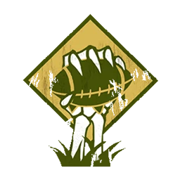

# No Muertos — Inicio 1000k (1.000k)

> **BB 3ª temporada / BB2025.** Roster de inicio a **1.000k** según [`source/teams/no-muertos.md`](../../source/teams/no-muertos.md). Reglamento: [`reglamento-bb3-season3.pdf`](https://github.com/asantolaria/bloodbowl-my-rosters/blob/main/source/reglamento/reglamento-bb3-season3.pdf). Con la lista 2025 suele priorizarse **Zombie** frente a **Esqueleto** en el núcleo barato (AR y rasgos de línea).

## Alineación

*Roster inicial sin habilidades de progresión. Orden: Momias → Caballeros → Necrófagos → Zombies.*

| Nº | Nombre | Posición   | Coste | MV | FU | AG | PS | AR | Habilidades |
|----|--------|------------|-------|----|----|----|----|----|-------------|
| ____ | ____________________ | Momia      | 125k  | 3  | 5  | 1  | —  | 10 | Golpe mortífero, Regeneración |
| ____ | ____________________ | Momia      | 125k  | 3  | 5  | 1  | —  | 10 | Golpe mortífero, Regeneración |
| ____ | ____________________ | Caballero  | 95k   | 6  | 3  | 3  | —  | 9  | Cabeza dura, Placar, Placaje defensivo, Regeneración |
| ____ | ____________________ | Caballero  | 95k   | 6  | 3  | 3  | —  | 9  | Cabeza dura, Placar, Placaje defensivo, Regeneración |
| ____ | ____________________ | Necrófago  | 75k   | 7  | 3  | 3  | —  | 8  | Esquivar, Regeneración |
| ____ | ____________________ | Necrófago  | 75k   | 7  | 3  | 3  | —  | 8  | Esquivar, Regeneración |
| ____ | ____________________ | Zombie     | 40k   | 4  | 3  | 2  | —  | 9  | Piquete de ojos, Tembloroso, Regeneración |
| ____ | ____________________ | Zombie     | 40k   | 4  | 3  | 2  | —  | 9  | Piquete de ojos, Tembloroso, Regeneración |
| ____ | ____________________ | Zombie     | 40k   | 4  | 3  | 2  | —  | 9  | Piquete de ojos, Tembloroso, Regeneración |
| ____ | ____________________ | Zombie     | 40k   | 4  | 3  | 2  | —  | 9  | Piquete de ojos, Tembloroso, Regeneración |
| ____ | ____________________ | Zombie     | 40k   | 4  | 3  | 2  | —  | 9  | Piquete de ojos, Tembloroso, Regeneración |

**Total jugadores:** 11 | **TV:** 1.000k

**Desglose TV (todo lo que tiene precio):** Referencia de precios: Reroll 70.000 (No Muertos) | Apotecario 50.000 | Hinchas 10.000 c/u.

| Concepto | Coste |
|----------|--------|
| Jugadores (2 Momias 250k, 2 Caballeros 190k, 2 Necrófagos 150k, 5 Zombies 200k) | 790.000 |
| Rerolls (3 × 70.000) | 210.000 |
| **Total TV** | **1.000.000** |

## Información del equipo

| Concepto | Valor |
|----------|--------|
| **Tier NAF** | Tier 2 |
| **Valoración del equipo (TV)** | 1.000k |
| **Total plantilla** | 11 jugadores |
| **Tesorería actual** | 0 |
| **Rerolls** | 3 |
| **Asistentes de entrenador** | 0 |
| **Animadoras** | 0 |
| **Hinchas** | 0 |
| **Apotecario** | No (No Muertos no tienen Apo) |

## Descripción oficial de las habilidades

* **Cabeza dura (Thick Skull) — incl.:** En tirada de Heridas: Inconsciente solo con 9; 8 = Aturdido.
* **Esquivar (Dodge) — incl.:** Repetir un chequeo de esquivar por turno; afecta a Desequilibrado en placajes recibidos.
* **Golpe mortífero (Mighty Blow) — incl.:** Al derribar en Placaje puede aplicar +1 a tirada de Armadura o de Heridas (decidir después de tirar).
* **Inestable (Unstable) — incl.:** Cuando este jugador es derribado, el entrenador rival hace una tirada en la tabla de heridas contra él.
* **Piquete de ojos (Eye Gouge) — incl.:** Rival empujado por este jugador no puede dar apoyos ofensivos ni defensivos hasta que vuelva a ser activado.
* **Placar (Block) — incl.:** En placaje con «Ambos derribados» puede elegir no ser derribado.
* **Placaje defensivo (Tackle) — incl.:** Rival que esquivando sale de su zona de defensa no puede usar Esquivar; en placaje contra él, Desequilibrado trata al rival como sin Esquivar.
* **Regeneración (Regeneration) — incl.:** Al sufrir Lesión: 1D6; 4+=se ignora la lesión y va a reservas; 1-3=normal.

## Inducements

- No tienen Apotecario. Rerolls y Fans según reglamento del torneo.

## Estrategia

- **Ataque:** Momias (FU5, Golpe mortífero) y Caballeros (Placar, Placaje defensivo) para abrir huecos; Necrófagos (MV7, Esquivar) para llevar el balón; Zombies (Piquete de ojos) para pantalla y marcar. Regeneración en todos permite asumir más riesgo.
- **Defensa:** Línea de Momias y Caballeros; Necrófagos para presionar el balón; Zombies para marcar y aplicar Piquete de ojos. MV3 en Momias: colocarlas bien desde el inicio.

## Progresión recomendada

- **Momia:** Primaria Defensa; secundarias Mantenerse firme, Abrirse paso (F / AG según source/teams/no-muertos.md).
- **Caballero:** Primaria Golpe mortífero o Defensa; secundarias Forcejear, Abrirse paso (GF / AD).
- **Necrófago:** Primaria Echarse a un lado; secundarias Manos seguras, Esquivar (AG / DPF).
- **Zombie:** Primaria Placar; secundarias Defensa, Golpe mortífero (DG / AF).
