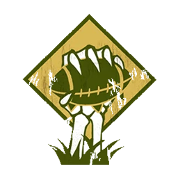

# No Muertos — Tope Tier 2 (1.160k)

> Presupuesto **Tier 2 = 1.160.000 gp** ([oro-presupuesto.md](../../source/tiers/oro-presupuesto.md)). 12 jugadores; oro gastado al completo. Lista **BB2025 / 3ª temporada**: máximo **2 Necrófagos**. Ver [no-muertos-valoracion-limitada.md](no-muertos-valoracion-limitada.md).

## Alineación

*Orden: Momias, Caballeros, Necrófagos, Zombis.*

| Nº | Nombre | Posición   | Coste | MA | ST | AG | PA | AR | Habilidades |
|----|--------|------------|-------|----|----|----|----|----|-------------|
| ____ | ____________________ | Momia      | 125k  | 3  | 5  | 5+ | 6+ | 10 | Golpe Mortífero, Regeneración |
| ____ | ____________________ | Momia      | 125k  | 3  | 5  | 5+ | 6+ | 10 | Golpe Mortífero, Regeneración |
| ____ | ____________________ | Caballero  | 95k   | 6  | 3  | 3+ | 5+ | 9  | Cabeza Dura, Placar, Placaje Defensivo, Regeneración |
| ____ | ____________________ | Caballero  | 95k   | 6  | 3  | 3+ | 5+ | 9  | Cabeza Dura, Placar, Placaje Defensivo, Regeneración |
| ____ | ____________________ | Necrófago  | 75k   | 7  | 3  | 3+ | 3+ | 8  | Esquivar, Regeneración |
| ____ | ____________________ | Necrófago  | 75k   | 7  | 3  | 3+ | 3+ | 8  | Esquivar, Regeneración |
| ____ | ____________________ | Zombie     | 40k   | 4  | 3  | 4+ | 6+ | 9  | Piquete de Ojos, Inestable, Regeneración |
| ____ | ____________________ | Zombie     | 40k   | 4  | 3  | 4+ | 6+ | 9  | Piquete de Ojos, Inestable, Regeneración |
| ____ | ____________________ | Zombie     | 40k   | 4  | 3  | 4+ | 6+ | 9  | Piquete de Ojos, Inestable, Regeneración |
| ____ | ____________________ | Zombie     | 40k   | 4  | 3  | 4+ | 6+ | 9  | Piquete de Ojos, Inestable, Regeneración |
| ____ | ____________________ | Zombie     | 40k   | 4  | 3  | 4+ | 6+ | 9  | Piquete de Ojos, Inestable, Regeneración |
| ____ | ____________________ | Zombie     | 40k   | 4  | 3  | 4+ | 6+ | 9  | Piquete de Ojos, Inestable, Regeneración |

**Total jugadores:** 12 | **TV:** 1.160k

**Desglose TV (todo lo que tiene precio):** Reroll 70.000 | Fans dedicados 10.000 c/u | Asistente de entrenador 10.000 c/u.

| Concepto | Coste |
|----------|--------|
| Jugadores (2 Momia 250k, 2 Caballero 190k, 2 Necrófago 150k, 6 Zombie 240k) | 830.000 |
| Rerolls (3 × 70.000) | 210.000 |
| Fans dedicados (6 × 10.000) | 60.000 |
| Asistentes de entrenador (6 × 10.000) | 60.000 |
| **Total TV** | **1.160.000** |

## Información del equipo

| Concepto | Valor |
|----------|--------|
| **Tier NAF** | Tier 2 |
| **Presupuesto tier** | 1.160.000 gp |
| **Valoración del equipo (TV)** | 1.160k |
| **Total plantilla** | 12 jugadores |
| **Tesorería actual** | 0 |
| **Rerolls** | 3 |
| **Asistentes de entrenador** | 6 |
| **Cheerleaders** | 0 |
| **Fans dedicados** | 6 |
| **Apotecario** | No (roster oficial) |

## Descripción oficial de las habilidades

* **Nota (Tembloroso vs Inestable):** **Tembloroso** en español corresponde al rasgo inglés ***Unsteady*** (p. ej. Saurios: no pueden **Asegurar el balón**). Los **Zombis** de No Muertos no tienen Tembloroso; llevan **Inestable** (*Unstable*): cuando son derribados, el entrenador rival hace una tirada en la tabla de heridas contra ellos. Ver [no-muertos.md](../../source/teams/no-muertos.md).
* **Cabeza Dura (Thick Skull) — incl.:** En tirada de Heridas: Inconsciente solo con 9; 8 = Aturdido. Con Escurridizo: Inconsciente con 8, 7 = Aturdido.
* **Esquivar (Dodge) — incl.:** Repetir un chequeo de esquivar por turno; afecta a Desequilibrado en placajes recibidos.
* **Golpe Mortífero (Mighty Blow) — incl.:** Al derribar en Placaje puede aplicar +1 a tirada de Armadura o de Heridas (decidir después de tirar).
* **Inestable (Unstable) — incl.:** Cuando este jugador es derribado, el entrenador rival hace una tirada en la tabla de heridas contra él.
* **Piquete de Ojos (Eye Gouge) — incl.:** Rival empujado por este jugador no puede dar apoyos ofensivos ni defensivos hasta que vuelva a ser activado.
* **Placar (Block) — incl.:** En placaje con «Ambos derribados» puede elegir no ser derribado.
* **Placaje Defensivo (Tackle) — incl.:** Rival que esquivando sale de su zona de defensa no puede usar Esquivar; en placaje contra él, Desequilibrado trata al rival como sin Esquivar.
* **Regeneración (Regeneration) — incl.:** Al sufrir Lesión: 1D6; 4+=se ignora la lesión y va a reservas; 1-3=normal.

## Inducements

- Según reglamento del torneo.

## Estrategia

- **Ataque:** Cage con Momias; **2 Necrófagos** (tope de lista) para portador y presión; 6 Zombis marcan y empujan.
- **Defensa:** Momias en el centro; Zombis en jugadores clave.

## Progresión recomendada

- Ver builds en [../skill-pack/](../skill-pack/) y datos en [no-muertos.md](../../source/teams/no-muertos.md).
