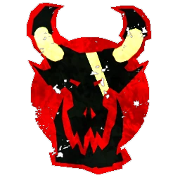

# Orcos Negros — Sugerencia torneo Triple Dirty (1.150k)

> Roster de torneo anti-elfos. Muy común en torneos grandes. Ver [orcos-negros-valoracion-limitada.md](orcos-negros-valoracion-limitada.md).

## Alineación

*Roster torneo. Orden: Troll → Orcos Negros → Goblins.*

| Nº | Nombre | Posición         | Coste | MA | ST | AG | PA | AR | Habilidades |
|----|--------|------------------|-------|----|----|----|----|----|-------------|
| ____ | ____________________ | Troll Adiestrado | 115k  | 4  | 5  | 5+ | 5+ | 10 | Siempre Hambriento, Solitario (3+), Golpe Mortífero, Proyectil Vómito, Realmente Estúpido, Regeneración, Lanzar Compañero |
| ____ | ____________________ | Orco Negro       | 90k   | 4  | 4  | 4+ | 5+ | 10 | Luchador, Apartar |
| ____ | ____________________ | Orco Negro       | 90k   | 4  | 4  | 4+ | 5+ | 10 | Luchador, Apartar |
| ____ | ____________________ | Orco Negro       | 90k   | 4  | 4  | 4+ | 5+ | 10 | Luchador, Apartar |
| ____ | ____________________ | Orco Negro       | 90k   | 4  | 4  | 4+ | 5+ | 10 | Luchador, Apartar |
| ____ | ____________________ | Orco Negro       | 90k   | 4  | 4  | 4+ | 5+ | 10 | Luchador, Apartar |
| ____ | ____________________ | Orco Negro       | 90k   | 4  | 4  | 4+ | 5+ | 10 | Luchador, Apartar |
| ____ | ____________________ | Goblin Bruiser  | 45k   | 6  | 2  | 3+ | 4+ | 8  | Esquivar, Humanoide Bala, Escurridizo, Cabeza Dura |
| ____ | ____________________ | Goblin Bruiser  | 45k   | 6  | 2  | 3+ | 4+ | 8  | Esquivar, Humanoide Bala, Escurridizo, Cabeza Dura |
| ____ | ____________________ | Goblin Bruiser  | 45k   | 6  | 2  | 3+ | 4+ | 8  | Esquivar, Humanoide Bala, Escurridizo, Cabeza Dura |
| ____ | ____________________ | Goblin Bruiser  | 45k   | 6  | 2  | 3+ | 4+ | 8  | Esquivar, Humanoide Bala, Escurridizo, Cabeza Dura |
| ____ | ____________________ | Goblin Bruiser  | 45k   | 6  | 2  | 3+ | 4+ | 8  | Esquivar, Humanoide Bala, Escurridizo, Cabeza Dura |
| ____ | ____________________ | Goblin Bruiser  | 45k   | 6  | 2  | 3+ | 4+ | 8  | Esquivar, Humanoide Bala, Escurridizo, Cabeza Dura |
| ____ | ____________________ | Goblin Bruiser  | 45k   | 6  | 2  | 3+ | 4+ | 8  | Esquivar, Humanoide Bala, Escurridizo, Cabeza Dura |

**Total jugadores:** 14 | **TV:** 1.150k

**Desglose TV:** Reroll 60.000.

| Concepto | Coste |
|----------|--------|
| Jugadores (1 Troll 115k, 6 Orco Negro 540k, 7 Goblin 315k) | 970.000 |
| Rerolls (3 × 60.000) | 180.000 |
| **Total TV** | **1.150.000** |

## Información del equipo

| Concepto | Valor |
|----------|--------|
| **Tier NAF** | Tier 3 |
| **Valoración del equipo (TV)** | 1.150k |
| **Total plantilla** | 14 jugadores |
| **Tesorería actual** | 0 |
| **Rerolls** | 3 |
| **Asistentes de entrenador** | 0 |
| **Cheerleaders** | 0 |
| **Fans dedicados** | 0 |
| **Apotecario** | No (inducement típico) |

## Descripción oficial de las habilidades

* **Apartar (Grab) — incl.:** Si el blanco es empujado, su entrenador elige la casilla; el blanco no puede usar Echarse a un Lado. No compatible con Furia.
* **Cabeza Dura (Thick Skull) — incl.:** En tirada de Heridas: Inconsciente solo con 9; 8 = Aturdido. Con Escurridizo: Inconsciente con 8, 7 = Aturdido.
* **Escurridizo (Stunty) — incl.:** No sufre -1 por estar marcado al esquivar; -1 AG al interceptar; tirada de Heridas en tabla Escurridizos.
* **Esquivar (Dodge) — incl.:** Repetir un chequeo de esquivar por turno; afecta a Desequilibrado en placajes recibidos.
* **Golpe Mortífero (Mighty Blow) — incl.:** Al derribar en Placaje puede aplicar +1 a tirada de Armadura o de Heridas (decidir después de tirar).
* **Humanoide Bala (Right Stuff) — incl.:** Puede ser lanzado por compañero con Lanzar compañero (incluso tumbado).
* **Lanzar Compañero (Throw Team-Mate) — incl.:** Puede declarar la acción de Lanzar compañero.
* **Luchador (Brawler) — incl.:** En Placaje puede repetir un único resultado de «Ambos derribados».
* **Proyectil Vómito (Projectile Vomit) — incl.:** Acción especial: rival adyacente, 1D6; 2+=tirada Armadura no modificada; 1=tirada contra él.
* **Realmente Estúpido (Really Stupid) — incl.:** Al activarse: 1D6 (+2 si adyacente a compañero en pie sin este rasgo); 4+=normal, 1-3=Distraído.
* **Regeneración (Regeneration) — incl.:** Al sufrir Lesión: 1D6; 4+=se ignora la lesión y va a reservas; 1-3=normal.
* **Siempre Hambriento (Always Hungry) — incl.:** Antes del chequeo de Lanzar compañero: 1D6; 1=intenta comerse al compañero (segundo 1D6: 1=devorado).
* **Solitario (Loner) — incl.:** Para usar Segunda oportunidad en su tirada debe tirar 1D6 ≥ número entre paréntesis; si no, la RR se gasta pero no repite.

## Inducements

- Inducements típicos: 2 Sobornos, Apotecario.

## Estrategia

- **Ataque:** Marcar fuerte la línea; derribar con Orcos; foul cada turno.
- **Defensa:** Contra equipos ágiles suele decidir el partido.

## Progresión recomendada

- Ver [orcos-negros-valoracion-limitada.md](orcos-negros-valoracion-limitada.md).
