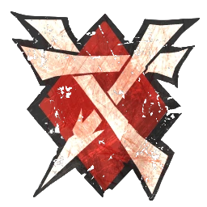

# Skavens — Sugerencia torneo TV ~1.150 competitivo (970k)

> Roster con Apotecario. Sin Rata Ogro. Ver [skavens-valoracion-limitada.md](skavens-valoracion-limitada.md).

## Información del equipo

| Concepto | Valor |
|----------|--------|
| **Tier NAF** | Tier 2 |
| **Valoración del equipo (TV)** | 970k |
| **Total plantilla** | 11 jugadores |
| **Tesorería actual** | 0 |
| **Rerolls** | 3 |
| **Asistentes de entrenador** | 0 |
| **Cheerleaders** | 0 |
| **Fans dedicados** | 0 |
| **Apotecario** | Sí |

## Alineación

*Roster torneo. Orden: Blitzers, Gutter Runners, Linemen.*

| Nº | Nombre | Posición      | Coste | MA | ST | AG | PA | AR | Habilidades |
|----|--------|---------------|-------|----|----|----|----|----|-------------|
| 1  | —      | Blitzer       | 90k   | 8  | 3  | 3+ | 4+ | 9  | Placar, Robar Balón |
| 2  | —      | Blitzer       | 90k   | 8  | 3  | 3+ | 4+ | 9  | Placar, Robar Balón |
| 3  | —      | Gutter Runner | 85k   | 9  | 2  | 2+ | 4+ | 8  | Apuñalar, Esquivar |
| 4  | —      | Gutter Runner | 85k   | 9  | 2  | 2+ | 4+ | 8  | Apuñalar, Esquivar |
| 5  | —      | Gutter Runner | 85k   | 9  | 2  | 2+ | 4+ | 8  | Apuñalar, Esquivar |
| 6  | —      | Gutter Runner | 85k   | 9  | 2  | 2+ | 4+ | 8  | Apuñalar, Esquivar |
| 7  | —      | Linemen       | 50k   | 7  | 3  | 3+ | 4+ | 8  | - |
| 8  | —      | Linemen       | 50k   | 7  | 3  | 3+ | 4+ | 8  | - |
| 9  | —      | Linemen       | 50k   | 7  | 3  | 3+ | 4+ | 8  | - |
| 10 | —      | Linemen       | 50k   | 7  | 3  | 3+ | 4+ | 8  | - |
| 11 | —      | Linemen       | 50k   | 7  | 3  | 3+ | 4+ | 8  | - |

**Total jugadores:** 11 | **TV:** 970k

**Desglose TV:** Reroll 50.000 | Apotecario 50.000.

| Concepto | Coste |
|----------|--------|
| Jugadores (2 Blitzer 180k, 4 Gutter 340k, 5 Linemen 250k) | 770.000 |
| Rerolls (3 x 50.000) | 150.000 |
| Apotecario | 50.000 |
| **Total TV** | **970.000** |

## Descripción oficial de las habilidades

* Ver [skavens.md](../../source/teams/skavens.md).

## Inducements

- Te quedan 190k (tope 1.160k): Rata Ogro, más Linemen o inducements.

## Estrategia

- **Ataque:** Anotar en 2-3 turnos; Apo protege Gutters y Blitzers.
- **Defensa:** Presión al balón; blitz con Gutter (Wrestle y Strip Ball con skill pack).

## Progresión recomendada

- Ver [skavens-skill-pack.md](../skill-pack/skavens-skill-pack.md).
