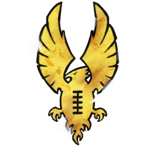

# Altos Elfos — Skill pack Ultra defensivo (1.150k)

> Build Ultra defensivo (8 skills). Ver [altos-elfos-skill-pack.md](altos-elfos-skill-pack.md). Equipo: [altos-elfos.md](../../source/teams/altos-elfos.md).

## Alineación

*Roster con skill pack 8 skills. Habilidades del pack en **negrita**.*

| Nº | Nombre | Posición           | Coste | MA | ST | AG | PA | AR | Habilidades |
|----|--------|-------------------|-------|----|----|----|----|----|-------------|
| ____ | ____________________ | White Lion Blitzer| 90k   | 8  | 3  | 2+ | 5+ | 9  | Atrapar, Forcejear, Garras, **Esquivar** |
| ____ | ____________________ | White Lion Blitzer| 90k   | 8  | 3  | 2+ | 5+ | 9  | Atrapar, Forcejear, Garras, **Esquivar** |
| ____ | ____________________ | Phoenix Thrower   | 100k  | 6  | 3  | 2+ | 2+ | 9  | Partenubes, Pasar, Pase Seguro, **Líder** |
| ____ | ____________________ | Alto Elfo Línea   | 70k   | 6  | 3  | 2+ | 4+ | 9  | **Forcejear** |
| ____ | ____________________ | Alto Elfo Línea   | 70k   | 6  | 3  | 2+ | 4+ | 9  | **Forcejear** |
| ____ | ____________________ | Alto Elfo Línea   | 70k   | 6  | 3  | 2+ | 4+ | 9  | **Placaje Defensivo** |
| ____ | ____________________ | Alto Elfo Línea   | 70k   | 6  | 3  | 2+ | 4+ | 9  | **Patada** |
| ____ | ____________________ | Alto Elfo Línea   | 70k   | 6  | 3  | 2+ | 4+ | 9  | **Guardia** |
| ____ | ____________________ | Alto Elfo Línea   | 70k   | 6  | 3  | 2+ | 4+ | 9  | - |
| ____ | ____________________ | Alto Elfo Línea   | 70k   | 6  | 3  | 2+ | 4+ | 9  | - |
| ____ | ____________________ | Alto Elfo Línea   | 70k   | 6  | 3  | 2+ | 4+ | 9  | - |

**Total jugadores:** 11 | **TV:** 1.150k

**Desglose TV:** Reroll 50.000 | Habilidades primaria 20.000 (8 skills).

| Concepto | Coste |
|----------|--------|
| Jugadores (2 Blitzer 180k, 1 Thrower 100k, 8 Línea 560k) | 840.000 |
| Rerolls (3 x 50.000) | 150.000 |
| Habilidades (8 x 20.000) | 160.000 |
| **Total TV** | **1.150.000** |

## Información del equipo

| Concepto | Valor |
|----------|--------|
| **Tier NAF** | Tier 1 |
| **Valoración del equipo (TV)** | 1.150k |
| **Total plantilla** | 11 jugadores |
| **Tesorería actual** | 0 |
| **Rerolls** | 3 |
| **Asistentes de entrenador** | 0 |
| **Cheerleaders** | 0 |
| **Fans dedicados** | 0 |
| **Apotecario** | No |

## Descripción

* Pack: Esquivar x2 Blitzers; Líder Thrower; Forcejear x2, Placaje Defensivo, Patada, Guardia en Línea.

## Inducements

- Según reglamento.

## Estrategia

- Defensa muy fuerte contra otros elfos.

## Progresión

- Ver [altos-elfos-skill-pack.md](altos-elfos-skill-pack.md).
