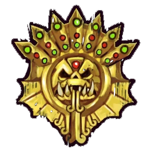

# Hombres Lagarto — Skill pack 7 habilidades agresivo (1.260k)

> Build 7 primarias, variante agresiva (Golpe Mortífero). Ver [hombres-lagarto-skill-pack.md](hombres-lagarto-skill-pack.md).

## Información del equipo

| Concepto | Valor |
|----------|--------|
| **Tier NAF** | Tier 1 |
| **Valoración del equipo (TV)** | 1.260k |
| **Total plantilla** | 12 jugadores |
| **Tesorería actual** | 0 |
| **Rerolls** | 2 |
| **Asistentes de entrenador** | 0 |
| **Cheerleaders** | 0 |
| **Fans dedicados** | 0 |
| **Apotecario** | No |

## Alineación

*Roster con skill pack 7 primarias (alternativa agresiva). Habilidades en **negrita**.*

| Nº | Nombre | Posición      | Coste | MA | ST | AG | PA | AR | Habilidades |
|----|--------|---------------|-------|----|----|----|----|----|-------------|
| ____ | ____________________ | Kroxigor      | 140k  | 6  | 5  | 5+ | 6+ | 10 | Cabeza Dura, Estúpido, Cola Prensil, Golpe Mortífero, Solitario (4+), **Guardia** |
| ____ | ____________________ | Saurio        | 90k   | 6  | 4  | 5+ | 6+ | 10 | Imparable, Tembloroso, **Placar** |
| ____ | ____________________ | Saurio        | 90k   | 6  | 4  | 5+ | 6+ | 10 | Imparable, Tembloroso, **Placar** |
| ____ | ____________________ | Saurio        | 90k   | 6  | 4  | 5+ | 6+ | 10 | Imparable, Tembloroso, **Placar** |
| ____ | ____________________ | Saurio        | 90k   | 6  | 4  | 5+ | 6+ | 10 | Imparable, Tembloroso, **Placar** |
| ____ | ____________________ | Saurio        | 90k   | 6  | 4  | 5+ | 6+ | 10 | Imparable, Tembloroso, **Guardia** |
| ____ | ____________________ | Saurio        | 90k   | 6  | 4  | 5+ | 6+ | 10 | Imparable, Tembloroso, **Golpe Mortífero** |
| ____ | ____________________ | Eslizón Línea | 60k   | 8  | 2  | 3+ | 4+ | 8  | Esquivar, Escurridizo, **Pies Seguros** |
| ____ | ____________________ | Eslizón Línea | 60k   | 8  | 2  | 3+ | 4+ | 8  | Esquivar, Escurridizo |
| ____ | ____________________ | Eslizón Línea | 60k   | 8  | 2  | 3+ | 4+ | 8  | Esquivar, Escurridizo |
| ____ | ____________________ | Eslizón Línea | 60k   | 8  | 2  | 3+ | 4+ | 8  | Esquivar, Escurridizo |
| ____ | ____________________ | Eslizón Línea | 60k   | 8  | 2  | 3+ | 4+ | 8  | Esquivar, Escurridizo |

**Total jugadores:** 12 | **TV:** 1.260k

**Desglose TV:** Reroll 70.000 | Habilidades primaria 20.000 c/u.

| Concepto | Coste |
|----------|--------|
| Jugadores (1 Kroxigor 140k, 6 Saurio 540k, 5 Eslizon 300k) | 980.000 |
| Rerolls (2 x 70.000) | 140.000 |
| Habilidades progresión (7 x 20.000) | 140.000 |
| **Total TV** | **1.260.000** |

## Descripción oficial de las habilidades

* Ver [hombres-lagarto.md](../../source/teams/hombres-lagarto.md).

## Inducements

- Según reglamento del torneo.

## Estrategia

- Variante agresiva: un Saurio con Golpe Mortífero para eliminar jugadores.

## Progresion recomendada

- Ver [hombres-lagarto-skill-pack.md](hombres-lagarto-skill-pack.md).
