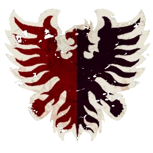

# Nobleza Imperial — Skill pack Meta estándar (1.270k)

> Build Meta estándar. Ver [nobleza-imperial-skill-pack.md](nobleza-imperial-skill-pack.md). Equipo: [nobleza-imperial.md](../../source/teams/nobleza-imperial.md).

## Alineación

*Roster con skill pack. Habilidades del pack en **negrita**.*

| Nº | Nombre | Posición          | Coste | MA | ST | AG | PA | AR | Habilidades |
|----|--------|-------------------|-------|----|----|----|----|----|-------------|
| ____ | ____________________ | Ogre              | 140k  | 5  | 5  | 4+ | 5+ | 10 | Estúpido, Solitario (3+), Golpe Mortífero, Cabeza Dura, Lanzar Compañero, **Guardia** |
| ____ | ____________________ | Bodyguard         | 85k   | 5  | 3  | 3+ | 4+ | 9  | Mantenerse Firme, Forcejeo, **Guardia** |
| ____ | ____________________ | Bodyguard         | 85k   | 5  | 3  | 3+ | 4+ | 9  | Mantenerse Firme, Forcejeo, **Guardia** |
| ____ | ____________________ | Bodyguard         | 85k   | 5  | 3  | 3+ | 4+ | 9  | Mantenerse Firme, Forcejeo |
| ____ | ____________________ | Bodyguard         | 85k   | 5  | 3  | 3+ | 4+ | 9  | Mantenerse Firme, Forcejeo |
| ____ | ____________________ | Noble Blitzer     | 90k   | 7  | 3  | 3+ | 4+ | 9  | Placar, Atrapar, Profesional, **Esquivar**, **Golpe Mortífero** (sec) |
| ____ | ____________________ | Noble Blitzer     | 90k   | 7  | 3  | 3+ | 4+ | 9  | Placar, Atrapar, Profesional, **Placaje Defensivo** |
| ____ | ____________________ | Imperial Thrower  | 75k   | 6  | 3  | 3+ | 2+ | 9  | Pasar, Pasar y seguir, Profesional |
| ____ | ____________________ | Retainer Línea     | 45k   | 6  | 3  | 3+ | 4+ | 8  | Zafarse, **Patada** |
| ____ | ____________________ | Retainer Línea     | 45k   | 6  | 3  | 3+ | 4+ | 8  | Zafarse |
| ____ | ____________________ | Retainer Línea     | 45k   | 6  | 3  | 3+ | 4+ | 8  | Zafarse |
| ____ | ____________________ | Retainer Línea     | 45k   | 6  | 3  | 3+ | 4+ | 8  | Zafarse |
| ____ | ____________________ | Retainer Línea     | 45k   | 6  | 3  | 3+ | 4+ | 8  | Zafarse |

**Total jugadores:** 13 | **TV:** 1.270k

**Desglose TV:** Reroll 50.000 | Habilidades primaria 20.000, secundaria 40.000.

| Concepto | Coste |
|----------|--------|
| Jugadores (4 Bodyguard 340k, 2 Blitzer 180k, 5 Retainer 225k, 1 Thrower 75k, 1 Ogre 140k) | 960.000 |
| Rerolls (3 x 50.000) | 150.000 |
| Habilidades (6 primarias x 20.000 + 1 secundaria x 40.000) | 160.000 |
| **Total TV** | **1.270.000** |

## Información del equipo

| Concepto | Valor |
|----------|--------|
| **Tier NAF** | Tier 2 |
| **Valoración del equipo (TV)** | 1.270k |
| **Total plantilla** | 13 jugadores |
| **Tesorería actual** | 0 |
| **Rerolls** | 3 |
| **Asistentes de entrenador** | 0 |
| **Cheerleaders** | 0 |
| **Fans dedicados** | 0 |
| **Apotecario** | No |

## Descripción

* Pack: Guardia x2 Bodyguards; Esquivar y Placaje Defensivo Blitzers; Patada Retainer; Guardia Ogre; secundaria Golpe Mortífero en Blitzer.

## Inducements

- Según reglamento.

## Estrategia

- Guardia en Bodyguards. Blitzer con Esquivar = portador o anotador fiable.

## Progresión

- Ver [nobleza-imperial-skill-pack.md](nobleza-imperial-skill-pack.md).
