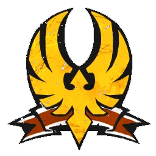

# Union Elfica — Skill pack Ultra agresivo (1.205k)

> Build Ultra agresivo (8 skills). Ver [union-elfica-skill-pack.md](union-elfica-skill-pack.md). Equipo: [union-elfica.md](../../source/teams/union-elfica.md).

## Información del equipo

| Concepto | Valor |
|----------|--------|
| **Tier NAF** | Tier 2 |
| **Valoracion del equipo (TV)** | 1.205k |
| **Total plantilla** | 11 jugadores |
| **Tesorería actual** | 0 |
| **Rerolls** | 3 |
| **Asistentes de entrenador** | 0 |
| **Cheerleaders** | 0 |
| **Fans dedicados** | 0 |
| **Apotecario** | No |

## Alineación

*Roster con skill pack 8 skills. Habilidades del pack en **negrita**.*

| Nº | Nombre | Posición     | Coste | MA | ST | AG | PA | AR | Habilidades |
|----|--------|--------------|-------|----|----|----|----|----|-------------|
| ____ | ____________________ | Elfo Blitzer  | 115k  | 7  | 3  | 2+ | 3+ | 9  | Echarse a un Lado, Placar, **Esquivar** |
| ____ | ____________________ | Elfo Blitzer  | 115k  | 7  | 3  | 2+ | 3+ | 9  | Echarse a un Lado, Placar, **Esquivar** |
| ____ | ____________________ | Elfo Catcher  | 100k  | 8  | 3  | 2+ | 4+ | 8  | Atrapar, Nervios de Acero, Recepción Heroica, **Placar** |
| ____ | ____________________ | Elfo Catcher  | 100k  | 8  | 3  | 2+ | 4+ | 8  | Atrapar, Nervios de Acero, Recepción Heroica, **Forcejear** |
| ____ | ____________________ | Elfo Lanzador | 75k   | 6  | 3  | 2+ | 2+ | 8  | Pasar, Pase a lo Loco, **Líder** |
| ____ | ____________________ | Elfo Línea    | 65k   | 6  | 3  | 2+ | 3+ | 8  | Dejada, **Patada** |
| ____ | ____________________ | Elfo Línea    | 65k   | 6  | 3  | 2+ | 3+ | 8  | Dejada, **Placaje Defensivo** |
| ____ | ____________________ | Elfo Línea    | 65k   | 6  | 3  | 2+ | 3+ | 8  | Dejada, **Forcejear** |
| ____ | ____________________ | Elfo Línea    | 65k   | 6  | 3  | 2+ | 3+ | 8  | Dejada |
| ____ | ____________________ | Elfo Línea    | 65k   | 6  | 3  | 2+ | 3+ | 8  | Dejada |
| ____ | ____________________ | Elfo Línea    | 65k   | 6  | 3  | 2+ | 3+ | 8  | Dejada |

**Total jugadores:** 11 | **TV:** 1.205k

**Desglose TV:** Reroll 50.000 | Habilidades primaria 20.000 (8 skills).

| Concepto | Coste |
|----------|--------|
| Jugadores (2 Blitzer 230k, 2 Catcher 200k, 1 Lanzador 75k, 6 Línea 390k) | 895.000 |
| Rerolls (3 x 50.000) | 150.000 |
| Habilidades (8 x 20.000) | 160.000 |
| **Total TV** | **1.205.000** |

## Descripción

* Pack: Esquivar x2 Blitzers; Placar y Forcejear Catchers; Patada, Placaje Defensivo, Forcejear Línea; Líder Lanzador.

## Inducements

- Según reglamento.

## Estrategia

- Equipo muy completo: scorer, sacker, defensa sólida.

## Progresión

- Ver [union-elfica-skill-pack.md](union-elfica-skill-pack.md).
