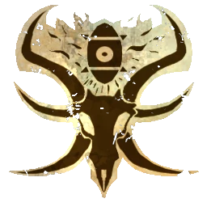

# Elegidos del Caos — Torneo Season 3 (1.125k, Ogro)

> **BB 3ª temporada / BB2025.** Big Guy: **Ogro del Caos** (140k) — más estable que el Troll para muchos metas. Misma estructura: 4 Guerreros, 7 Beastmen, 3 RR, apo. **Otras variantes:** [Troll 1.100k](torneo-s3-elegidos-del-caos-troll-1100k.md) · [Minotauro 1.135k](torneo-s3-elegidos-del-caos-minotauro-1135k.md). Lista: [`source/teams/elegidos-del-caos.md`](../../source/teams/elegidos-del-caos.md).

## Alineación

*Sin avances de habilidades en la TV. **Dorsales:** Beastman **1–7**, Guerrero **9–12**, Ogro **20** (**21** libre si no usas Minotauro).*

| Nº | Nombre | Posición | Coste | MA | ST | AG | PA | AR | Habilidades |
|----|--------|----------|-------|----|----|----|----|----|-------------|
| 1 | ____ | Beastman | 55k | 6 | 3 | 3+ | 4+ | 9+ | Cuernos, Cabeza Dura |
| 2 | ____ | Beastman | 55k | 6 | 3 | 3+ | 4+ | 9+ | Cuernos, Cabeza Dura |
| 3 | ____ | Beastman | 55k | 6 | 3 | 3+ | 4+ | 9+ | Cuernos, Cabeza Dura |
| 4 | ____ | Beastman | 55k | 6 | 3 | 3+ | 4+ | 9+ | Cuernos, Cabeza Dura |
| 5 | ____ | Beastman | 55k | 6 | 3 | 3+ | 4+ | 9+ | Cuernos, Cabeza Dura |
| 6 | ____ | Beastman | 55k | 6 | 3 | 3+ | 4+ | 9+ | Cuernos, Cabeza Dura |
| 7 | ____ | Beastman | 55k | 6 | 3 | 3+ | 4+ | 9+ | Cuernos, Cabeza Dura |
| 9 | ____ | Guerrero Caos | 100k | 5 | 4 | 3+ | 5+ | 10+ | Llave de Brazo |
| 10 | ____ | Guerrero Caos | 100k | 5 | 4 | 3+ | 5+ | 10+ | Llave de Brazo |
| 11 | ____ | Guerrero Caos | 100k | 5 | 4 | 3+ | 5+ | 10+ | Llave de Brazo |
| 12 | ____ | Guerrero Caos | 100k | 5 | 4 | 3+ | 5+ | 10+ | Llave de Brazo |
| 20 | ____ | Ogro del Caos | 140k | 5 | 5 | 4+ | 5+ | 10+ | Estúpido, Solitario (4+), Golpe Mortífero, Cabeza Dura, Lanzar Compañero |

**Total jugadores:** 12 | **TV:** 1.125k

**Desglose TV (todo lo que tiene precio):** Reroll 50.000 | Apotecario 50.000 | Fans dedicados 10.000 c/u.

| Concepto | Coste |
|----------|--------|
| Jugadores (1 Ogro 140k, 4 Guerreros 400k, 7 Beastmen 385k) | 925.000 |
| Rerolls (3 × 50.000) | 150.000 |
| Apotecario | 50.000 |
| **Total TV** | **1.125.000** |

## Información del equipo

| Concepto | Valor |
|----------|--------|
| **Tier NAF (referencia)** | Tier 3 |
| **Valoración del equipo (TV)** | 1.125k |
| **Total plantilla** | 12 jugadores |
| **Tesorería actual** | 0 |
| **Rerolls** | 3 |
| **Asistentes de entrenador** | 0 |
| **Cheerleaders** | 0 |
| **Fans dedicados** | 0 |
| **Apotecario** | Sí |

## Notas Season 3

- **Guerreros:** **Llave de Brazo**; priorizar **Placar** en torneo.
- **Ogro:** **MA 5**, **Estúpido** (1 en dado) frente a **Realmente Estúpido** del Troll; **Lanzar Compañero** con Beastmen.
- **Favoured Of…:** según reglamento del evento.

## Paquete de habilidades y mutaciones (referencia)

- **Guerreros:** **Placar** x4.
- **Beastmen:** **Garras**, **Tentáculos**, **Brazos Adicionales** (GM / ADPS).

## Estrellas sugeridas

- [Lord Borak the Despoiler](../../source/jugadores-estrella/lord-borak-the-despoiler.md)
- [Withergrasp Doubledrool](../../source/jugadores-estrella/withergrasp-doubledrool.md) — si **Favoured Of: Nurgle**.

## Descripción oficial de las habilidades

*[`source/teams/elegidos-del-caos.md`](../../source/teams/elegidos-del-caos.md) · [`source/habilidades/mutaciones.md`](../../source/habilidades/mutaciones.md).*

## Inducements

- Según torneo y **Favoured Of…**.

## Estrategia

- **Muro:** Ogro **FU 5** con **Cabeza Dura** y **Golpe Mortífero**; menos reglas que el Troll pero **Solitario (4+)** en rerolls.
- **Riesgo:** guerreros sin Placar de lista; **3 RR** recomendables.

## Progresión recomendada (liga)

- **Guerrero Caos:** primarias Placar, Defensa; secundarias (GMS / AD).
- **Beastman:** primarias Placar, Garras; secundarias (GM / ADPS).
- **Ogro del Caos:** primarias **MS**; secundarias **AG** (`elegidos-del-caos.md`).
