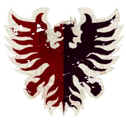

# Nobleza Imperial — Torneo Season 3 (1.155k, 2 Throwers)

> **BB 3ª temporada / BB2025.** Guías *Imperial Nobility* citan **1–2 Throwers**: aquí van **2 Imperial Thrower** y **1 Retainer Línea** (en lugar de 1+3), **10 fans** para cerrar **1.155k** con 3 RR y apo. **Otra variante:** [1 Thrower + 3 Retainers → 1.150k](torneo-s3-nobleza-imperial-1150k.md). Lista: [`source/teams/nobleza-imperial.md`](../../source/teams/nobleza-imperial.md).

## Alineación

*Sin avances de habilidades en la TV. **Dorsales:** Thrower **1** y **2**, Blitzers **3** y **4**, Bodyguards **5–8**, Retainer **9**, Ogro **20** (**10–12** libres).*

| Nº | Nombre | Posición | Coste | MV | FU | AG | PS | AR | Habilidades |
|----|--------|----------|-------|----|----|----|----|----|-------------|
| 1 | ____ | Imperial Thrower | 75k | 6 | 3 | 3+ | 2+ | 9+ | Pasar, Pasar y seguir, Profesional |
| 2 | ____ | Imperial Thrower | 75k | 6 | 3 | 3+ | 2+ | 9+ | Pasar, Pasar y seguir, Profesional |
| 3 | ____ | Noble Blitzer | 90k | 7 | 3 | 3+ | 4+ | 9+ | Placar, Atrapar, Profesional |
| 4 | ____ | Noble Blitzer | 90k | 7 | 3 | 3+ | 4+ | 9+ | Placar, Atrapar, Profesional |
| 5 | ____ | Bodyguard | 85k | 5 | 3 | 3+ | 4+ | 9+ | Mantenerse firme, Forcejear |
| 6 | ____ | Bodyguard | 85k | 5 | 3 | 3+ | 4+ | 9+ | Mantenerse firme, Forcejear |
| 7 | ____ | Bodyguard | 85k | 5 | 3 | 3+ | 4+ | 9+ | Mantenerse firme, Forcejear |
| 8 | ____ | Bodyguard | 85k | 5 | 3 | 3+ | 4+ | 9+ | Mantenerse firme, Forcejear |
| 9 | ____ | Retainer Línea | 45k | 6 | 3 | 3+ | 4+ | 8+ | Zafarse |
| 20 | ____ | Ogro | 140k | 5 | 5 | 4+ | 5+ | 10+ | Estúpido, Solitario (3+), Golpe mortífero (+1), Cabeza dura, Lanzar compañero |

**Total jugadores:** 11 | **TV:** 1.155k

**Desglose TV (todo lo que tiene precio):** Reroll 50.000 | Apotecario 50.000 | Hinchas 10.000 c/u.

| Concepto | Coste |
|----------|--------|
| Jugadores (1 Ogro 140k, 2 Noble Blitzers 180k, 4 Bodyguards 340k, 2 Throwers 150k, 1 Retainer 45k) | 855.000 |
| Rerolls (3 × 50.000) | 150.000 |
| Apotecario | 50.000 |
| Hinchas (10 × 10.000) | 100.000 |
| **Total TV** | **1.155.000** |

<!-- habilidades-roster:inicio -->
## Habilidades del roster

*Definición de todas las habilidades y rasgos de los jugadores de esta lista (de serie y compradas). Generado con `scripts/habilidades_en_rosters.py`.*

- **[Atrapar](../../source/habilidades/agilidad.md)** (*Catch* · Agilidad · Activa): Puede **repetir** cualquier chequeo de AG fallido al **intentar atrapar** el balón.
- **[Cabeza dura](../../source/habilidades/fuerza.md)** (*Thick Skull* · Fuerza · Pasiva): Tirada de **Heridas**: **Inconsciente** solo con **9**; **8** = **Aturdido**. Con **Escurridizo**: Inconsciente con **8**, **7** = Aturdido.
- **[Estúpido](../../source/habilidades/rasgos.md)** (*Bone Head* · Rasgo · Pasiva (obligatoria)): Tras declarar acción: **1D6** **2+** OK; **1** = **Distraído**.
- **[Forcejear](../../source/habilidades/general.md)** (*Wrestle* · General · Activa): En **Placaje** (activo o como blanco), si aplicaría **Ambos derribados**, puede usarla: **ambos** quedan **tumbados boca arriba**, sin importar otras habilidades.
- **[Golpe mortífero](../../source/habilidades/fuerza.md)** (*Mighty Blow* · Fuerza · Activa (Elite)): Si **derriba** a un rival en **Placaje** (aunque él también quede derribado), **+1** a **Armadura** **o** a **Heridas** (eliges **después** de tirar ese dado).
- **[Lanzar compañero](../../source/habilidades/rasgos.md)** (*Throw Team-Mate* · Rasgo · Activa): Puede declarar **Lanzar compañero**.
- **[Mantenerse firme](../../source/habilidades/fuerza.md)** (*Stand Firm* · Fuerza · Activa): Ante **empuje** por Placaje (incl. cadena) puede **no moverse**. **No** bloquea el **segundo Placaje** de **Furia** si sigue en pie.
- **[Pasar](../../source/habilidades/pase.md)** (*Pass* · Pase · Activa): Puede **repetir** cualquier chequeo de **Pase** fallido en acción de **Pase**.
- **[Pasar y seguir](../../source/habilidades/pase.md)** (*Give and Go* · Pase · Activa): Tras **Pase rápido** o **Entregar balón** sin cambio de turno: **no** termina; puede seguir **Movimiento** con lo que le quede.
- **[Placar](../../source/habilidades/general.md)** (*Block* · General · Activa (Elite)): En Placaje con **Ambos derribados** puede elegir **no** ser **derribado**.
- **[Profesional](../../source/habilidades/general.md)** (*Pro* · General · Activa): En **su activación**, para repetir **un** dado: antes **1D6**, **3+** puede repetir, **1–2** no. **No** en Armadura/Heridas/lesiones ni tiradas **fuera** de su activación ni que no haga **él** (p. ej. protestar al árbitro). Tras intentar Pro, **no** otra repetición en la misma tirada.
- **[Solitario](../../source/habilidades/rasgos.md)** (*Loner* · Rasgo · Pasiva (obligatoria)): Para usar **Segunda oportunidad**: **1D6** vs número entre paréntesis; si falla **no** repite pero **gasta** el reroll.
- **[Zafarse](../../source/habilidades/general.md)** (*Fend* · General · Activa): Si es **empujado** por Placaje **contra él**, el rival **no** puede **impulso**. **No** contra **Bola con cadena** ni **Imparable** en **Penetración**.

<!-- habilidades-roster:fin -->

## Información del equipo

| Concepto | Valor |
|----------|--------|
| **Tier NAF (referencia)** | Tier 2 |
| **Valoración del equipo (TV)** | 1.155k |
| **Total plantilla** | 11 jugadores |
| **Tesorería actual** | 0 |
| **Rerolls** | 3 |
| **Asistentes de entrenador** | 0 |
| **Animadoras** | 0 |
| **Hinchas** | 10 |
| **Apotecario** | Sí |

## Notas

- **Dos Throwers:** **Pasar**, **Pasar y seguir** y **Profesional** en dos piezas **PS 2+**; menos **Retainers** para pantalla/faltas — compensa con **10 fans**.
- Resto igual que la ficha [1.150k](torneo-s3-nobleza-imperial-1150k.md): Bodyguards, Blitzers, Ogro, Season 3.

## Apotecario vs mascota

Ajusta según reglamento del torneo si aplica mascota u otro asistente.

## Paquete de habilidades (torneo — referencia)

- **Bodyguards:** **Defensa**.
- **Noble Blitzers:** **Placaje defensivo** o **Esquivar**.
- **Throwers:** **Líder**, **Precisión** según paquete.

## Estrellas (presupuesto amplio)

[Morg'n'Thorg](../../source/jugadores-estrella/morg-n-thorg.md), [Griff Oberwald](../../source/jugadores-estrella/griff-oberwald.md).

## Inducements

- Según torneo.

## Estrategia

- **Pase:** dos piezas **PS 2+** con **Profesional** rotan el balón y presionan menos al único **Retainer** de apoyo.
- **Control:** cuatro Bodyguards + Ogro como en la variante de 1.150k.

## Progresión recomendada (liga)

- **Bodyguard:** primarias Defensa, Placar; secundarias (GF / A).
- **Noble Blitzer:** primarias Placaje defensivo, Esquivar; secundarias (AG / PF).
- **Imperial Thrower:** primarias Líder, Precisión; secundarias (GP / AF).
- **Retainer Línea:** primarias Placar, Luchador; secundarias (G / AF).
- **Ogro:** primarias Defensa, Abrirse paso; secundarias (F / AG).
