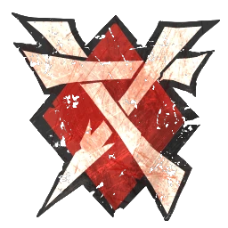

# Skavens — Torneo Season 3 (1.000k, 2 RR + fans)

> **BB 3ª temporada / BB2025.** Mismo **núcleo de 11 jugadores** que [1.010k (3 RR)](torneo-s3-skavens-1010k.md), pero para **techo 1.000k estricto:** **2 rerolls** + **4 Hinchas** (4 × 10k). Sin apotecario en la suma. **Otras variantes:** [1.010k, 3 RR](torneo-s3-skavens-1010k.md) · [1.010k, 2 RR + apo](torneo-s3-skavens-1010k-apo.md) · [1.060k, 5.º Lineman](torneo-s3-skavens-1060k.md). Lista: [`source/teams/skavens.md`](../../source/teams/skavens.md).

## Alineación

*Sin avances de torneo en la TV. **Dorsales:** Thrower **1–2**, Gutter Runner **3–4**, Blitzer **5–6**, Linemen **7–10**, Rata Ogro **20**.*

| Nº | Nombre | Posición | Coste | MV | FU | AG | PS | AR | Habilidades |
|----|--------|----------|-------|----|----|----|----|----|-------------|
| 1 | ____ | Thrower | 80k | 7 | 3 | 3+ | 2+ | 8+ | Manos seguras, Pasar |
| 2 | ____ | Thrower | 80k | 7 | 3 | 3+ | 2+ | 8+ | Manos seguras, Pasar |
| 3 | ____ | Gutter Runner | 85k | 9 | 2 | 2+ | 4+ | 8+ | Apuñalar, Esquivar |
| 4 | ____ | Gutter Runner | 85k | 9 | 2 | 2+ | 4+ | 8+ | Apuñalar, Esquivar |
| 5 | ____ | Blitzer | 90k | 8 | 3 | 3+ | 4+ | 9+ | Placar, Robar balón |
| 6 | ____ | Blitzer | 90k | 8 | 3 | 3+ | 4+ | 9+ | Placar, Robar balón |
| 7 | ____ | Linemen | 50k | 7 | 3 | 3+ | 4+ | 8+ | — |
| 8 | ____ | Linemen | 50k | 7 | 3 | 3+ | 4+ | 8+ | — |
| 9 | ____ | Linemen | 50k | 7 | 3 | 3+ | 4+ | 8+ | — |
| 10 | ____ | Linemen | 50k | 7 | 3 | 3+ | 4+ | 8+ | — |
| 20 | ____ | Rata Ogro | 150k | 6 | 5 | 4+ | — | 9+ | Ferocidad animal, Cola prensil, Furia, Golpe mortífero (+1), Solitario (4+) |

**Total jugadores:** 11 | **TV:** 1.000k

**Desglose TV:** Reroll 50.000 | Hinchas 10.000 c/u.

| Concepto | Coste |
|----------|--------|
| Jugadores (1 Rata Ogro 150k, 2 Throwers 160k, 2 Gutter Runners 170k, 2 Blitzers 180k, 4 Linemen 200k) | 860.000 |
| Rerolls (2 × 50.000) | 100.000 |
| Hinchas (4 × 10.000) | 40.000 |
| **Total TV** | **1.000.000** |

<!-- habilidades-roster:inicio -->
## Habilidades del roster

*Definición de todas las habilidades y rasgos de los jugadores de esta lista (de serie y compradas). Generado con `scripts/habilidades_en_rosters.py`.*

- **[Apuñalar](../../source/habilidades/rasgos.md)** (*Stab* · Rasgo · Activa): Acción **Apuñalar** (sin límite por turno): rival **en pie** adyacente, **Armadura** sin mods.; si rompe → **Heridas**. Puede **sustituir** Placaje en **Penetración** (activación termina igualmente).
- **[Cola prensil](../../source/habilidades/mutaciones.md)** (*Prehensile Tail* · Mutaciones · Activa): **-1** adicional al AG de rivales que **esquivan, saltan o brincan** desde su zona de defensa. **Solo uno** por intento de salida.
- **[Esquivar](../../source/habilidades/agilidad.md)** (*Dodge* · Agilidad · Activa (Elite)): **Una vez por turno** puede repetir un **único** chequeo de AG al **intentar esquivar**. Afecta al resultado **Desequilibrado** cuando un rival le hace un Placaje.
- **[Ferocidad animal](../../source/habilidades/rasgos.md)** (*Animal Savagery* · Rasgo · Pasiva (obligatoria)): Tras declarar: **1D6** (**+2** si Placaje/Penetración). **4+** OK; **1–3** ataca **compañero adyacente en pie** (derribo); sin cambio de turno salvo que llevara el balón; con **Garras**/**Golpe mortífero** debe usarlos vs compañero; después puede seguir su activación (FAQ). **1–3** sin compañero adyacente → **Distraído**.
- **[Furia](../../source/habilidades/general.md)** (*Frenzy* · General · Activa (obligatoria)): Tras **empujar** en Placaje debe **impulso** si puede; si el blanco sigue **en pie**, **segundo Placaje** al mismo (e impulso otra vez). En **Penetración**, el segundo cuesta **movimiento**; si no puede forzar marcha, **no** hay segundo placaje. **No** **Apartar**, **Golpe a la carrera** ni **Placaje múltiple**.
- **[Golpe mortífero](../../source/habilidades/fuerza.md)** (*Mighty Blow* · Fuerza · Activa (Elite)): Si **derriba** a un rival en **Placaje** (aunque él también quede derribado), **+1** a **Armadura** **o** a **Heridas** (eliges **después** de tirar ese dado).
- **[Manos seguras](../../source/habilidades/general.md)** (*Sure Hands* · General · Activa): Puede **repetir** el **D6** al **recoger** el balón (**no** en **Asegurar el balón**). **Robar balón** **no** puede usarse contra él.
- **[Pasar](../../source/habilidades/pase.md)** (*Pass* · Pase · Activa): Puede **repetir** cualquier chequeo de **Pase** fallido en acción de **Pase**.
- **[Placar](../../source/habilidades/general.md)** (*Block* · General · Activa (Elite)): En Placaje con **Ambos derribados** puede elegir **no** ser **derribado**.
- **[Robar balón](../../source/habilidades/general.md)** (*Strip Ball* · General · Activa): Placaje al **portador** y **empuje**: el balón **cae y rebota** desde la casilla de destino **antes** de que el rival quede tumbado, pero **después** de que **este jugador** elija si hace **impulso**.
- **[Solitario](../../source/habilidades/rasgos.md)** (*Loner* · Rasgo · Pasiva (obligatoria)): Para usar **Segunda oportunidad**: **1D6** vs número entre paréntesis; si falla **no** repite pero **gasta** el reroll.

<!-- habilidades-roster:fin -->

## Información del equipo

| Concepto | Valor |
|----------|--------|
| **Tier NAF (referencia)** | Tier 2 |
| **Valoración del equipo (TV)** | 1.000k |
| **Total plantilla** | 11 jugadores |
| **Rerolls** | 2 |
| **Hinchas** | 4 |
| **Apotecario** | No en esta suma |

## Notas

- Menos **Segunda oportunidad** que la build de 3 RR; los **fans** ayudan en tiradas de asistencia / FAME según reglas del evento.

## Paquete de habilidades, inducements, estrategia y progresión

*Ver [torneo-s3-skavens-1010k.md](torneo-s3-skavens-1010k.md) (contexto Season 3, táctica, progresión de liga).*
