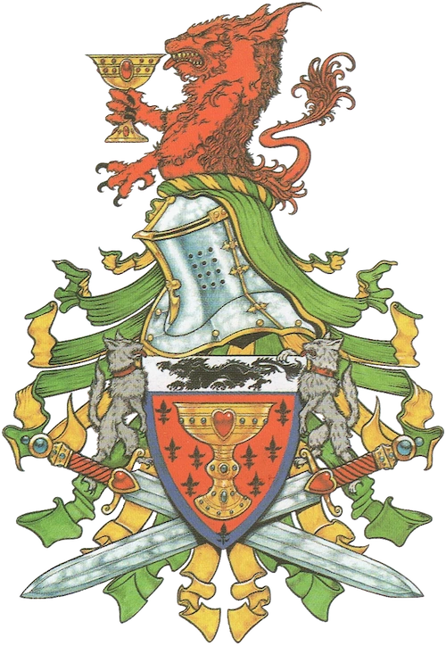

# Bretonia — Datos 2025

Fuente: [Nuffle Zone — Bretonia](https://nufflezone.com/equipos-blood-bowl/bretonia/)

## Roster 2025 (Brionne Barons)

| CTD | Posición | Coste | MA | FU | AG | PA | AR | Habilidades (resumen) | Pri | Sec |
|-----|-----------|-------|----|----|----|----|-----|------------------------|-----|-----|
| 0-16 | Escuderos | 50k | 6 | 3 | 3+ | 4+ | 8+ | Forcejeo | G | AF |
| 0-2 | Caballero Receptor | 85k | 7 | 3 | 3+ | 4+ | 9+ | Agallas, Atrapar, Nervios de Acero | AG | F |
| 0-2 | Caballero Lanzador | 80k | 6 | 3 | 3+ | 3+ | 9+ | Agallas, Pasar, Nervios de Acero | GP | AS |
| 0-4 | Caballero del Grial | 95k | 7 | 3 | 3+ | 4+ | 10+ | Agallas, Equilibrio Firme, Placar | GS | A |

- **Rerolls:** 60k  
- **Apotecario:** Sí  
- **Reglas especiales:** Ninguna  
- **Liga:** Clásica del Viejo Mundo  

## Descripción oficial de las habilidades

* **Agallas (Dauntless) — incl.:** Al placar a rival con más FU: 1D6+FU de este jugador; si total > FU rival, este jugador cuenta con FU igual al rival para ese placaje.
* **Atrapar (Catch) — incl.:** Puede repetir chequeo de AG fallido al atrapar el balón.
* **Equilibrio Firme (Steady Footing) — incl.:** Al ir a ser derribado/caer: 1D6; con 6 no cae y no hay cambio de turno si es en su activación.
* **Forcejear (Wrestle) — incl.:** En placaje con «Ambos derribados» puede elegir que ambos queden tumbados boca arriba.
* **Nervios de Acero (Nerves Of Steel) — incl.:** Ignora modificadores por estar marcado al atrapar o al hacer chequeo de Pase para pasar.
* **Pasar (Pass) — incl.:** Puede repetir cualquier chequeo de Pase fallido en una acción de Pase.
* **Placar (Block) — incl.:** En placaje con «Ambos derribados» puede elegir no ser derribado.
