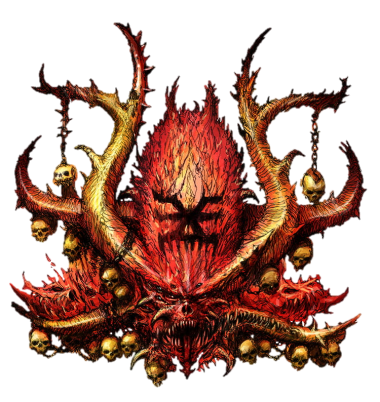

# Demonios de Khorne — Datos (NAF)

Fuente: [Nuffle Zone — Demonios de Khorne](https://nufflezone.com/equipos-blood-bowl/demonios-de-khorne/)

## Roster

| CTD | Posición | Coste | MA | FU | AG | PA | AR | Habilidades (resumen) | Pri | Sec |
|-----|-----------|-------|----|----|----|----|-----|------------------------|-----|-----|
| 0-16 | Pit Fighters | 60k | 6 | 3 | 3+ | 4+ | 9+ | Furia | G | AF |
| 0-4 | Bloodletter | 80k | 6 | 3 | 3+ | 4+ | 8+ | Cuernos, Imparable, Regeneración | AGF | P |
| 0-2 | Khorne Heralds | 90k | 5 | 3 | 4+ | 5+ | 9+ | Furia, Cuernos, Imparable | AG | MPF |
| 0-1 | Bloodthirster | 180k | 6 | 5 | 5+ | – | 10+ | Cuernos, Garras, Furia, Golpe Mortífero(+1), Imparable, Ira Descontrolada, Regeneración, Solitario (4+) | F | MG |

- **Rerolls:** 70k  
- **Apotecario:** Sí  
- **Reglas especiales:** Favoured of Khorne  

*Equipo oficial NAF; no disponible en caja GW.*

## Descripción oficial de las habilidades

* **Cuernos (Horns) — incl.:** En Penetración aplica +1 FU a sus placajes en esa acción.
* **Furia (Frenzy) — incl.:** Si empuja en Placaje debe hacer impulso; si el blanco sigue en pie debe segundo Placaje (y impulso si empuja).
* **Garras (Claws) — incl.:** En tirada de Armadura contra rival derribado por su placaje, un 8+ natural rompe armadura sea cual sea el AR.
* **Golpe Mortífero (Mighty Blow) — incl.:** Al derribar en Placaje puede aplicar +1 a tirada de Armadura o de Heridas (decidir después de tirar).
* **Imparable (Juggernaut) — incl.:** En Penetración: «Ambos derribados» → Empujón; rival no puede usar Forcejear, Mantenerse Firme ni Zafarse.
* **Ira Descontrolada (Unchannelled Fury) — incl.:** Al activarse: 1D6 (+2 si Placaje/Penetración); 1-3=no hace nada, activación termina; 4+=normal.
* **Regeneración (Regeneration) — incl.:** Al sufrir Lesión: 1D6; 4+=se ignora la lesión y va a reservas; 1-3=normal.
* **Solitario (Loner) — incl.:** Para usar Segunda oportunidad en su tirada debe tirar 1D6 ≥ número entre paréntesis; si no, la RR se gasta pero no repite.
