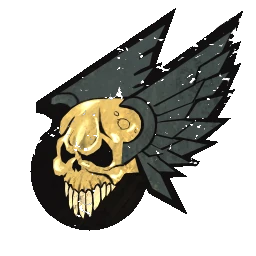

# Elfos Oscuros — Datos 2025

Fuente: [Nuffle Zone — Elfos Oscuros](https://nufflezone.com/equipos-blood-bowl/elfos-oscuros/)

## Roster 2025

| CTD | Posición | Coste | MA | FU | AG | PA | AR | Habilidades (resumen) | Pri | Sec |
|-----|-----------|-------|----|----|----|----|-----|------------------------|-----|-----|
| 0-12 | Elfo Oscuro Línea | 65k | 6 | 3 | 2+ | 3+ | 9+ | – | AG | DF |
| 0-2 | Elfo Oscuro Runner | 80k | 7 | 3 | 2+ | 3+ | 8+ | Pase Precipitado, Patada de Despeje | AGP | DF |
| 0-2 | Elfo Oscuro Asesino | 90k | 7 | 3 | 2+ | 4+ | 8+ | Apuñalar, Golpe a la Carrera, Perseguir | AD | GF |
| 0-4 | Elfo Oscuro Blitzer | 105k | 7 | 3 | 2+ | 3+ | 9+ | Placar | AG | DPF |
| 0-2 | Bruja Elfa | 110k | 7 | 3 | 2+ | 4+ | 8+ | En Pie de un Salto, Esquivar, Furia | AG | DF |

- **Rerolls:** 50k  
- **Apotecario:** Sí  
- **Reglas especiales:** Liga de los Reinos Élficos  

## Descripción oficial de las habilidades

* **Apuñalar (Stab) — incl.:** Acción especial: tirada de Armadura no modificada contra rival en pie adyacente; si rompe, tirada de Heridas. Puede reemplazar el Placaje de una Penetración.
* **En Pie de un Salto (Jump Up) — incl.:** Levantarse «gratis»; puede declarar Placaje desde tumbado con AG+1.
* **Esquivar (Dodge) — incl.:** Repetir un chequeo de esquivar por turno; afecta a Desequilibrado en placajes recibidos.
* **Furia (Frenzy) — incl.:** Si empuja en Placaje debe hacer impulso; si el blanco sigue en pie debe segundo Placaje (y impulso si empuja).
* **Golpe a la Carrera (Hit and Run) — incl.:** Tras Placaje o Apuñalar, si sigue en pie puede mover 1 casilla gratis (sin quedar marcando/marcado). No compatible con Furia.
* **Pase Precipitado (Dump-Off) — incl.:** Cuando rival va a placarlo o a usar acción especial contra él, puede hacer un Pase rápido justo antes (no puede causar cambio de turno).
* **Patada de Despeje (Punt) — incl.:** Acción especial: puede moverse antes; si es portador puede dar patada de despeje (plantilla, 1D6 dirección, 1D6 distancia). Con Patada puede repetir una o ambas tiradas.
* **Perseguir (Shadowing) — incl.:** Cuando rival esquivando sale de su zona: 1D6; 4+=este jugador se coloca en la casilla que deja (máx. MV veces por turno). Solo uno por casilla.
* **Placar (Block) — incl.:** En placaje con «Ambos derribados» puede elegir no ser derribado.

## Descripción oficial de las habilidades

* **Apuñalar (Stab) — incl.:** Acción especial: tirada de Armadura no modificada contra rival en pie adyacente; si rompe, tirada de Heridas. Puede reemplazar el Placaje de una Penetración.
* **En Pie de un Salto (Jump Up) — incl.:** Levantarse «gratis»; puede declarar Placaje desde tumbado con AG+1.
* **Esquivar (Dodge) — incl.:** Repetir un chequeo de esquivar por turno; afecta a Desequilibrado en placajes recibidos.
* **Furia (Frenzy) — incl.:** Si empuja en Placaje debe hacer impulso; si el blanco sigue en pie debe segundo Placaje (y impulso si empuja).
* **Golpe a la Carrera (Hit and Run) — incl.:** Tras Placaje o Apuñalar, si sigue en pie puede mover 1 casilla gratis (sin quedar marcando/marcado). No compatible con Furia.
* **Pase Precipitado (Dump-Off) — incl.:** Cuando rival va a placarlo o a usar acción especial contra él, puede hacer un Pase rápido justo antes (no puede causar cambio de turno).
* **Patada de Despeje (Punt) — incl.:** Acción especial: puede moverse antes; si es portador puede dar patada de despeje (plantilla, 1D6 dirección, 1D6 distancia). Con Patada puede repetir una o ambas tiradas.
* **Perseguir (Shadowing) — incl.:** Cuando rival esquivando sale de su zona: 1D6; 4+=este jugador se coloca en la casilla que deja (máx. MV veces por turno). Solo uno por casilla.
* **Placar (Block) — incl.:** En placaje con «Ambos derribados» puede elegir no ser derribado.
