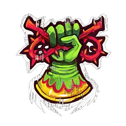

# Elfos Silvanos — Datos 2025

Fuente: [Nuffle Zone — Elfos Silvanos](https://nufflezone.com/equipos-blood-bowl/elfos-silvanos/)

## Roster 2025

| CTD | Posición | Coste | MA | FU | AG | PA | AR | Habilidades (resumen) | Pri | Sec |
|-----|-----------|-------|----|----|----|----|-----|------------------------|-----|-----|
| 0-12 | Elfo Silvano Línea | 65k | 7 | 3 | 2+ | 3+ | 8+ | – | AG | F |
| 0-2 | Elfo Silvano Thrower | 85k | 7 | 3 | 2+ | 2+ | 8+ | Pasar, Proteger el Cuero | AGP | F |
| 0-4 | Elfo Silvano Catcher | 90k | 8 | 2 | 2+ | 3+ | 8+ | Atrapar, Esprintar, Esquivar | AG | PF |
| 0-2 | Wardancer | 130k | 8 | 3 | 2+ | 3+ | 8+ | Placar, Esquivar, Saltar | AG | PF |
| 0-1 | Loren Forest Treeman | 120k | 2 | 6 | 5+ | 5+ | 11+ | Solitario(4+), Golpe Mortífero(+1), Mantenerse Firme, Brazo Fuerte, Echar Raíces, Cabeza Dura, Lanzar Compañero | F | AG |

- **Rerolls:** 50k  
- **Apotecario:** Sí  
- **Ligas:** Liga de los Reinos Élficos, Liga del Bosque  

## Descripción oficial de las habilidades

* **Atrapar (Catch) — incl.:** Puede repetir chequeo de AG fallido al atrapar el balón.
* **Brazo Fuerte (Strong Arm) — incl.:** +1 al chequeo de Pase en Lanzar compañero. Solo si tiene Lanzar compañero.
* **Cabeza Dura (Thick Skull) — incl.:** En tirada de Heridas: Inconsciente solo con 9; 8 = Aturdido. Con Escurridizo: Inconsciente con 8, 7 = Aturdido.
* **Echar Raíces (Take Root) — incl.:** Al activarse: 1D6; 1 = Echa raíces (no moverse, no empujado, etc.) hasta final de entrada o ser derribado.
* **Esprintar (Sprint) — incl.:** Una vez por movimiento puede forzar la marcha una vez más.
* **Esquivar (Dodge) — incl.:** Repetir un chequeo de esquivar por turno; afecta a Desequilibrado en placajes recibidos.
* **Golpe Mortífero (Mighty Blow) — incl.:** Al derribar en Placaje puede aplicar +1 a tirada de Armadura o de Heridas (decidir después de tirar).
* **Lanzar Compañero (Throw Team-Mate) — incl.:** Puede declarar la acción de Lanzar compañero.
* **Mantenerse Firme (Stand Firm) — incl.:** Puede elegir no ser empujado (incl. cadena). No impide segundo Placaje por Furia.
* **Pasar (Pass) — incl.:** Puede repetir cualquier chequeo de Pase fallido en una acción de Pase.
* **Placar (Block) — incl.:** En placaje con «Ambos derribados» puede elegir no ser derribado.
* **Proteger el Cuero (Safe Pair of Hands) — incl.:** Si va a ser derribado/caer con el balón, puede colocar el balón en casilla adyacente antes (no rebota).
* **Saltar (Leap) — incl.:** Durante movimiento puede intentar Saltar una casilla (como Brincar, puede reducir modificadores negativos en 1, mín. -1). No compatible con Pogo.
* **Solitario (Loner) — incl.:** Para usar Segunda oportunidad en su tirada debe tirar 1D6 ≥ número entre paréntesis; si no, la RR se gasta pero no repite.
