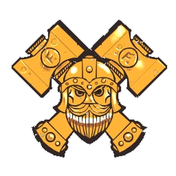

# Enanos — Datos 2025

Fuente: [Nuffle Zone — Enanos](https://nufflezone.com/equipos-blood-bowl/enanos/) · verificado con [Blood Bowl Base — Dwarf](https://bloodbowlbase.ru/bb2025/teams/Dwarf/)

## Roster 2025

| CTD | Posición         | Coste | MV | FU | AG | PS | AR  | Habilidades (resumen) | Pri | Sec |
|-----|------------------|-------|----|----|----|----|-----|------------------------|-----|-----|
| 0-16 | Enano Línea      | 70k   | 4  | 3  | 4+ | 5+ | 10+ | Placar, Romper defensas, Cabeza dura | DG | F   |
| 0-2 | Enano Runner     | 80k   | 6  | 3  | 3+ | 4+ | 9+  | Esprintar, Manos seguras, Cabeza dura | GP | AF  |
| 0-2 | Enano Blitzer    | 100k  | 5  | 3  | 4+ | 4+ | 10+ | Placar, Placaje defensivo, Placaje heroico, Cabeza dura | GF | P   |
| 0-2 | MataTrols        | 95k   | 5  | 3  | 4+ | 5+ | 9+  | Placar, Agallas, Furia, Cabeza dura, Odio (Troll) | GF | D   |
| 0-1 | Apisonadora Enana| 170k  | 5  | 7  | 5+ | – | 11+ | Abrirse paso, Jugar sucio, Imparable, Solitario (4+), Golpe mortífero, El balón ni verlo, Arma secreta, Mantenerse firme | DF | G   |

- **Rerolls:** 60k  
- **Apotecario:** Sí  
- **Reglas especiales:** Brutos brutales, Sobornos y corrupción  
- **Liga:** Superliga del Fin del Mundo  

## Descripción oficial de las habilidades

* **Abrirse paso (Break Tackle) — incl.:** Una vez por turno, al esquivar: +1 AG si FU≤3, +2 si FU=4, +3 si FU≥5.
* **Agallas (Dauntless) — incl.:** Al placar a rival con más FU: 1D6+FU de este jugador; si total > FU rival, este jugador cuenta con FU igual al rival para ese placaje.
* **Arma secreta (Secret Weapon) — incl.:** Al final de la entrada en que haya participado, es Expulsado.
* **Cabeza dura (Thick Skull) — incl.:** En tirada de Heridas: Inconsciente solo con 9; 8 = Aturdido. Con Escurridizo: Inconsciente con 8, 7 = Aturdido.
* **El balón ni verlo (No Ball) — incl.:** Nunca puede ser portador; falla automático al atrapar/recoger; no puede interceptar.
* **Esprintar (Sprint) — incl.:** Una vez por movimiento puede forzar la marcha una vez más.
* **Furia (Frenzy) — incl.:** Si empuja en Placaje debe hacer impulso; si el blanco sigue en pie debe segundo Placaje (y impulso si empuja).
* **Golpe mortífero (Mighty Blow) — incl.:** Al derribar en Placaje puede aplicar +1 a tirada de Armadura o de Heridas (decidir después de tirar).
* **Imparable (Juggernaut) — incl.:** En Penetración: «Ambos derribados» → Empujón; rival no puede usar Forcejear, Mantenerse firme ni Zafarse.
* **Jugar sucio (Dirty Player) — incl.:** En Falta puede aplicar +1 a tirada de Armadura o de Heridas (decidir después de tirar).
* **Manos seguras (Sure Hands) — incl.:** Puede repetir D6 al recoger el balón (no Asegurar el balón). Robar balón no puede usarse contra él.
* **Mantenerse firme (Stand Firm) — incl.:** Puede elegir no ser empujado (incl. cadena). No impide segundo Placaje por Furia.
* **Odio (Hatred) — incl.:** Al placar a jugador de la clave indicada puede repetir un resultado de Atacante derribado.
* **Placaje defensivo (Tackle) — incl.:** Rival que esquivando sale de su zona de defensa no puede usar Esquivar; en placaje contra él, Desequilibrado trata al rival como sin Esquivar.
* **Placaje heroico (Diving Tackle) — incl.:** Rival que esquivando/saltando/brincando sale de su zona de defensa: -2 al chequeo y este jugador se tumba en la casilla que deja.
* **Placar (Block) — incl.:** En placaje con «Ambos derribados» puede elegir no ser derribado.
* **Romper defensas (Defensive) — incl.:** Rivales que marque no pueden usar Defensa ni Meter la bota en turnos rivales.
* **Solitario (Loner) — incl.:** Para usar Segunda oportunidad en su tirada debe tirar 1D6 ≥ número entre paréntesis; si no, la RR se gasta pero no repite.
