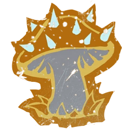

# Gnomos — Datos 2025

Fuente: [Nuffle Zone — Gnomos](https://nufflezone.com/equipos-blood-bowl/gnomos/)

## Roster 2025

| CTD | Posición | Coste | MA | FU | AG | PA | AR | Habilidades (resumen) | Pri | Sec |
|-----|-----------|-------|----|----|----|----|-----|------------------------|-----|-----|
| 0-16 | Gnomo Línea | 40k | 5 | 2 | 3+ | 4+ | 8+ | Esquivar, Humanoide Bala, Escurridizo | A | DGF |
| 0-2 | Gnomo Blitzer | 70k | 6 | 2 | 3+ | 4+ | 8+ | Esquivar, Humanoide Bala, Escurridizo, Placar | A | DGF |
| 0-2 | Gnomo Thrower | 65k | 5 | 2 | 3+ | 3+ | 8+ | Esquivar, Humanoide Bala, Escurridizo, Pasar | AP | DGF |
| 0-2 | Gnomo Troll Slayer | 95k | 5 | 2 | 3+ | 4+ | 9+ | Esquivar, Humanoide Bala, Escurridizo, Berserker, Romper Defensas | AF | DG |
| 0-2 | Forest Troll | 110k | 4 | 5 | 5+ | 5+ | 10+ | Golpe Mortífero, Lanzar Compañero, Realmente Estúpido, Regeneración, Siempre Hambriento | F | AGP |
| 0-2 | Bombardero | 40k | 5 | 2 | 3+ | 4+ | 8+ | Arma Secreta, Bombardero, Esquivar, Humanoide Bala, Escurridizo | DP | AGF |

- **Rerolls:** 70k  
- **Apotecario:** Sí  
- **Reglas especiales:** Soborno y Corrupción  
- **Liga:** Reyerta en las Yermas  

## Descripción oficial de las habilidades

* **Arma Secreta (Secret Weapon) — incl.:** Al final de la entrada en que haya participado, es Expulsado.
* **Bombardero (Bombardier) — incl.:** Acción especial Lanzar bomba (como pase; si cae al suelo explota; 1D6 por adyacentes, 4+ impactados).
* **Escurridizo (Stunty) — incl.:** No sufre -1 por estar marcado al esquivar; -1 AG al interceptar; tirada de Heridas en tabla Escurridizos.
* **Esquivar (Dodge) — incl.:** Repetir un chequeo de esquivar por turno; afecta a Desequilibrado en placajes recibidos.
* **Furia (Frenzy) — incl.:** Si empuja en Placaje debe hacer impulso; si el blanco sigue en pie debe segundo Placaje (y impulso si empuja).
* **Golpe Mortífero (Mighty Blow) — incl.:** Al derribar en Placaje puede aplicar +1 a tirada de Armadura o de Heridas (decidir después de tirar).
* **Humanoide Bala (Right Stuff) — incl.:** Puede ser lanzado por compañero con Lanzar compañero (incluso tumbado).
* **Lanzar Compañero (Throw Team-Mate) — incl.:** Puede declarar la acción de Lanzar compañero.
* **Pasar (Pass) — incl.:** Puede repetir cualquier chequeo de Pase fallido en una acción de Pase.
* **Placar (Block) — incl.:** En placaje con «Ambos derribados» puede elegir no ser derribado.
* **Realmente Estúpido (Really Stupid) — incl.:** Al activarse: 1D6 (+2 si adyacente a compañero en pie sin este rasgo); 4+=normal, 1-3=Distraído.
* **Regeneración (Regeneration) — incl.:** Al sufrir Lesión: 1D6; 4+=se ignora la lesión y va a reservas; 1-3=normal.
* **Romper Defensas (Defensive) — incl.:** Rivales que marque no pueden usar Defensa ni Meter la Bota en turnos rivales.
* **Siempre Hambriento (Always Hungry) — incl.:** Antes del chequeo de Lanzar compañero: 1D6; 1=intenta comerse al compañero (segundo 1D6: 1=devorado).
