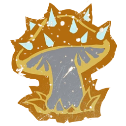

# Gnomos — Datos 2025

Fuente: [Nuffle Zone — Gnomos 2025](https://nufflezone.com/equipos-blood-bowl/gnomos/)

## Roster 2025 (3ª temporada)

| CTD | Posición | Coste | MA | FU | AG | PA | AR | Habilidades (resumen) | Pri | Sec |
|-----|-----------|-------|----|----|----|----|-----|------------------------|-----|-----|
| 0-16 | Gnomo Línea | 40k | 5 | 2 | 3+ | 4+ | 7+ | En Pie de un Salto, Humanoide Bala, Escurridizo, Forcejeo | A | DGF |
| 0-2 | Gnomo Ilusionista | 50k | 5 | 2 | 3+ | 3+ | 7+ | En Pie de un Salto, Escurridizo, Embaucador, Forcejeo | AP | DG |
| 0-2 | Zorro de Bosque | 50k | 7 | 2 | 2+ | – | 6+ | Esquivar, Mi Balón, Echarse a un Lado, Escurridizo | – | A |
| 0-2 | Gnomo Maestro de las Bestias | 55k | 5 | 2 | 3+ | 4+ | 8+ | Vigilar, En Pie de un Salto, Escurridizo, Forcejeo | A | DGF |
| 0-2 | Hombre-Árbol | 120k | 2 | 6 | 5+ | 5+ | 11+ | Golpe Mortífero, Mantenerse Firme, Brazo Fuerte, Echar Raíces, Cabeza Dura, Lanzar Compañero, ¡Tronco va! | F | AGP |

- **Rerolls:** 50k  
- **Apotecario:** Sí  
- **Ligas:** Copa Dedal Halfling, Liga del Bosque  

*En inglés del builder GW: **Altern Forest Treeman** = **Hombre-Árbol**; **Gnome Beastmaster** = **Gnomo Maestro de las Bestias**; **Gnome Illusionist** = **Gnomo Ilusionista**; **Woodland Fox** = **Zorro de Bosque**; **Gnome Lineman** = **Gnomo Línea**; **Halfling Thimble Cup** = **Copa Dedal Halfling**.*

## Descripción oficial de las habilidades

* **Brazo Fuerte (Strong Arm) — incl.:** Al declarar un pase o un Lanzar compañero, +1 casillas de alcance a la banda de alcance (reglas vigentes).
* **Cabeza Dura (Thick Skull) — incl.:** En tirada de Heridas: Inconsciente solo con 9; 8 = Aturdido. Con Escurridizo: Inconsciente con 8, 7 = Aturdido.
* **Echar Raíces (Take Root) — incl.:** Tras activarse, queda enraizado hasta fin de partido o lesión que lo ponga fuera; mientras enraizado no puede moverse voluntariamente (reglas completas en PDF GW).
* **Echarse a un Lado (Sidestep) — incl.:** Cuando es empujado, puede desplazarse a una casilla vacía adyacente en lugar de seguir la línea de empuje.
* **Embaucador (Trickster) — incl.:** Habilidad de equipo del Ilusionista; ver reglamento GW / Nuffle.
* **En Pie de un Salto (Jump Up) — incl.:** Levantarse «gratis»; puede declarar Placaje desde tumbado con AG+1.
* **Escurridizo (Stunty) — incl.:** No sufre -1 por estar marcado al esquivar; -1 AG al interceptar; tirada de Heridas en tabla Escurridizos.
* **Esquivar (Dodge) — incl.:** En «Ambos derribados» en esquiva puede repetir la tirada de AG.
* **Forcejeo (Wrestle) — incl.:** En Placaje, si aplicaría «Ambos derribados», puede usarla: ambos tumbados boca arriba salvo que otras habilidades lo impidan.
* **Golpe Mortífero (Mighty Blow) — incl.:** Al derribar en Placaje puede aplicar +1 a tirada de Armadura o de Heridas (decidir después de tirar).
* **Humanoide Bala (Right Stuff) — incl.:** Puede ser lanzado por compañero con Lanzar compañero (incluso tumbado).
* **Lanzar Compañero (Throw Team-mate) — incl.:** Puede declarar la acción de Lanzar compañero.
* **Mantenerse Firme (Stand Firm) — incl.:** Si sería empujado en un Placaje, puede quedarse en la casilla salvo que el empuje sea múltiple.
* **Mi Balón (My Ball) — incl.:** Regla de balón del Zorro; ver reglamento GW / Nuffle.
* **¡Tronco va! (Timmm-ber!) — incl.:** Regla del Hombre-Árbol al caer o empujar; ver reglamento GW / Nuffle.
* **Vigilar (Guard) — incl.:** En placaje puede aportar asistencia defensiva a un compañero adyacente marcado por el mismo rival.
