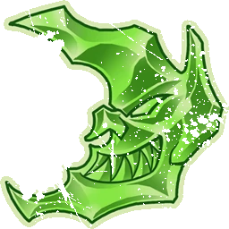

# Habitantes del Inframundo — Datos 2025

Fuente: [Nuffle Zone — Habitantes del Inframundo](https://nufflezone.com/equipos-blood-bowl/habitantes-del-inframundo/)

## Roster 2025

| CTD | Posición | Coste | MA | FU | AG | PA | AR | Habilidades (resumen) | Pri | Sec |
|-----|-----------|-------|----|----|----|----|-----|------------------------|-----|-----|
| 0-12 | Linemen | 50k | 6 | 3 | 3+ | 4+ | 8+ | – | DG | AMF |
| 0-2 | Thrower | 80k | 6 | 3 | 3+ | 2+ | 8+ | Manos Seguras, Pasar | GP | ADMF |
| 0-2 | Blitzer | 90k | 7 | 3 | 3+ | 4+ | 9+ | Placar, Robar Balón | GF | ADM |
| 0-2 | Gutter Runner | 85k | 9 | 2 | 2+ | 4+ | 8+ | Apuñalar, Esquivar | ADG | MF |
| 0-2 | Mutante | 85k | 6 | 3 | 3+ | 4+ | 8+ | Mutación Aleatoria | DG | AMF |
| 0-1 | Troll del Caos | 110k | 4 | 5 | 5+ | 5+ | 10+ | Regeneración, Siempre Hambriento, Realmente Estúpido, Lanzar Compañero, Golpe Mortífero | F | AGM |
| 0-1 | Rata Ogro | 150k | 6 | 5 | 4+ | – | 9+ | Ferocidad Animal, Cola Prensil, Furia, Golpe Mortífero(+1), Solitario (4+) | F | AGM |

- **Rerolls:** 50k  
- **Apotecario:** Sí  
- **Reglas especiales:** Soborno y Corrupción  
- **Liga:** Reto del Inframundo  

## Descripción oficial de las habilidades

* **Apuñalar (Stab) — incl.:** Acción especial: tirada de Armadura no modificada contra rival en pie adyacente; si rompe, tirada de Heridas. Puede reemplazar el Placaje de una Penetración.
* **Cola Prensil (Prehensile Tail) — incl.:** Rival que esquivando/saltando/brincando desde su zona de defensa: -1 adicional al chequeo. Solo uno por casilla.
* **Esquivar (Dodge) — incl.:** Repetir un chequeo de esquivar por turno; afecta a Desequilibrado en placajes recibidos.
* **Ferocidad Animal (Animal Savagery) — incl.:** Al activarse: 1D6 (+2 si Placaje/Penetración); 1-3=ataca compañero adyacente (derribado); 4+=normal.
* **Furia (Frenzy) — incl.:** Si empuja en Placaje debe hacer impulso; si el blanco sigue en pie debe segundo Placaje (y impulso si empuja).
* **Golpe Mortífero (Mighty Blow) — incl.:** Al derribar en Placaje puede aplicar +1 a tirada de Armadura o de Heridas (decidir después de tirar).
* **Manos Seguras (Sure Hands) — incl.:** Puede repetir D6 al recoger el balón (no Asegurar el balón). Robar balón no puede usarse contra él.
* **Pasar (Pass) — incl.:** Puede repetir cualquier chequeo de Pase fallido en una acción de Pase.
* **Placar (Block) — incl.:** En placaje con «Ambos derribados» puede elegir no ser derribado.
* **Realmente Estúpido (Really Stupid) — incl.:** Al activarse: 1D6 (+2 si adyacente a compañero en pie sin este rasgo); 4+=normal, 1-3=Distraído.
* **Regeneración (Regeneration) — incl.:** Al sufrir Lesión: 1D6; 4+=se ignora la lesión y va a reservas; 1-3=normal.
* **Robar Balón (Strip Ball) — incl.:** Placaje al **portador** y **empuje**: el balón **cae y rebota** desde la casilla de destino **antes** de que el rival quede tumbado, pero **después** de que **este jugador** elija si hace **impulso**.
* **Siempre Hambriento (Always Hungry) — incl.:** Antes del chequeo de Lanzar compañero: 1D6; 1=intenta comerse al compañero (segundo 1D6: 1=devorado).
* **Solitario (Loner) — incl.:** Para usar Segunda oportunidad en su tirada debe tirar 1D6 ≥ número entre paréntesis; si no, la RR se gasta pero no repite.
* **Lanzar Compañero (Throw Team-Mate) — incl.:** Puede declarar la acción de Lanzar compañero.
