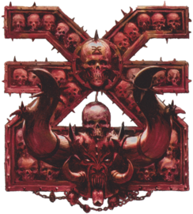

# Khorne — Datos 2025

Fuente: [Nuffle Zone — Khorne](https://nufflezone.com/equipos-blood-bowl/khorne/)

## Roster 2025

| CTD | Posición | Coste | MA | FU | AG | PA | AR | Habilidades (resumen) | Pri | Sec |
|-----|-----------|-------|----|----|----|----|-----|------------------------|-----|-----|
| 0-16 | Líneas Marauder Nacidos de la Sangre | 50k | 6 | 3 | 3+ | 4+ | 8+ | Furia | GM | ADF |
| 0-4 | Khorngors | 70k | 6 | 3 | 3+ | 4+ | 9+ | Cabeza Dura, Cuernos, En Pie de un Salto, Imparable | GFM | ADP |
| 0-4 | Bloodseekers | 105k | 5 | 4 | 4+ | 6+ | 10+ | Furia | GFM | AD |
| 0-1 | BloodSpawn | 160k | 5 | 5 | 4+ | 6+ | 9+ | Garras, Furia, Golpe Mortífero(+1), Ira Descontrolada, Solitario (4+) | FM | AG |

- **Rerolls:** 60k  
- **Apotecario:** Sí  
- **Reglas especiales:** Brutos Brutales, Elegido de Khorne  
- **Liga:** Choque del Caos  

## Descripción oficial de las habilidades

* **Cabeza Dura (Thick Skull) — incl.:** En tirada de Heridas: Inconsciente solo con 9; 8 = Aturdido. Con Escurridizo: Inconsciente con 8, 7 = Aturdido.
* **Cuernos (Horns) — incl.:** En Penetración aplica +1 FU a sus placajes en esa acción.
* **En Pie de un Salto (Jump Up) — incl.:** Levantarse «gratis»; puede declarar Placaje desde tumbado con AG+1.
* **Furia (Frenzy) — incl.:** Si empuja en Placaje debe hacer impulso; si el blanco sigue en pie debe segundo Placaje (y impulso si empuja).
* **Garras (Claws) — incl.:** En tirada de Armadura contra rival derribado por su placaje, un 8+ natural rompe armadura sea cual sea el AR.
* **Golpe Mortífero (Mighty Blow) — incl.:** Al derribar en Placaje puede aplicar +1 a tirada de Armadura o de Heridas (decidir después de tirar).
* **Imparable (Juggernaut) — incl.:** En Penetración: «Ambos derribados» → Empujón; rival no puede usar Forcejear, Mantenerse Firme ni Zafarse.
* **Ira Descontrolada (Unchannelled Fury) — incl.:** Al activarse: 1D6 (+2 si Placaje/Penetración); 1-3=no hace nada, activación termina; 4+=normal.
* **Solitario (Loner) — incl.:** Para usar Segunda oportunidad en su tirada debe tirar 1D6 ≥ número entre paréntesis; si no, la RR se gasta pero no repite.
