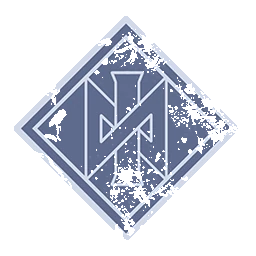

# Nórdicos — Datos 2025

Fuente: [Nuffle Zone — Nórdicos](https://nufflezone.com/equipos-blood-bowl/nordicos/)

## Roster 2025

| CTD | Posición | Coste | MA | FU | AG | PA | AR | Habilidades (resumen) | Pri | Sec |
|-----|-----------|-------|----|----|----|----|-----|------------------------|-----|-----|
| 0-16 | Línea | 50k | 6 | 3 | 3+ | 4+ | 8+ | Borracho, Cabeza Dura, Inestable, Placar | G | APF |
| 0-2 | Cerdo Cervecero | 20k | 5 | 1 | 3+ | – | 6+ | Esquivar, Sin Manos, Bebida Reconstituyente, Escurridizo, Canijo | – | A |
| 0-2 | Berserker | 90k | 6 | 3 | 3+ | 5+ | 8+ | Placar, Furia, En Pie de un Salto | GF | AP |
| 0-2 | Valkyrie | 95k | 7 | 3 | 3+ | 3+ | 8+ | Atrapar, Agallas, Pasar, Robar Balón | AGP | F |
| 0-2 | Ulfwerener | 105k | 6 | 4 | 4+ | 6+ | 9+ | Furia, Inestable | GF | A |
| 0-1 | Yhetee | 140k | 5 | 5 | 4+ | 6+ | 9+ | Garras, Presencia Perturbadora, Furia, Solitario (4+), Ira Descontrolada | F | AG |

- **Rerolls:** 60k  
- **Apotecario:** Sí  
- **Reglas especiales:** Elegido de… (elegir uno: Caos Indiviso, Khorne; si liga es Choque del Caos → Elegido de Khorne)  
- **Ligas:** Choque del Caos, Clásica del Viejo Mundo  

## Descripción oficial de las habilidades

* **Agallas (Dauntless) — incl.:** Al placar a rival con más FU: 1D6+FU de este jugador; si total > FU rival, este jugador cuenta con FU igual al rival para ese placaje.
* **Atrapar (Catch) — incl.:** Puede repetir chequeo de AG fallido al atrapar el balón.
* **Borracho (Drunkard) — incl.:** -1 a chequeos para forzar la marcha.
* **Cabeza Dura (Thick Skull) — incl.:** En tirada de Heridas: Inconsciente solo con 9; 8 = Aturdido. Con Escurridizo: Inconsciente con 8, 7 = Aturdido.
* **Canijo (Titchy) — incl.:** +1 AG para esquivar; rivales no aplican -1 por marcarlo al esquivar para salir de su zona.
* **En Pie de un Salto (Jump Up) — incl.:** Levantarse «gratis»; puede declarar Placaje desde tumbado con AG+1.
* **Escurridizo (Stunty) — incl.:** No sufre -1 por estar marcado al esquivar; -1 AG al interceptar; tirada de Heridas en tabla Escurridizos.
* **Esquivar (Dodge) — incl.:** Repetir un chequeo de esquivar por turno; afecta a Desequilibrado en placajes recibidos.
* **Furia (Frenzy) — incl.:** Si empuja en Placaje debe hacer impulso; si el blanco sigue en pie debe segundo Placaje (y impulso si empuja).
* **Garras (Claws) — incl.:** En tirada de Armadura contra rival derribado por su placaje, un 8+ natural rompe armadura sea cual sea el AR.
* **Inestable (Unstable) — incl.:** Cuando este jugador es derribado, el entrenador rival hace una tirada en la tabla de heridas contra él.
* **Ira Descontrolada (Unchannelled Fury) — incl.:** Al activarse: 1D6 (+2 si Placaje/Penetración); 1-3=no hace nada, activación termina; 4+=normal.
* **Pasar (Pass) — incl.:** Puede repetir cualquier chequeo de Pase fallido en una acción de Pase.
* **Placar (Block) — incl.:** En placaje con «Ambos derribados» puede elegir no ser derribado.
* **Presencia Perturbadora (Disturbing Presence) — incl.:** Por cada jugador con esta habilidad a 3 casillas o menos, rival tiene -1 al chequeo de Pase/AG (pase, lanzar compañero, lanzar bomba, interceptar, atrapar).
* **Robar Balón (Strip Ball) — incl.:** Si en Placaje empuja al portador del balón, el balón cae y rebota desde la casilla de destino (antes de que el rival quede tumbado).
* **Sin Manos (No Hands) — incl.:** No puede ser portador del balón; no puede atrapar, recoger ni interceptar el balón.
* **Solitario (Loner) — incl.:** Para usar Segunda oportunidad en su tirada debe tirar 1D6 ≥ número entre paréntesis; si no, la RR se gasta pero no repite.
* **Levantar Compañero (Pick-Me-Up) — incl.:** Al final de cada turno rival: 1D6 por cada tumbado boca arriba a ≤3 casillas de un compañero con este rasgo; 5+=se levanta.
