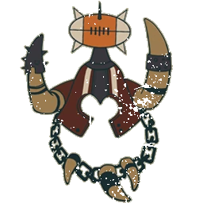

# Ogros — Datos 2025

Fuente: [Nuffle Zone — Ogros](https://nufflezone.com/equipos-blood-bowl/ogros/)

## Roster 2025

| CTD | Posición | Coste | MA | FU | AG | PA | AR | Habilidades (resumen) | Pri | Sec |
|-----|-----------|-------|----|----|----|----|-----|------------------------|-----|-----|
| 0-16 | Gnoblar Línea | 20k | 5 | 1 | 4+ | 6+ | 6+ | Humanoide Bala, Escurridizo, Titchy | AD | GMF |
| 0-5 | Ogre Línea | 140k | 5 | 5 | 5+ | 5+ | 10+ | Lanzar Compañero, Golpe Mortífero(+1), Muro de Carne, Realmente Estúpido, Cabeza Dura | F | AGM |
| 0-1 | Ogre Runt Punter | 140k | 5 | 5 | 5+ | 4+ | 10+ | Lanzar Compañero, Golpe Mortífero(+1), Muro de Carne, Punter, Realmente Estúpido, Cabeza Dura | F | AGM |
| 0-5 | Ogre Blocker | 160k | 5 | 5 | 5+ | 5+ | 10+ | Lanzar Compañero, Golpe Mortífero(+1), Muro de Carne, Romper Defensas, Realmente Estúpido, Cabeza Dura | F | AGM |

- **Rerolls:** 140k  
- **Apotecario:** Sí  
- **Reglas especiales:** Ninguna  
- **Liga:** Reyerta en las Yermas  

## Descripción oficial de las habilidades

* **Cabeza Dura (Thick Skull) — incl.:** En tirada de Heridas: Inconsciente solo con 9; 8 = Aturdido. Con Escurridizo: Inconsciente con 8, 7 = Aturdido.
* **Canijo (Titchy) — incl.:** +1 AG para esquivar; rivales no aplican -1 por marcarlo al esquivar para salir de su zona.
* **Escurridizo (Stunty) — incl.:** No sufre -1 por estar marcado al esquivar; -1 AG al interceptar; tirada de Heridas en tabla Escurridizos.
* **Golpe Mortífero (Mighty Blow) — incl.:** Al derribar en Placaje puede aplicar +1 a tirada de Armadura o de Heridas (decidir después de tirar).
* **Humanoide Bala (Right Stuff) — incl.:** Puede ser lanzado por compañero con Lanzar compañero (incluso tumbado).
* **Lanzar Compañero (Throw Team-Mate) — incl.:** Puede declarar la acción de Lanzar compañero.
* **Realmente Estúpido (Really Stupid) — incl.:** Al activarse: 1D6 (+2 si adyacente a compañero en pie sin este rasgo); 4+=normal, 1-3=Distraído.
* **Romper Defensas (Defensive) — incl.:** Rivales que marque no pueden usar Defensa ni Meter la Bota en turnos rivales.
