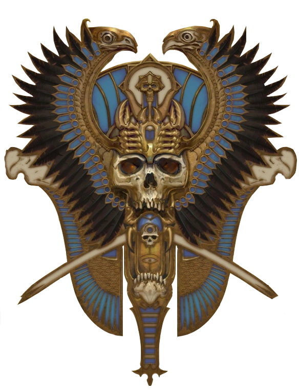

# Reyes Funerarios (Tomb Kings) — Datos 2025

Fuente: [Nuffle Zone — Reyes Funerarios](https://nufflezone.com/equipos-blood-bowl/reyes-funerarios/)

## Roster 2025

| CTD | Posición | Coste | MA | FU | AG | PA | AR | Habilidades (resumen) | Pri | Sec |
|-----|-----------|-------|----|----|----|----|-----|------------------------|-----|-----|
| 0-16 | Esqueleto de Reyes Funerarios Línea | 40k | 5 | 3 | 4+ | 6+ | 9+ | Regeneración | DG | AF |
| 0-4 | Guardián de Reyes Funerarios | 70k | 6 | 3 | 3+ | 4+ | 9+ | Regeneración, Mantenerse Firme | GF | AD |
| 0-2 | Blitzer de Reyes Funerarios | 90k | 6 | 3 | 3+ | 4+ | 9+ | Placar, Regeneración | GF | AD |
| 0-2 | Thrower de Reyes Funerarios | 70k | 6 | 3 | 3+ | 3+ | 9+ | Pasar, Regeneración | GP | ADF |
| 0-1 | Momia de Reyes Funerarios | 110k | 3 | 5 | 5+ | 6+ | 10+ | Golpe Mortífero(+1), Mantenerse Firme, Regeneración, Lentitud | F | AGD |

- **Rerolls:** 70k  
- **Apotecario:** No  
- **Reglas especiales:** Señores de los No Muertos  
- **Liga:** Liga de la Arena Mortuoria  

## Descripción oficial de las habilidades

* **Golpe Mortífero (Mighty Blow) — incl.:** Al derribar en Placaje puede aplicar +1 a tirada de Armadura o de Heridas (decidir después de tirar).
* **Mantenerse Firme (Stand Firm) — incl.:** Puede elegir no ser empujado (incl. cadena). No impide segundo Placaje por Furia.
* **Pasar (Pass) — incl.:** Puede repetir cualquier chequeo de Pase fallido en una acción de Pase.
* **Placar (Block) — incl.:** En placaje con «Ambos derribados» puede elegir no ser derribado.
* **Regeneración (Regeneration) — incl.:** Al sufrir Lesión: 1D6; 4+=se ignora la lesión y va a reservas; 1-3=normal.
